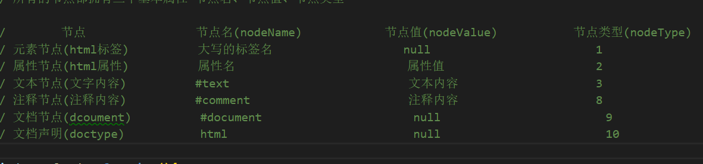

DOM 指的是文档对象模型，它指的是把文档当做一个对象来对待，这个对象主要定义了处理网页内容的方法和接口。  
BOM 指的是浏览器对象模型，它指的是把浏览器当做一个对象来对待，这个对象主要定义了与浏览器进行交互的法和接口。

BOM 的核心是 window，而 window 对象具有双重角色，它既是通过 js 访问浏览器窗口的一个接口，  
又是一个 Global（全局）对象。  
这意味着在网页中定义的任何对象，变量和函数，都作为全局对象的一个属性或者方法存在。  
window: location、navigator、screen、history，存储对象等子对象，  
并且 DOM 的最根本的对象 document 对象也是 BOM 的 window 对象的子对象。

## window

### window 下面的内置对象

- location
- document
- history

### window 下面的常用方法

window,alert()  
window.prompt()  
window.confirm();  
window.parseInt()  
window.parseFloat()  
window.setInterval(函数或函数体，时间 ms)  
window.clearInterval(定时器的返回值)  
window.setTimeout(函数或函数体，时间 ms)  
window.clearTimeout(定时器的返回值)  
window.open('http://www.baidu.com')打开一个新页面  
window.close()关闭页面  
window.getComputedStyle(元素对象).width  
window.open('http://www.baidu.com')打开一个新页面  
window.close()关闭页面

## window 下面的事件类型

window.onload 页面加载完毕  
window.scroll 滚动条事件 高频事件  
window.onresize 浏览器可视区域

## 地址栏的组成

协议，域名，路径（端口），数据，哈希值

### location 对象下面的属性和方法

location.href 地址  
location.search 数据  
location.hash 哈希值  
location.reload（） 刷新  
location.assign（）控制页面跳转

### history 对象

history.go() 前进或后退指定的页面数（负数后退，正数前进）  
history.go(0)也会刷新页面  
history.back() 后退一步  
history.forward() 前进一步  
history.length 属性 -- history 对象中缓存了多少个 URL

### navigator 对象

navigator.userAgent

### 哪些操作可以刷新浏览器

window.history.go(0)  
window.location.reload()

### 定时器

### 1.间隔定时器（反复调用）

window.setInterval(函数名或函数体,实践 ms)  
window.clearInterval(开启定时器的返回值)

### 2.延时定时器(约定的时间只执行一次)

window.setTimeout(函数名或函数体,实践 ms)  
window.clearTimeout(开启定时器的返回值)  
注意：定时器里面的代码比外面的代码执行的慢

### window 的可视区的尺寸和滚动条距离

### 可视区的尺寸 不带单位

document.documentElement.clientWidth  
document.documentElement.clientHeight

### 滚动条距离 不带单位

document.documentElement.scrollTop：离顶部的距离 scrollHeight(表示 body 所有元素的总长度(包括 body 元素自身的 padding),页面不能滚动时也是存在的,此时 scrollHeight 等于 clientHeight)    
document.documentElement.scrollLeft：离左边的距离 scrollWidth

offsetWidth、offsetHeight：获取盒模型的尺寸 -重点  
offsetLeft、offsetTop：获取元素相对可视区的位置，无论是否有定位，都可以获取 - 重点  
offsetParent ：获取元素的定位父级(元素)

## DOM

### 获取页面中基本控制元素（标签）

document,html,head,body,title  
获取 document 文档，document 是 html 页面最大的对象。  
获取 html 元素，document.documentElement  
获取 head,body,title 元素  
document.head  
document.body  
document.title

### DOM 的基本操作（增删改查）

### 查

1.这接通过 id 名获取元素对象(id 名不用加引号)  
2.document.getElementById()  
3.document.getElementsByClassName() 返回类数组  
4.document.getElementsByTagName() 返回类数组 只能选取调用该方法的元素的后代元素 当 tagName 为\*时，表示选取所有元素  
5.document.getElementsByName() 返回类数组 获取 name 的元素 一般在 form 表单中  
通过 css 选择器选择元素对象  
6.document.querySelector()  
document.querySelectorAll() 返回类数组

参考：https://blog.csdn.net/Fancy_vae/article/details/108563476

### 增

先创建，再增加  
创建：document.createElement('li')  
追加：父元素.appendChild(创建的子元素)

## 插入

插入:父元素.insertBefore(新的元素,存在的元素)

### 删

先获取，再删除  
结构：父元素.removeChild(元素对象)  
删除自身：remove()

### 替换（改）

获取，创建，替换  
结构：父元素.replaceChild(新的元素 , 被替换的元素)

### 克隆

元素节点.cloneNode(true)

### 操作元素对象的属性

父元素.children 只包括元素节点 返回类数组  
父元素.childNodes 包含空白节点 返回类数组  
子元素.parentNode

### 了解节点的高级操作

firstChild————第一个子节点（包括空白节点）  
firstElementChild————第一个子元素  
lastChild————最后一个子节点（包括空白）  
lastElementChild————最后一个子元素  
firstChild.nextSibling————第一个子节点的下一个子节点（包括空白节点）  
firstChild.nextElementSibling————第一个子节点的下一个子元素  
lastChild.previousSibling————最后一个子节点的上一子节点（包括空白节点）  
lastChild.previousElementSibling————最后一个子节点的上一子元素

### 获取元素对象中的 css 的属性值

offsetWidth、offsetHeight：获取盒模型的尺寸 -重点  
offsetLeft、offsetTop：获取元素相对可视区的位置，无论是否有定位，都可以获取 - 重点  
offsetParent ：获取元素的定位父级(元素)

### 获取任意的 css 属性值 - window.getComputedStyle(元素对象) - 标准浏览器 - 带单位

currentStyle 非标准浏览器使用  
getComputedStyle(元素对象).width  
getComputedStyle(元素对象)['height']  
点符号后面不能跟带有中杠的属性，可以将中杠改成驼峰命名。

### 设置 css 属性值

元素对象.style.width=' ' 逐条设置  
元素对象.style=' ' 整体设置
元素对象.style.cssText=' ' 利用 cssText 属性 整体设置

### 设置 css 选择器

元素对象.选择器名称=' '  
className

### 获取和设置元素内部的结构内容

innerHTML 不包括自身元素  
outerHTML 包括自身元素  
innerText 只获取文本

### 元素属性的操作

自定义属性：点操作符和中括号属性访问器  
getAttribute('属性名')  
setAttribute('属性名'，’属性值‘)  
removeAttribute('属性名')  
delete 元素对象.自定义属性名 利用 delete 关键字删除自定义属性

### dataset 属性操作 - 重点

元素对象.dataset 返回对象  
注意：操作自定义属性的时候，前面都添加 data-,直接通过 dataset 属性获取所有的属性，输出对象，通过对象进行访问。

## DOM 元素类型

