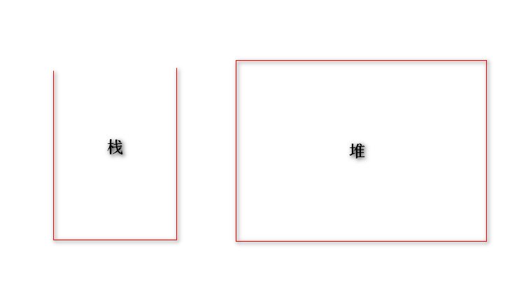
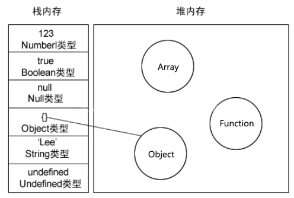

## 总结

内存分为堆内存和栈内存

### 1.堆（heap）

**存储**：存储引用数据类型的值 (先进后出 FILO)

**特点**：动态分配内存，不会自动释放

**访问方法**：JS 不能直接访问内存中的值, 只能操作对象的地址, 所以产生深/浅拷贝问题

**引用数据类型**：同时存储在栈和堆中，占据空间大、大小不固定。引用数据类型在栈中存储了指针，该指针指向堆中该实体的起始地址。当解释器寻找引用值时，会首先检索 其在栈中的地址，取得地址后从堆中获得实体。

### 2.栈（stack）

**存储**：存储基本类型的值和引用数据类型的地址（指针） (先进先出 FIFO)

**特点**：自动分配内存空间，系统自动释放

**访问方法**：按值访问, 直接操作内存中的值

**基本数据类型**：直接存储在栈中，占据空间小、大小固定，属于被频繁使用的数据，所以放入栈中存储

## 一、栈(stack)和 堆(heap)

栈(stack)：是栈内存的简称，栈是自动分配相对固定大小的内存空间，并由系统自动释放，栈数据结构遵循 FILO（first in last out）先进后出的原则，较为经典的就是乒乓球盒结构，先放进去的乒乓球只能最后取出来；

堆(heap)：是堆内存的简称，堆是动态分配内存，内存大小不固定，也不会自动释放，堆数据结构是一种无序的树状结构，同时它还满足 key-value 键值对的存储方式；我们只用知道 key 名，就能通过 key 查找到对应的 value。比较经典的就是书架存书的例子，我们知道书名，就可以找到对应的书籍；

栈的特点：开口向上、速度快,容量小；堆的特点：速度稍慢、容量比较大；

## 二、 基本类型和引用类型

基本数据类型：Undefined,String,Boolean,Null,Number，都是直接按值存放在栈内存中，占用的内存空间的大小是确定的，并由系统自动分配和自动释放。这样带来的好处就是，内存可以及时得到回收，相对于堆来说，更加容易管理内存空间。

引用数据类型：指那些可能由多个值构成的对象，如对象(Object)、数组(Array)、函数(Function) ，它们是通过拷贝和 new 出来的，这样的数据存储于堆中。

## 三、 传值和传址的区别

基本类型：采用的是值传递。  
引用类型：则是地址传递。

引用类型的数据的地址指针是存储于栈中的，将存放在栈内存中的地址赋值给接收的变量。当我们想要访问引用类型的值的时候，需要先从栈中获得对象的地址指针，然后，在通过地址指针找到堆中的所需要的数据（保存在堆内存中,包含引用类型的变量实际上保存的不是变量本身，而是指向该对象的指针）。

## 四、 内存分配垃圾回收

### 1.内存分配：

1. 栈内存：线性有序存储，容量小，系统分配效率高。
2. 堆内存：首先要在堆内存新分配存储区域，之后又要把指针存储到栈内存中，效率相对就要低一些了。

### 2.垃圾回收

1. 栈内存：变量基本上用完就回收了，相比于堆来说存取速度会快，并且栈内存中的数据是可以共享的。
2. 堆内存：堆内存中的对象不会随方法的结束而销毁，就算方法结束了，这个对象也可能会被其他引用变量所引用(参数传递)。创建对象是为了反复利用（因为对象的创建成本通常较大），这个对象将被保存到运行时数据区（也就是堆内存）。只有当一个对象没有任何引用变量引用它时，系统的垃圾回收机制才会在核实的时候回收它。
