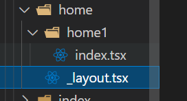
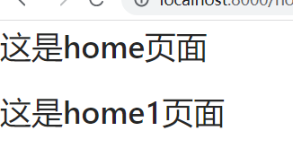
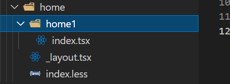
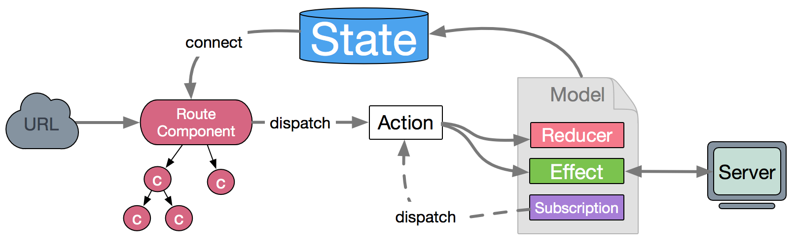
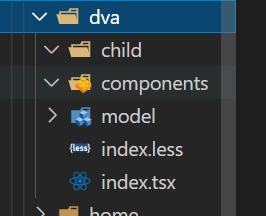
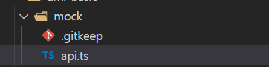

官网https://umijs.org/zh-CN/docs/getting-started


umi 是基于 react 开发的，是阿里自己内部封装的脚手架（蚂蚁金服），比起 cra 脚手架功能更强大，阿里内部用的还有 BigFish，Iceworks（又名飞冰）  
Ant Design —— web 端的组件库  
Antd mobile —— 移动端的组件库  
umi 是完整的 MVC 框架

- next.js —— 是 react 自己开发的（基于 react 语法）后端渲染框架
- nuxt.js —— 是 vue 官方开发的（基于 vue 语法的）后端渲染的框架  
  后端渲染和前后端分离的区别和优劣  
  前后端分离 2 个缺点  
  1.seo 优化不是很好  
  2.首页的打开速度比较慢  
  （大麦网—单页面应用—vue）  
  查看网页源代码是，只有一个 html(是虚拟 DOM 后面添加的)

后端渲染两个缺点  
1.对开发人员的要求比较高  
2.服务器压力过大（当很多用户访问时，都在服务器做拼接，服务器压力大）  
3.seo 优化会好一点  
（新浪——后端渲染）  
查看网页源代码（所有的数据都在里面）  
用后端渲染做的项目，用搜索引擎去搜更容易被搜到  
vue 做的就不容易被搜到  
只要是前后端分离的项目，seo 优化都是会受影响的

## 1.umi 脚手架创建项目

安装 tyarn  
tyarn 就相当于 cnpm,tyarn 去替代 yarn,是淘宝的，淘宝内部还有 tnpm  
安装 tyarn(管理员身份运行)  
`cnpm i tyarn -g`  
start 命令是可以忽略 run 的，只有这一个可以忽略  
新建一个空目录（文件），在目录中创建项目  
`yarn create @umijs/umi-app`  
安装项目依赖 —— tyarn  
`tyarn run build` —— 项目打包 ，会生成一个 dist 文件（里面只有 html,css,js）  
umi 脚手架里面自带了 router，AntD，ts.....  
umi 很多功能都是内置好的

- 在 umi 脚手架中，之前在 react 中解构的东西，现在还在 react 中解构
- 之前不在 react 中解构的（例如：react-router-dom，react-redux 等等）现在全部在 umi 中解构

## 2.项目目录

```javascript
package.json —— 项目的依赖记录文件 里卖弄可以设置命令别名
yarn.lock —— 版本锁定文件（）
typings.d.ts —— ts的类型声明文件
tsconfig.json —— ts的配置文件
README.md —— 项目的说明文件
.umirc.ts —— umi项目的配置文件
.prettierrc —— 格式化相关的
.prettierignore —— 格式化相关的
.gitignore —— git忽略上传文件
.editorconfig —— 编辑器的配置文件
node_modules —— 项目的依赖
src —— 开发目录
```

src 下面的.umi 文件 —— 当项目创建，会自动能生成.umi 文件,不要管，不要改
没有 index.js 入口文件了  
约定大于配置（约定什么就按照他的约定操作，和 vue 中的指令差不多，规定好了的）

- .开头的是隐藏文件
- \_开头的是临时文件
- 半透明的文件时 git 忽略上传的文件

## 3.src 目录下的文件

```javascript
src下面的.umi文件 —— 当项目创建，会自动能生成.umi文件,不要管，不要改
pages文件（在src里面自己建的），按照路由（约定式）的方式
404文件 —— index.tsx
home —— index.tsx —— 下面还可以有二级路由文件
about —— index.tsx
utils —— 封装的工具函数（http.js   api.js  等等）
```

之前在 react 中解构的东西还是在 react 中解构  
不是在 react 中解构的东西，现在从 umi 中解构

## 4.路由

路由组件下面要写 index.tsx,不然会显示不出来

### 01.约定式路由

1.配置路由（和 vue 的路由表差不多）  
2.约定式路由（文件路由）  
删掉 routes 配置，项目就自动进入约定式路由，然后分析 src/pages 目录拿到路由配置。  
意思是就是在.umirc.ts 文件中将下面这段代码删掉

```javascript
// 删掉routes配置，项目就自动进入约定式路由
// routes: [
//   { path: '/', component: '@/pages/index' },
// ],
```

需要注意的是，满足以下任意规则的文件不会被注册为路由，

- 以 . 或 \_ 开头的文件或目录
- 以 d.ts 结尾的类型定义文件
- 以 test.ts、spec.ts、e2e.ts 结尾的测试文件（适用于 .js、.jsx 和 .tsx 文件）
- components 和 component 目录
- utils 和 util 目录
- 不是 .js、.jsx、.ts 或 .tsx 文件
- 文件内容不包含 JSX 元素

### 02.动态路由

```javascript
约定 [ ] 包裹的文件或文件夹为动态路由。
比如：
- src/pages/users/[id].tsx 会成为 /users/:id
- src/pages/users/[id]/settings.tsx 会成为 /users/:id/settings
index.tsx ——要想使此文件或页面拥有动态路由，需改为
[index:id].tsx —— 动态路由参数为params.index  (index相当于变量，也可写为[id:id].tsx)
```

动态路由参数使用 hooks 可以拿到

### 03.动态可选路由（或动态可选参数）

```javascript
index.tsx ——要想使此文件或页面拥变为动态可选路由，需改为
[id$].tsx —— 动态路由参数为params.id可以传参数，也可以不传，都会显示
react的v6版本的路由也有动态路由可选参数
```

### 04.嵌套路由

Umi 里约定目录下有 \_layout.tsx 时会生成嵌套路由，以 \_layout.tsx 为该目录的 layout。layout 文件需要返回一个 React 组件，并通过 props.children 渲染子组件。  
解释：哪个页面需要使用路由嵌套，就必须在这个页面所在的文件里面建一个\_layout.tsx 的文件，  

  
home 是一级路由  
home1 是二级路由  
必须在 home 里建一个\_layout.tsx 文件  
home 一级路由的页面信息可以写在\_layout.tsx 文件中，这样他们就有公共部分了

```javascript
import { IRouteComponentProps } from "umi";

export default function Layout({
  children,
  location,
  route,
  history,
  match,
}: IRouteComponentProps) {
  return (
    <>
      <h1>这是home页面</h1>
      {children}
    </>
  );
}
```

嵌套路由这样写

```javascript
import styles from "./index.less";
import { IRouteComponentProps } from "umi";

export default function IndexPage(props: IRouteComponentProps) {
  return (
    <div>
      <h1 className={styles.title}>Page index</h1>
      {props.children}
    </div>
  );
}
```



### 05.全局 layouts

约定 `src/layouts/index.tsx` 为全局路由。返回一个 React 组件，并通过 props.children 渲染子组件。  
每个页面又会有`<div>@巴塞罗那</div>`  
1.可以写全局的公共部分  
2.也可以加重定向  
加一个判断，什么情况下返回 children，神魔情况下返回一个重定向的标签

```javascript
import { IRouteComponentProps } from "umi";

export default function Layout({
  children,
  location,
  route,
  history,
  match,
}: IRouteComponentProps) {
  console.log(location);
  // return (
  //   <>
  //       {children}
  //       <footer>@巴塞罗那</footer>
  //   </>
  // )
  if (location.pathname === "/") {
    return <Redirect to="/home/home1"></Redirect>;
  } else {
    return children;
  }
}
```

### 06.404 路由

约定 src/pages/404.tsx 为 404 页面，需返回 React 组件。  
404 下面的 index.tsx

```javascript
const Index = () => {
  return <h1>404 not found</h1>;
};

export default Index;
```

### 07.编程式导航

可以使用原先的 hooks  
还有一个 history，不用 useHistory

```javascript
import { Button } from "antd";
import { useHistory, history } from "umi";

const About = () => {
  // const history=useHistory();
  const goHome = () => {
    history.push("/home/home1");
  };
  return (
    <>
      <div>这是about页面</div>
      <Button type="primary" onClick={goHome}>
        Primary Button
      </Button>
    </>
  );
};

export default About;
```

## 4.插件

https://github.com/umijs/umi-request/blob/master/README_zh-CN.md

### 01.request

umi 自带了一个 request 的数据请求方式  
封装 request  
utils  
http.ts

```javascript
// import request from 'umi-request';
import { extend } from "umi-request";
// extend函数的返回值是request

// 创建实例
const request = extend({
  prefix: "http://localhost:8000/",
  timeout: 1000,
  headers: {
    "Content-Type": "multipart/form-data",
  },
});

const http = {
  get(url: string, params?: object) {
    return request(url, {
      method: "get",
      params,
    })
      .then((res) => {
        return res;
      })
      .catch(function (error) {
        console.log(error);
      });
  },
};

export default http;
```

app.ts

```javascript
import http from "./http";

export const dataApi = (params?: object) => http.get("api/users2", params);
```

使用

```javascript
import { FC, useEffect } from "react";
// import request from 'umi-request';
import { dataApi } from "../utils/api";

const Request: FC = () => {
  useEffect(() => {
    // request('http://localhost:8000/api/users2',{
    //     method: 'get',
    //       params:{
    //           id:10,
    //       }
    //   })
    //   .then((res)=>{
    //     console.log(res);
    //   })
    //   .catch(function (error) {
    //     console.log(error);
    //   });
    (async () => {
      const res = await dataApi({ id: 100 });
      console.log(res);
    })();
  }, []);
  return <>request</>;
};

export default Request;
```

### 02.dva 状态管理

dva 刚开始复制过来的时候，会有红线，关闭 vscode 之后再次打开项目就没有了，这个和电脑的配有有关  

dva model 小仓库  
每个页面都可以有自己的小仓库，就相当于仓库的模块化，umi 中不需要使用大仓库进行整合，是约定好的



model 用例一

```javascript
import { Effect, ImmerReducer, Reducer, Subscription } from "umi";
import { listApi } from "@/utils/api";

export interface ItemTypes {
  id: number;
  name: string;
}

export interface IndexModelState {
  name: string;
  count: number;
  list: ItemTypes[];
}

export interface IndexModelType {
  namespace: "index";
  state: IndexModelState;
  effects: {
    query: Effect,
    load: Effect,
  };
  reducers: {
    save: Reducer,
    increment: Reducer,
    decrement: Reducer,
    addItem: Reducer,
    minusItem: Reducer,
    setLoad: Reducer,
  };
  subscriptions: { setup: Subscription };
}

const IndexModel: IndexModelType = {
  // 1.命名空间：相当于仓库的模块名，如果不写会以文件名会以文件名作为 namespace
  namespace: "index",
  // 2.仓库定义状态
  state: {
    name: "",
    count: 10,
    list: [],
  },
  // 3.写异步函数的，相当于vuex的actions
  effects: {
    *query({ payload }, { call, put }) {},
    *load({ payload }, { call, put }) {
      const res = yield call(listApi);
      console.log(res);
      yield put({
        type: "setLoad",
        payload: res.data,
      });
    },
  },
  // 4.写同步函数的,用于改变state的值的，相当于vuex的mutations
  reducers: {
    save(state, action) {
      return {
        ...state,
        ...action.payload,
      };
    },
    increment(state, action) {
      return {
        ...state,
        count: state.count + action.payload,
      };
    },
    decrement(state, action) {
      return {
        ...state,
        count: state.count - action.payload,
      };
    },
    addItem(state, action) {
      return {
        ...state,
        list: [...state.list, action.payload],
      };
    },
    minusItem(state, action) {
      return {
        ...state,
        list: state.list.filter(
          (item: ItemTypes) => item.id !== action.payload
        ),
      };
    },
    setLoad(state, action) {
      return {
        ...state,
        list: action.payload,
      };
    },
  },
  // 5.监听url的改变
  // 可以在这里监听url的改变，从而调用effects函数
  subscriptions: {
    // setup是一个自动执行的函数
    setup({ dispatch, history }) {
      console.log(1);
      console.log(history);
      return history.listen(({ pathname }) => {
        if (pathname === "/dva") {
          dispatch({
            type: "load",
          });
        }
      });
    },
  },
};

export default IndexModel;
```

1.组件中使用的时候从 umi 中解构 useSelector,useDispatch  
2.使用状态和改变状态的方法的时候都需要加模块名（也就是 model 里面的 nameSpace）

model 用例二

```javascript
import { Effect, ImmerReducer, Reducer, Subscription } from "umi";
import { dataApi } from "@/pages/utils/api";

// 仓库中数据的类型
export interface IndexModelState {
  name: string;
  grades: any[];
}

// 仓库中其他方法的类型
export interface IndexModelType {
  // 当我们的字符串常量的时候，这个字符串不回去该改变，我们可以直接拿这个字符串当作ts的数据类型
  namespace: "index";
  state: IndexModelState;
  effects: {
    query: Effect,
    load: Effect,
  };
  reducers: {
    save: Reducer,
    change: Reducer,
    getData: Reducer,
  };
  subscriptions: { setup: Subscription };
}

// IndexModel就是仓库实例
const IndexModel: IndexModelType = {
  // 模块化的命名空间（vuex中也有）
  namespace: "index",

  // state仓库数据
  state: {
    name: "zhangsan",
    grades: [],
  },

  // effects表示异步方法，在这里面调用reducer，在effects不能直接修改数据
  // 如果我想同步的改变数据，我在组件中直接去调用reducer的方法
  // 如果我要异步的改变数据，那么我要先去调用effects方法，effects里面去调用reducer方法，reducer方法再去改变state
  // 这样的仓库结构和vuex的结构几乎是一样的原理（mutations，actions）
  effects: {
    // generator函数，（redux-sagas）说明里面已经内置好了中间件
    // payload是传过来的参数，call是用来做异步的，put是用来调用仓库中改变数据的函数的（相当于dispatch）
    *query({ payload }, { call, put }) {},
    *load({ payload }, { call, put }) {
      // console.log("load");
      // 请求数据
      const res = yield call(dataApi);
      // console.log(res);
      // 调用reducer里面的getData函数，并且传入请求到的数据
      yield put({ type: "getData", payload: res.result });
    },
  },

  // 同步方法，用来改变state的
  reducers: {
    save(state, action) {
      return {
        ...state,
        ...action.payload,
      };
    },
    change(state, action) {
      return {
        ...state,
        name: action.name,
      };
    },
    // 改变仓库的数据
    getData(state, action) {
      return {
        ...state,
        grades: action.payload,
      };
    },
  },

  // 可以用来做url监听
  // 组件中的进入页面的声明周期就不用写了，可以写在setup里面，setup监听进入到页面，然后做一些事情
  subscriptions: {
    // setup是会自动执行的（会一直监听url的改变）
    setup({ dispatch, history }) {
      return history.listen(({ pathname }) => {
        console.log(pathname); //  pathname就是路由名称 /dva
        // 判断进入/dva页面后去调用effects函数，回去数据，那么组件中就不用写useEffect生命周期了
        if (pathname === "/dva") {
          dispatch({
            type: "load",
          });
        }
      });
    },
  },
};

export default IndexModel;
```

页面使用自己仓库中的数据

```javascript
import { FC } from "react";
import { useSelector, useDispatch } from "umi";

const index: FC = () => {
  const name = useSelector((state: any) => state.index.name);
  const grades = useSelector((state: any) => state.index.grades);
  const dispatch = useDispatch();

  // 使用小仓库之后，在组件中调用reducer和effects的方式是一样的，都是使用dispatch
  // useEffect(()=>{
  //     dispatch({type:"index/load"});
  // },[])
  return (
    <>
      <h2>dva</h2>
      <p>{name}</p>
      <button onClick={() => dispatch({ type: "index/change", name: "lisi" })}>
        点击
      </button>

      <hr />

      <ul>
        {grades.map((item: any) => (
          <li key={item.GradeName}>{item.GradeName}</li>
        ))}
      </ul>
    </>
  );
};

export default index;
```

## 5.页面跳转

额外增加了 history 对象，相当于 useHistory,这样我们就不用调用 useHistory 了

### 声明式

通过 Link 使用，通常作为 React 组件使用。

```javascript
<Link to="/about">跳转</Link>
```

### 命令式

通过 history 使用，通常在事件处理中被调用。

```javascript
const handleClick = (): void => {
  history.push("/about");
};
```

```javascript
import { Link, useHistory, history } from "umi";
import { FC } from "react";
// 额外增加了history对象，相当于useHistory,这样我们就不用调用useHistory了

const Index: FC = () => {
  // const history=useHistory();
  const handleClick = (): void => {
    history.push("/about");
  };
  return (
    <>
      <h1>这是Index页面</h1>
      {/* 声明式跳转 */}
      {/* <Link to="/about">跳转</Link> */}
      {/* 命令式跳转 */}
      <button onClick={handleClick}>点击</button>
    </>
  );
};

export default Index;
```

## 6.mock 数据

mock 数据 模拟假数据的（找一个好的文档对着用）  
安装 mock  
`tyarn add mockjs --dev`  
无法找到 mockjs 声明文件  
原因：mockjs 的包是只能给 js 用的，是不支持 ts 的  
解决：安装这个版本 `tyarn add @types/mockjs  --dev`  
约定式 Mock 文件  
Umi 约定 /mock 文件夹下所有文件为 mock 文件。

```javascript
import Mock from "mockjs";

const { grades } = Mock.mock({
  "grades|3-10": [
    {
      // 属性 GradeId 是一个自增数，起始值为 1，每次增 1
      "GradeId|+1": 1,
      // @cname 随机生成一个常见的中文姓名。(英文名：把c去掉)
      GradeName: "@cname",
      SubjectName: "@ctitle(10,15)",
      // @integer( min, max )返回一个随机的整数。min最小值,max最大值
      ClassHour: "@integer(22,80)",
      id: "@increment(1)",
      title: "@ctitle",
      content: "@cparagraph",
      add_time: "@date(yyyy-MM-dd hh:mm:ss)",
      idCard: "@id()",
      address: "@city(true)",
    },
  ],
});

export default {
  // 支持值为 Object 和 Array
  "GET /api/users": {
    success: 1,
    result: [
      {
        id: 1,
        name: "zhangsan",
      },
      {
        id: 2,
        name: "lisi",
      },
    ],
  },
  "GET /api/users2": {
    success: 1,
    result: grades,
  },

  // GET 可忽略
  "/api/users/1": { id: 1 },

  // 支持自定义函数，API 参考 express@4
  // req是请求的数据，res是接收的数据
  "POST /api/users/create": (req: any, res: any) => {
    // 添加跨域请求头
    res.setHeader("Access-Control-Allow-Origin", "*");
    res.end("ok");
  },
};
```



```javascript
// 制作假数据的

import Mock from "mockjs";

var { data } = Mock.mock({
  // 20条数据
  "data|20": [
    {
      // 商品种类
      goodsClass: "女装",
      // 商品Id
      "goodsId|+1": 1,
      //商品名称
      goodsName: "@ctitle(10)",
      //商品地址
      goodsAddress: "@county(true)",
      //商品等级评价★
      "goodsStar|1-5": "★",
      //商品图片
      goodsImg: "@Image('100x100','@color','小甜甜')",
      //商品售价
      "goodsSale|30-500": 30,
    },
  ],
});

export default {
  // 支持值为 Object 和 Array
  "GET /api/users/list": { data: data },
  "GET /api/todolist": {
    data: [
      {
        id: 0,
        name: "张三",
      },
      {
        id: 1,
        name: "李四",
      },
      {
        id: 2,
        name: "王五",
      },
    ],
  },

  // GET 可忽略
  "/api/users/1": { id: 1 },

  // 支持自定义函数，API 参考 express@4
  "POST /api/users/create": (req: any, res: any) => {
    // 添加跨域请求头
    res.setHeader("Access-Control-Allow-Origin", "*");
    res.end("ok");
  },
};
```

## 7.使用 CSS 全局样式

umi 中配置了 less,但是没有 sass 的配置  
重置样式可以写在这里面  
Umi 中约定 `src/global.css` 为全局样式，如果存在此文件，会被自动引入到入口文件最前面。

CSS Modules  
在一个文件中写的样式，如果别的文件里面的标签的类名和这个文件里面的标签的类名相同，样式是会相互影响的，vue 中是在 style 标签中加入 scoped 属性，在 react 中使用 css Modules  
当引入 css 文件的时候，取一个变量名  
import “路径” —— 样式会相互影响  
import style from "路径"  
下面的标签中的类名改为 `className={style.类名}`

Umi 内置支持 less，不支持 sass 和 stylus，但如果有需求，可以通过 chainWebpac 配置或者 umi 插件的形式支持。

## 8.使用图片

```javascript
图片的问题
< img src="绝对路径" />可以正常显示
< img src="相对路径" />不能显示
解决
1.require("相对路径")
< img src={require（“相对路径”）} />
2.使用import引入
import Logo from "相对路径"
< img src={Logo} />
通过 require 引用相对路径的图片。

比如：
export default () => 
支持别名，比如通过 @ 指向 src 目录：
export default () => 
```

```javascript
import {FC,useState,ChangeEvent,useEffect} from "react";
// FC是函数组件的类型
import Child from "./components/index";
import Logo from "../../assets/1dca318ed20500cecfccd58238f20cc.png";

import { Button } from 'antd';

// 这样引入，如果我别的页面也有同样的类名，那么他们的样式是会相互影响的
// import "./index.less";
// 解决办法：使用CSS Modules
// 引入的css，去一个变量，类名就不要叫count了，变成{style.count}
// CSS Modules的方式，样式不会相互干扰
import style from"./index.less";

interface ListItemType {
    id:number;
    name:string;
}

const Index:FC = () => {
    useEffect(()=>{
        // fetch("http://localhost:8000/api/users").then(response=>response.json())
        // .then(res=>{
        //     // console.log(res);
        //     if(res.success===1){
        //         setList(res.result);
        //     }
        // })
        fetch("/api/mmdb/movie/v3/list/hot.json?ct=%E6%9D%AD%E5%B7%9E&ci=50&channelId=4").then(response=>response.json())
        .then(res=>{
            // console.log(res);
            if(res.success===1){
                console.log(res);
            }
        })
    },[])
    // <number>泛型的写法定义useState的变量的类型
    const [count,setCount]=useState<number>(5);
    const [textValue,setValue]=useState("");
    const [list,setList]=useState<ListItemType[]>([]);


    // void表示函数没有返回值，函数只要写函数返回值的类型
    const add=():void=>{
        // 不用写函数变量的类型
        // const add:()=>void=():void=>{
        setCount(v=>v+1);
    };
    const minus=():void=>{
        setCount(v=>v-1);
    }
// ChangeEvent是event事件对象的类型，
// HTMLInputElement是input框中的类型
    const handleChange=(e:ChangeEvent<HTMLInputElement>):void=>{
        setValue(e.target.value);
    }


    const addItem=():void=>{
        setList((v:ListItemType[])=>{
            return [
                ...v,
                {
                    id:new Date().getTime(),
                    name:textValue,
                }
            ]
        });
        setValue("");
    }
    const remove=(id:number):void=>{
        setList((v)=>v.filter(item=>item.id!==id))
    }


    return (
        <>
            <div>这是ts页面</div>
            <button onClick={minus}>-</button>
            <span className={style.count}>{count}</span>
            <button onClick={add}>+</button>

            <hr />

            <input type="text" value={textValue} onChange={handleChange}/>
            <button onClick={addItem}>添加</button>
            <ul>
                {
                    list.map((item:ListItemType)=><li key={item.id}>{item.name}----------<button onClick={()=>remove(item.id)}>删除</button></li>)
                }
            </ul>


            <hr />

            <Child count={count} message="hello" a="123" b={100}/>

            <hr />

            {/* 这样图片是能显示的（绝对路径） */}
            {/*  */}
            {/* 图片存在本地,显示不出来的 */}
            {/*  */}
            {/* 解决1，使用require(不管是哪个脚手架都能用的) */}
            {/*  */}
            {/* 解决2.使用import（有的脚手架是不能用的） */}
            

            <hr />

            <Button type="primary">Primary Button</Button>
        </>
    );
}


export default Index;
```

## 9..umirc.ts 配置

### 01.组件按需加载

组件或者路由的懒加载

```javascript
export default {
  dynamicImport: {},
};
```

### 02.快速刷新（Fast Refresh）

```javascript
export default {
  fastRefresh: {},
};
```

### 03.404 配置

- Type: boolean
- Default: true  
  约定式路由中 404 页面的生效规则，可通过设置为 false 关闭。  
  不会出现 404 页面，就是没有 404 提示了

```javascript
export default {
  404: false,
};
```

### 04.alias 别名

```javascript
alias: {    foo: '/tmp/a/b/foo',  },
```

### 05.配置主题色 theme

```javascript
  theme: {
    '@primary-color': '#1DA57A',
  },
```

### 06.配置标题 title

`title: 'umi-basic'`

### 07.proxy

解决跨域，反向代理

```javascript
export default {
  proxy: {
    "/api": {
      target: "http://jsonplaceholder.typicode.com/",
      changeOrigin: true,
    },
  },
};
```

.umirc.ts 文件

```javascript
 // 配置反向代理,解决跨域问题
  proxy: {
    '/api': {
      target: 'https://i.maoyan.com/',
      changeOrigin: true,
    },
  },
```

## TS

```javascript
import { FC, useState, ChangeEvent } from "react";
```

函数组件的 ts 类型是 FC

```javascript
const Form: FC = () => {
  return <></>;
};
```

props 使用 ts 之后，props 就不用使用 propTypes 了  
e 事件对象的类型是`ChangeEvent<HTMLInputElement> `

```javascript
const handleChange: (e: ChangeEvent<HTMLInputElement>) => void = (
  e: ChangeEvent<HTMLInputElement>
): void => {
  setTextValue(e.target.value);
};
```

函数的类型表示的事函数的返回值类型 void 表示函数没有返回值

```javascript
const handleClick: (num: number) => void = (num: number): void => {
  dispatch({
    type: "index/minusItem",
    payload: num,
  });
};
```

```javascript
import {FC,useState,useMemo} from "react";
import Child from "./components/Child";

const Index:FC=()=>{
    const [count,setCount]=useState<number>(10);
    const add:(num:number)=>void=(num:number):void=>{
        setCount((v:number)=>v+num);
    }
    const minus:(num:number)=>void=(num:number):void=>{
        setCount((v:number)=>v-num);
    }

    const [list,setList]=useState<number[]>([1,2,3,4,5,6,7,8,9]);
    const oddList=useMemo(()=>{
        return list.filter((item:number)=>item%2)
    },[list])
    return (
        <>
            <h2>ts</h2>
            {/* 计数器 */}
            <button onClick={()=>minus(1)}>-</button>
            <span>{count}</span>
            <button onClick={()=>add(2)}>+</button>

            <hr />
            {/* 显示奇数 */}
            <ul>
                {
                    oddList.map((item:number)=><li key={item}>{item}</li>)
                }
            </ul>

            <Child count={count}/>

        </>
    )
}

export default Index;
```
