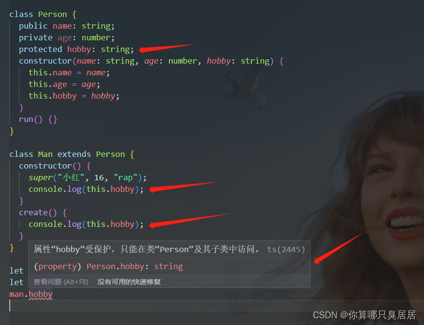

## 1.基础类型

## 2.任意类型

1. top type 顶级类型 any unknown
2. Object
3. Number String Boolean
4. number string boolean
5. 1 true 'qqq'
6. never

unknown 只能赋值给自身 或者是 any  
unknown 没有办法读取任何属性和方法  
unknown 比 any 更加安全

```ts
1.unknown只能赋给自身或者any类型
let a:unknown = 1
let b:any = 2
a = b
b = a
2.unknown没有办法读任何属性 方法也不可以调用
let a:unknown = {name:"chensiyi",fun:()=>{

}}
a.name
a.fun()//报错不会存在
结论unknown类型比any类型更安全如果有一个不确定的类型优先使用unknown
```

## 3.Object object `{}`

```ts
Object所有类型都指向它
let a:Object = 1
let a1:Object = "123"
let a2:Object = true
let a3:Object = () => {
}
let a4:Object = {name:"123"}
object对类型进行一个约束（能够选出引用类型）
let a:object = 1//报错
let a1:object = "123"//报错
let a2:object = true//报错
let a3:object = () =>{}
let a4:object = {}
{} 相当于 new Object 和 Object的区别是里面的属性不能修改（少用）
let a:{} = 1
let a1:{} = "123"
let a2:{} = true
let a3:{} = () => {
}
let a4:{} = {name:"123"}
a4.name = 111//报错
```

## 4.接口和对象类型

interface 属性用来定义对象类型的

```ts
interface As {
  name: string;
  age: number;
}
let a: As = {
  name: 'chensyi',
  age: 123
};
//他们两个要长得相同不能多属性不能少属性
```

### interface 属性重名会重合

```ts
interface As {
  name: string;
  age: number;
}
interface As {
  child: string;
}
let a: As = {
  name: 'chensyi',
  age: 123,
  child: '123'
};
```

### 索引签名(`[propName:string]`)

```ts
interface As {
  name: string;
  age: number;
  [propName: string]: any;
}

let a: As = {
  name: 'chensyi',
  age: 123,
  a: 1,
  age1: undefined
};
```

### ?可选属性

```ts
interface As {
  name: string;
  age?: number; //age属性可以有可以没有
  [propName: string]: any;
}

let a: As = {
  name: 'chensyi',
  a: 1,
  age1: undefined
};
```

### readonly 只读属性

```ts
interface As {
  name: string;
  age?: number;
  readonly id: number; //一般id不能更改
  readonly cb: () => boolean;
  [propName: string]: any;
}

let a: As = {
  id: 1,
  name: 'chensyi',
  a: 1,
  age1: undefined,
  cb: () => {
    return false;
  }
};
a.id = 2; //报错
a.cb = () => {
  return true;
}; //报错
```

### inderface 继承(extends)

```ts
interface As extends Ad {
  name: string;
  age?: number;
  readonly id: number; //一般id不能更改
  readonly cb: () => boolean;
  [propName: string]: any;
}
interface Ad {
  money: number;
}
let a: As = {
  id: 1,
  name: 'chensyi',
  a: 1,
  age1: undefined,
  money: 123, //继承时候相同于合并一起了
  cb: () => {
    return false;
  }
};
```

### 定义函数类型

```ts
interface Fn {
  (name: string): number[]; //函数参数类型string类型返回的是一个数字类型的数组
}
const fn: Fn = function (name: string) {
  return [1];
};
```

## 5. 数组类型

### 普通数组

可以使用两种方法来定义数组的类型

```ts
let arr: number[] = [1, 2, 3, 4, 5];
let arr1: Array<number> = [1, 2, 3, 4, 5]; //使用泛型去约束
```

### 对象数组

```ts
interface A {
  name: string;
  age: number;
}
let arr: A[] = [{ name: '123', age: 123 }];
```

### 二维数组

```ts
let arr1: number[][] = [[1], [2], [3]];
let arr: Array<Array<number>> = [[1], [2], [3]];
```

### 大杂烩数组

```ts
let arr2: any[] = [1, true, '123'];
let arr3: [number, boolean, string] = [1, true, '123'];
```

### 函数里数组如何定义

```ts
function fn(...args: any[]) {
  console.log(args);
}
fn(1, 2, 3);
//结果[1,2,3]
```

### 伪数组

```ts
function fn(...args:any[]){
console.log(arguments);
let a:IArguments = arguments
}
fn(1,2,3)

IArguments 原理
function fn(...args:any[]){
let a:Ag = arguments
}
interface Ag {
callee:Function
length:number
[index:number]:any
}
```

## 6.函数的类型

//普通函数

```ts
function add(a: number, b: number): number {
  return a + b;
}
add(1, 2);

//箭头函数
const arr = (a: number, b: number): number => {
  return a + b;
};
arr(1, 2);
```

### 函数的可选参数

```ts
const fn = (name: string, age?: number): string => {
  return name;
};
fn('玛卡巴卡');
```

### 函数的默认值

```ts
const fn = (name: string = '依古比古', age?: number): string => {
  return name;
};
fn();
```

### 接口定义函数

```ts
//定义参数 num 和 num2  ：后面定义返回值的类型
interface Add {
  (num: number, num2: number): number;
}

const fn: Add = (num: number, num2: number): number => {
  return num + num2;
};
fn(5, 5);

interface User {
  name: string;
  age: number;
}
function getUserInfo(user: User): User {
  return user;
}
```

### 定义函数中 this 的类型

ts 中可以定义 this 的类型，在 js 中无法使用，但必须是第一个参数定义 this 的类型

```ts
interface Obj {
  user: number[];
  add: (this: Obj, num: number) => void;
}

let obj: Obj = {
  user: [1, 2, 3],
  add(this: Obj, num: number) {
    this.user.push(num);
  }
};
obj.add(4);
```

### 定义剩余参数

```ts
const fn = (array: number[], ...items: any[]): any[] => {
  console.log(array, items);
  return items;
};

let a: number[] = [1, 2, 3];

fn(a, '4', '5', '6');
```

### 函数重载

重载只是方法名字相同，而参数不同，返回类型可以相同也可以不相同

如果参数类型不同，则参数类型应设置为 any。

参数数量不同可以将不同的参数设置为可选。

```ts
let user: number[] = [1, 2, 3, 4];
function findNum(add: number[]): number[]; //如果传入的是一个number类型的数组，则做添加
function findNum(id: number): number[]; //如果传入了id就是单个查询
function findNum(): number[]; //如果没有传入东西就是查询全部
function findNum(ids?: number | number[]): number[] {
  if (typeof ids === 'number') {
    return user.filter((v) => v == ids);
  } else if (Array.isArray(ids)) {
    user.push(...ids);
    return user;
  } else {
    return user;
  }
}

findNum(123);
findNum([4, 5, 6]);
```

## 7.联合类型|类型断言|交叉类型

### 联合类型 |

```ts
let phone: number | string = '010-2785463';

//函数使用联合类型
const fn = (a: number | boolean): boolean => {
  return !!a;
};
```

### 交叉类型 &

多种类型的集合，联合对象将具有所联合类型的所有成员。

```ts
interface People {
  name: string;
  age: number;
}

interface Man {
  sex: number;
}

const person = (man: People & Man): void => {
  console.log(man.name);
  console.log(man.age);
  console.log(man.sex);
};

person({ name: '玛卡巴卡', age: 18, sex: 1 });
```

### 类型断言 as

```ts
let fn = function (num: number | string) {
  console.log((num as string).length);
};
fn('1234');
interface A {
  name: string;
}

interface B {
  age: number;
}

let fn = (type: A | B) => {
  console.log((<A>type).name);
  //或者使用以下方法
  console.log((type as A).name);
};

//可以使用类型断言来推断他传入的是A接口的值
```

需要注意的是，类型断言只能够「欺骗」TypeScript 编译器，无法避免运行时的错误，反而滥用类型断言可能会导致运行时错误：

```ts
window.abc = 123(
  //这样写会报错因为window没有abc这个东西
  window as any
).abc = 123;
//可以使用any临时断言在 any 类型的变量上，访问任何属性都是允许的。
```

### as const

是对字面值的断言，与 const 直接定义常量是有区别的。

如果是普通类型跟直接 const 声明是一样的。

```ts
const names = '玛卡巴卡';
names = 'aa'; //无法修改

let names2 = '玛卡巴卡' as const;
names2 = 'aa'; //无法修改
// 数组
let a1 = [10, 20] as const;
const a2 = [10, 20];

a1.unshift(30); // 错误，此时已经断言字面量为[10, 20],数据无法做任何修改
a2.unshift(30); // 通过，没有修改指针
```

### 类型断言不具影响力

将 something 断言为 boolean 虽然可以通过编译，但是并没有什么用 并不会影响结果, 因为编译过程中会删除类型断言。

```ts
function toBoolean(something: any): boolean {
  return something as boolean;
}

toBoolean(1); // 返回值为 1
```

## 8.内置对象&代码雨

JavaScript 中有很多内置对象，它们可以直接在 TypeScript 中当做定义好了的类型。

### ECMAScript 的内置对象

```ts
Number、Date、Boolean、String、RegExp、Error

let num : Number = new Number(1);
let date : Date = new Date();
let b : Boolean = new Boolean(true);
let s : String = new String;
let reg : RegExp = new RegExp(/\w/);
let error : Error = new Error('错误');
let xhr : XMLHttpRequest = new XMLHttpRequest();
```

### DOM 和 BOM 的内置对象

```ts
HTMLElement、NodeList、Document、Event等

//DOM
//HTML（元素名称）Element   HTMLElement
let body : HTMLElement = document.body;

let allDiv:NodeList = document.querySelectorAll('div');
let div = document.querySelector('div');
//还可以有以下写法：
let div1 :NodeListOf<HTMLDivElement | HTMLElement> = document.querySelectorAll('div');
//BOM
let local:Storage = localStorage;
let lo:Location = location;
let promise:Promise<number> = new Promise((r) =>r(1));
promise.then(res=>{
  res.toString
})

let cookie:string = document.cookie;
```

### 代码雨

index.ts

```ts
let canvas: HTMLCanvasElement = document.querySelector('canvas');
let ctx = canvas.getContext('2d');
canvas.width = screen.availWidth;
canvas.height = screen.availHeight;

let str: string[] = 'HHHHHHHHH'.split('');
let Arr = Array(Math.ceil(canvas.width / 10)).fill(0);

//代码雨
const rain = () => {
  ctx.fillStyle = 'rgba(0,0,0,0.05)';
  ctx.fillRect(0, 0, canvas.width, canvas.height);
  ctx.fillStyle = '#0f0';
  Arr.forEach((item, index) => {
    ctx.fillText(
      str[Math.floor(Math.random() * str.length)],
      index * 10,
      item + 10
    );
    Arr[index] =
      item > canvas.height || item > 10000 * Math.random() ? 0 : item + 10;
  });
};
setInterval(rain, 40);
```

index.html

```ts
<!DOCTYPE html>
<html lang="en">
<head>
    <meta charset="UTF-8">
    <meta name="viewport" content="width=device-width, initial-scale=1.0">
    <title>Document</title>
    <style>
     * {
        padding: 0;
        margin:0;
        overflow: hidden;
     }
</style>
</head>
<body>
    <canvas id="canvas"></canvas>
    <script src="./index.js"></script>
</body>

</html>
```

## 9.class

ES6 提供了更接近传统语言的写法，引入了 Class（类）这个概念，作为对象的模板。通过 class 关键字，可以定义类。基本上，ES6 的 Class 可以看作只是一个语法糖，它的决大步风功能，ES5 都可以做到，新的 class 写法只是让对象原型的写法更加清晰、更像面向对象变成的语法而已。

```ts
//定义类
interface Options {
  el: string | HTMLElement;
}
interface VueCls {
  options: Options;
  init(): void;
}
//implements是用来约束class类
class Vue implements VueCls {
  options: Options;
  constructor(option: Options) {
    this.options = option;
  }
  init(): void {}
}
new Vue({
  el: '#app'
});
```

### 1.定义类

在 TypeScript 是不允许直接在 constructor 定义变量的，需要在 constructor 上面先声明。


如果定义了变量不使用，也会报错，通常是给一个默认值或者进行赋值。


### 2.类的修饰符

总共有三个 public 、private、 protected。

public 哪都能用  
private 只能在内部使用  
protected 给子类和内部使用  
readonly 只读，不能修改

#### ① 使用 public 修饰符可以让定义的变量内部访问，也可以外部方位，如果不写，默认就是 public。


#### ② 使用 private 修饰符，代表定义的变量私有的只能在内部访问，不能在外部访问。


#### ③ 使用 protected 修饰符，代表定义的变量私有的只能在内部和继承的子类中访问， 不能在外部访问。




### 3.static 静态属性和静态方法

#### ① 使用 static 定义的属性，不可以通过 this 去访问，只能通过类名去调用。


#### ② static 静态函数同样也是不能通过 this 去调用，也是通过类名去调用。


#### ③ 需注意：如果两个函数都是 static 静态，是可以通过 this 互相调用。


### super 原理

super 可以直接掉父类的方法  
父类的 prototype.constructor.call  
super 可以给父类的 constructor 传参

### 4、interface 定义类

TypeScript 的 interface 定义类，是使用关键字 implements 后面跟 interface 的名字，多个用都好隔开，继承还是使用 extends。

```ts
interface PersonClass {
  get(type: boolean): boolean;
}

interface PersonClass2 {
  set(): void;
  asd: string;
}

class A {
  name: string;
  constructor() {
    this.name = '123';
  }
}

class Person extends A implements PersonClass, PersonClass2 {
  asd: string;
  constructor() {
    super();
    this.asd = '123';
  }
  get(type: boolean) {
    return type;
  }
  set() {}
}
```

### 5、抽象类 abstract

abstract 所定义的抽象类  
abstract 所定义的方法 都只能是一个描述不能是一个实现

如果你写的的类实例化之后毫无用处，此时可以把他定义为抽象类。

或者，也可以把他作为一个基类-> 通过继承一个派生类去实现基类的一些方法。

#### ① 例子一：

```ts
abstract class A {
  public name: string;
}

new A(); //报错：无法创建抽象类实例
```

#### ② 例子二：

在 A 类定义了 getName 抽象方法但未实现。

B 类实现了 A 定义的抽象方法，如果不实现就不报错。

我们定义的抽象方法必须在派生类实现。

```ts
abstract class A {
  name: string;
  constructor(name: string) {
    this.name = name;
  }
  print(): string {
    return this.name;
  }
}

class B extends A {
  constructor() {
    super('打篮球');
  }
  getName(): string {
    return this.name;
  }
}

let b = new B();
console.log(b.getName());
```

## 10.元祖类型

如果需要一个固定大小的不同类型值的集合，需要使用元组。

### 1、元组就是数组的变种

元组与集合的不同之处在于，元组中的元素类型可以是不同的，而且数量固定。

元组的好处在于可以把多个元素作为一个单元传递。如果一个方法需要返回多个值，可以把这多个值作为元组返回，而不需要创建额外的类来表示。

````ts
let arr: [number, string] = [1, "打篮球"];
let arr2: readonly [number, boolean, string, undefined] = [
  1,
  true,
  "打篮球",
  undefined,
];
`
 当赋值或访问一个已知索引的元素时，会得到正确的类型：

```ts
let arr: [number, string] = [1, "打篮球"];
arr[0].length   //报错
arr[1].length   //success

//number是没有length的
````

元组类型还可以支持自定义名称和变为可选的。

```ts
let a: [x: number, y?: boolean] = [1];
```

### 2、越界元素

对于越界元素，他的类型被限制为联合类型（就是你在元组中定义的类型）：


### 3、应用场景

如定义 excel 返回的数据：

```ts
let excel: [string, string, number, string][] = [
  ['title', 'name', 1, '123'],
  ['title', 'name', 1, '123'],
  ['title', 'name', 1, '123'],
  ['title', 'name', 1, '123'],
  ['title', 'name', 1, '123']
];
```
