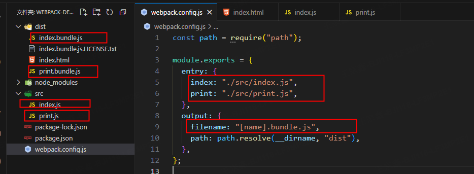
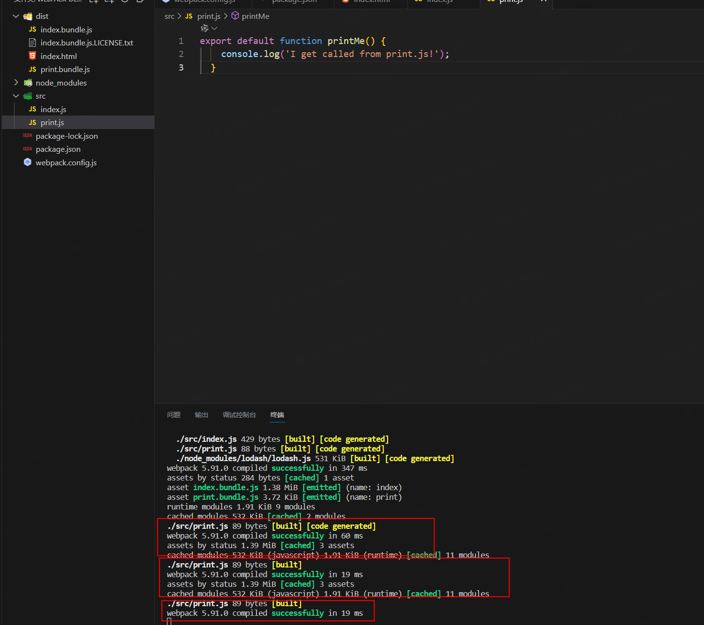
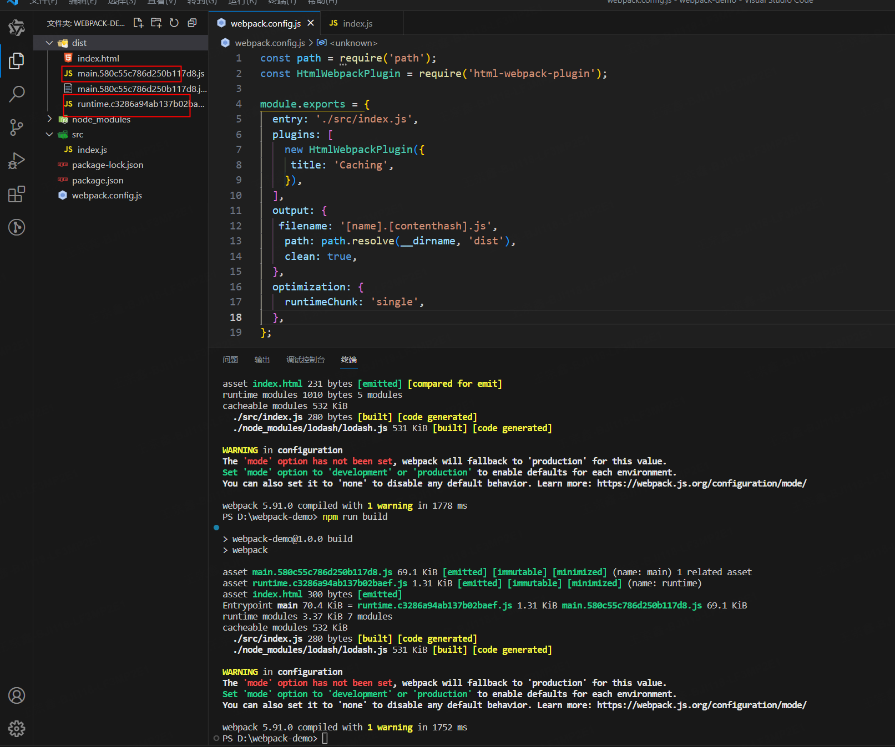

## 管理资源

### 加载 css

关键配置

```javascript
 module: {
    rules: [
      {
        test: /\.css$/i,
        use: ['style-loader', 'css-loader'],
      },
    ],
  },
```

module loader 可以链式调用。链中的每个 loader 都将对资源进行转换，不过链会逆序执行。第一个 loader 将其结果（被转换后的资源）传递给下一个 loader，依此类推。最后，webpack 期望链中的最后的 loader 返回 JavaScript。

请确保 loader 的先后顺序：'style-loader' 在前，而 'css-loader' 在后。如果不遵守此约定，webpack 可能会抛出错误。

打包后的产物


### 加载图像

关键配置

```javascript
  module: {
     rules: [
      {
        test: /\.(png|svg|jpg|jpeg|gif)$/i,
        type: 'asset/resource',
      },
     ],
   },
```

现在 `import XXX from './xxx.png'` 将会处理图像，将其添加到 `output` 目录，并且 `XXX` 变量将包含该图像在处理后的最终的 `url。如前所示，在使用` `css-loader` 时，处理 `CSS` 中的 `url('./xxx.png')` 也会发生类似过程。`loader` 会识别这是一个本地文件，并将 `'./xxx.png'` 路径替换为 `output` 目录中图像的最终路径。而 `html-loader` 也以相同方式处理 ``。

检查此元素将看到实际的文件名已更改为像 `29822eaa871e8eadeaa4.png` 一样的名称。这意味着 `webpack` 在 `src` 文件夹中找到了我们的文件，并对其进行了处理！

打包后的产物


### 加载字体

关键配置

```javascript
module: {
  rules: [
    {
      test: /\.(woff|woff2|eot|ttf|otf)$/i,
      type: "asset/resource",
    },
  ];
}
```

同理处理图像

### 加载数据

[参考文档](https://webpack.docschina.org/guides/asset-management/#loading-data)

## 管理输出

关键配置

```javascript
module.exports = {
  entry: {
    index: "./src/index.js",
    print: "./src/print.js",
  },
  output: {
    filename: "[name].bundle.js",
    path: path.resolve(__dirname, "dist"),
  },
};
```

可以看到，webpack 将会生成 print.bundle.js 与 index.bundle.js 文件，即与在 index.html 文件中指定的文件名称相对应




### HtmlWebpackPlugin

关键配置

```javascript
const path = require("path");
const HtmlWebpackPlugin = require("html-webpack-plugin");

module.exports = {
  entry: {
  plugins: [
    new HtmlWebpackPlugin({
      title: "管理输出",
    }),
  ],
};
```

`HtmlWebpackPlugin` 插件会默认在 `dist` 文件下生成 `index.html` 文件，同时会用新生成的 `index.html` 文件替换原有文件


### 清理 /dist 文件夹

```javascript
const path = require("path");
const HtmlWebpackPlugin = require("html-webpack-plugin");

module.exports = {
  output: {
    clean: true, // 关键配置
  },
};
```

## 开发环境

```javascript
module.exports = {
  mode: "development",
};
```

### source map(源码映射)

当 webpack 打包源代码时，可能会很难追踪到错误和警告在源代码中的原始位置。例如，如果将三个源文件（a.js，b.js 和 c.js）打包到一个 bundle（bundle.js）中，而其中一个源文件包含错误，那么堆栈跟踪就会直接指向到 bundle.js，却无法准确知道错误来自于哪个源文件，所以这种提示通常无法提供太多帮助。

为了更容易地追踪错误与警告在源代码中的原始位置，JavaScript 提供了 source map 功能，可以帮助将编译后的代码映射回原始源代码。source map 会直接告诉开发者错误来源于哪一个源代码。

source map 有许多 [可用选项](https://webpack.docschina.org/configuration/devtool/)，请务必仔细阅读它们，以便根据需要进行配置。

本指南将使用有助于解释说明示例意图的 inline-source-map 选项（不要在生产环境中使用它）：

```javascript
const path = require("path");
const HtmlWebpackPlugin = require("html-webpack-plugin");

module.exports = {
  devtool: "inline-source-map", // 关键代码
};
```


### 选择一个开发工具

1. webpack 的 观察模式
2. webpack-dev-server
3. webpack-dev-middleware

在多数场景中可能会使用 webpack-dev-server

### watch

可以指示 webpack “观察”依赖图中所有文件的更改。如果其中一个文件被更新，代码将被自动重新编译，所以不必再去手动运行整个构建。

像下面这样添加一个用于启动 webpack 观察模式的 npm scripts：

package.json

```javascript
 {
   "scripts": {
    "watch": "webpack --watch", // 关键命令
   },
 }
```

在命令行中运行 npm run watch，然后就会看到 webpack 是如何编译代码的。 编译完成后会发现它并没有退出命令行，这是因为该脚本当前还在观察你的文件。

**观察模式唯一的缺点是需要手动刷新浏览器才能看到修改后的实际效果。实现 webpack-dev-server 将能够自动刷新浏览器**



### webpack-dev-server

webpack-dev-server 提供了一个能够实时重新加载的基本的 web server。安装依赖如下：

`npm install --save-dev webpack-dev-server`

接下来修改配置文件，告诉 dev server 应从什么位置开始查找文件：

```javascript
const path = require("path");
const HtmlWebpackPlugin = require("html-webpack-plugin");

module.exports = {
  mode: "development",
  entry: {
    index: "./src/index.js",
    print: "./src/print.js",
  },
  devtool: "inline-source-map",
  devServer: {
    static: "./dist",
  },
  plugins: [
    new HtmlWebpackPlugin({
      title: "Development",
    }),
  ],
  output: {
    filename: "[name].bundle.js",
    path: path.resolve(__dirname, "dist"),
    clean: true,
  },
};
```

以上配置告知 webpack-dev-server 将 dist 目录下的文件作为可访问资源部署在 localhost:8080。。

**提示**

webpack-dev-server 会将在 output.path 中定义的目录中的 bundle 文件作为可访问资源部署在 server 中，即文件可以通过 http://[devServer.host]:[devServer.port]/[output.publicPath]/[output.filename] 进行访问。

**警告**

**webpack-dev-server 在编译之后不会写入任何输出文件，而是将 bundle 文件保留在内存中，然后将它们作为可访问资源部署在 server 中，就像是挂载在 server 根路径上的真实文件一样。如果页面希望在不同路径中找到 bundle 文件，可以修改 dev server 配置中的 devMiddleware.publicPath 选项。**

添加一个可以直接运行 dev server 的 script：

package.json

```javascript
 {
   "scripts": {
    "start": "webpack serve --open",
   }
 }
```

现在，在命令行中运行 npm start，会看到浏览器自动加载页面。更改任何源文件并保存它们，web server 将在编译代码后自动重新加载。试试看！

webpack-dev-server 具有许多可配置的选项。参阅 [配置文档](https://webpack.docschina.org/configuration/dev-server) 以了解更多配置选项。


### webpack-dev-middleware

[查看文档](https://webpack.docschina.org/guides/development/#using-webpack-dev-middleware)

## 代码分离

代码分离是 webpack 中最引人注目的特性之一。此特性能够把代码分离到不同的 bundle 中，然后便能按需加载或并行加载这些文件。代码分离可以用于获取更小的 bundle、控制资源加载优先级，如果使用合理，会极大减小加载时间。

常用的代码分离方法有三种：

1. 入口起点：使用 entry 配置手动地分离代码。
2. 防止重复：使用 入口依赖 或者 SplitChunksPlugin 去重和分离 chunk。
3. 动态导入：通过模块的内联函数调用分离代码。

正如前面所提及，这种方式存在一些隐患：

如果入口 chunk 之间包含一些重复的模块，那么这些重复模块会被引入到各个 bundle 中。

这种方法不够灵活，并且不能动态地拆分应用程序逻辑中的核心代码。

以上两点中，第一点所对应的问题已经在我们上面的实例中体现出来了。除了 ./src/another-module.js，我们也曾在 ./src/index.js 中引入过 lodash，这就导致了重复引用。下一章节会介绍如何移除重复的模块。

### 防止重复

##### 入口依赖

在配置文件中配置 dependOn 选项，以在多个 chunk 之间共享模块：

如果想要在一个 HTML 页面上使用多个入口起点，还需设置 optimization.runtimeChunk: 'single'，否则会遇到 此处（查看文档） 所述的麻烦。

```javascript
const path = require("path");

module.exports = {
  mode: "development",
  entry: {
    index: {
      import: "./src/index.js",
      dependOn: "shared",
    },
    another: {
      import: "./src/another-module.js",
      dependOn: "shared",
    },
    shared: "lodash",
  },
  output: {
    filename: "[name].bundle.js",
    path: path.resolve(__dirname, "dist"),
  },
  optimization: {
    runtimeChunk: "single",
  },
};
```


可以看到，除了 shared.bundle.js，index.bundle.js 和 another.bundle.js 之外，还生成了一个 runtime.bundle.js 文件。

尽管 webpack 允许每个页面使用多个入口起点，但在可能的情况下，应该避免使用多个入口起点，而使用具有多个导入的单个入口起点：`entry: { page: ['./analytics', './app'] }`。这样可以获得更好的优化效果，并在使用异步脚本标签时保证执行顺序一致。

#### SplitChunksPlugin

SplitChunksPlugin 插件可以将公共的依赖模块提取到已有的入口 chunk 中，或者提取到一个新生成的 chunk。让我们使用这个插件去除之前示例中重复的 lodash 模块：

```javascript
const path = require("path");

module.exports = {
  mode: "development",
  entry: {
    index: "./src/index.js",
    another: "./src/another-module.js",
  },
  output: {
    filename: "[name].bundle.js",
    path: path.resolve(__dirname, "dist"),
  },
  optimization: {
    splitChunks: {
      chunks: "all",
    },
  },
};
```

使用 optimization.splitChunks 配置选项后构建，将会发现 index.bundle.js 和 another.bundle.js 已经移除了重复的依赖模块。从插件将 lodash 分离到单独的 chunk，并且将其从 main bundle 中移除，减轻了 bundle 大小。执行 npm run build 查看效果

### 动态导入

[查看文档](https://webpack.docschina.org/guides/code-splitting/#dynamic-imports)

### 预获取/预加载模块

[查看文档](https://webpack.docschina.org/guides/code-splitting/#prefetchingpreloading-modules)

## 缓存

webpack 会在打包后生成可部署的 /dist 目录，并将打包后的内容放在此目录。一旦 /dist 目录中的内容部署到服务器上，客户端（通常是浏览器）就能够访问此服务器以获取站点及其资源。由于获取服务器资源是比较耗费时间的操作，因此浏览器使用了一种名为 缓存 的技术。命中缓存可以降低网络流量，使网站加载速度更快。然而，如果在部署资源的最新版本时没有更改资源的文件名，浏览器可能会认为它没有被更新，从而使用它的缓存版本。由于缓存的存在，当需要获取新的代码时，就会显得很棘手。

这篇指南的重点在于通过必要配置确保 webpack 编译生成的文件能够被客户端缓存；当文件内容变化后，客户端又能够请求到新的文件。

### 输出文件的文件名

更改 output.filename 中的 substitutions 以定义输出文件的名称。webpack 提供了一种称为 可替换模板字符串（substitution） 的方式，通过带括号字符串来模板化文件名。其中，[contenthash] 将根据资源内容创建唯一哈希值。当资源内容发生变化时，[contenthash] 也会发生变化。

```javascript
const path = require("path");
const HtmlWebpackPlugin = require("html-webpack-plugin");

module.exports = {
  entry: "./src/index.js",
  plugins: [
    new HtmlWebpackPlugin({
      title: "Caching",
    }),
  ],
  output: {
    filename: "[name].[contenthash].js",
    path: path.resolve(__dirname, "dist"),
    clean: true,
  },
};
```


文件内容发生改变，哈希值就会改变

### 提取引导模板

正如在 代码分离 中所学到的，SplitChunksPlugin 插件可以用于将模块分离到单独的 bundle 中。webpack 还提供了一个优化功能，可以使用 optimization.runtimeChunk 选项将 runtime 代码拆分为一个单独的 chunk。将其设置为 single 以便为所有 chunk 创建一个 runtime bundle：

webpack.config.js

```javascript
const path = require("path");
const HtmlWebpackPlugin = require("html-webpack-plugin");

module.exports = {
  entry: "./src/index.js",
  plugins: [
    new HtmlWebpackPlugin({
      title: "Caching",
    }),
  ],
  output: {
    filename: "[name].[contenthash].js",
    path: path.resolve(__dirname, "dist"),
    clean: true,
  },
  optimization: {
    runtimeChunk: "single",
  },
};
```


更改配置后再次构建，查看提取出来的 runtime bundle：

```javascript

```

由于像 lodash 或 react 这样的第三方库很少像本地源代码一样频繁修改，因此通常推荐将第三方库提取到单独的 vendor chunk 中。这一步将减少客户端对服务器的请求，同时保证自身代码与服务器一致。可以通过使用 SplitChunksPlugin 示例 2 中演示的 SplitChunksPlugin 插件的 cacheGroups 选项来实现。试试在 optimization.splitChunks 添加如下 cacheGroups 参数并执行构建：

```javascript
const path = require("path");
const HtmlWebpackPlugin = require("html-webpack-plugin");

module.exports = {
  entry: "./src/index.js",
  plugins: [
    new HtmlWebpackPlugin({
      title: "Caching",
    }),
  ],
  output: {
    filename: "[name].[contenthash].js",
    path: path.resolve(__dirname, "dist"),
    clean: true,
  },
  optimization: {
    runtimeChunk: "single",
    splitChunks: {
      cacheGroups: {
        vendor: {
          test: /[\\/]node_modules[\\/]/,
          name: "vendors",
          chunks: "all",
        },
      },
    },
  },
};
```

再次构建，然后查看新的 vendor bundle：


现在，可以看到 main 不再含有来自 node_modules 目录的 vendor 代码，并且体积减少

### 模块标识符

[查看文档](https://webpack.docschina.org/guides/caching/#module-identifiers)

## 创建库

除了打包应用程序，webpack 还可以打包 JavaScript 库

[查看文档](https://webpack.docschina.org/guides/author-libraries/)

## 环境变量

想要消除 webpack.config.js 在 开发环境 和 生产环境 之间的差异，你可能需要环境变量

webpack 命令行 环境配置 的 --env 参数，可以允许你传入任意数量的环境变量。而在 webpack.config.js 中可以访问到这些环境变量例如，`--env production` 或 `--env goal=local`。

`npx webpack --env goal=local --env production --progress`

对于我们的 webpack 配置，有一个必须要修改之处。通常，module.exports 指向配置对象。要使用 env 变量，你必须将 module.exports 转换成一个函数：

webpack.config.js

```javascript
const path = require("path");

module.exports = (env) => {
  // Use env.<YOUR VARIABLE> here:
  console.log("Goal: ", env.goal); // 'local'
  console.log("Production: ", env.production); // true

  return {
    entry: "./src/index.js",
    output: {
      filename: "bundle.js",
      path: path.resolve(__dirname, "dist"),
    },
  };
};
```

## 构建性能

[查看文档](https://webpack.docschina.org/guides/build-performance/)

## 模块热替换（HMR）

HMR 不适用于生产环境，而应当用于开发环境