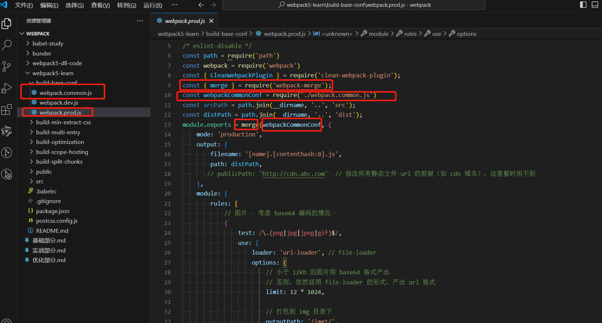
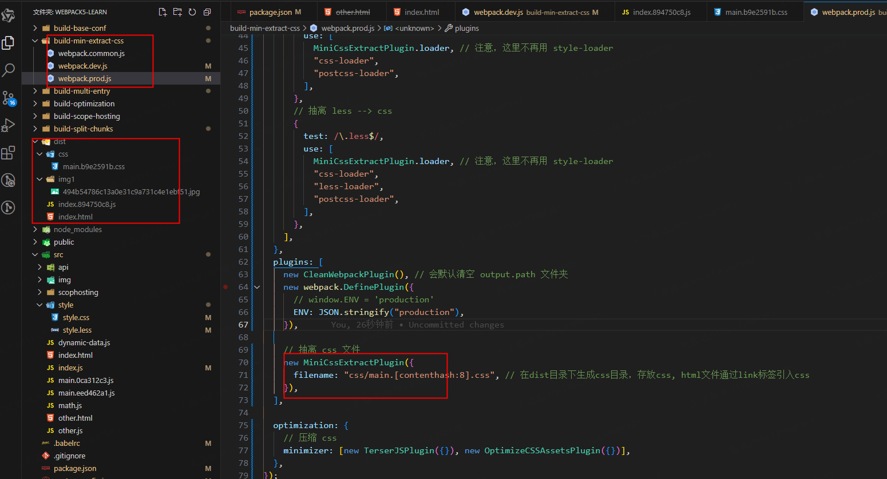
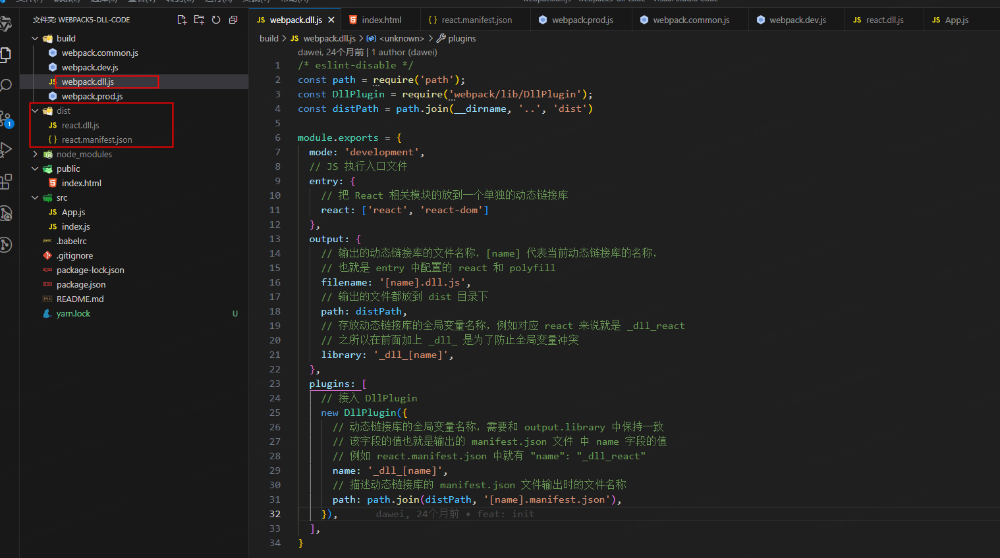
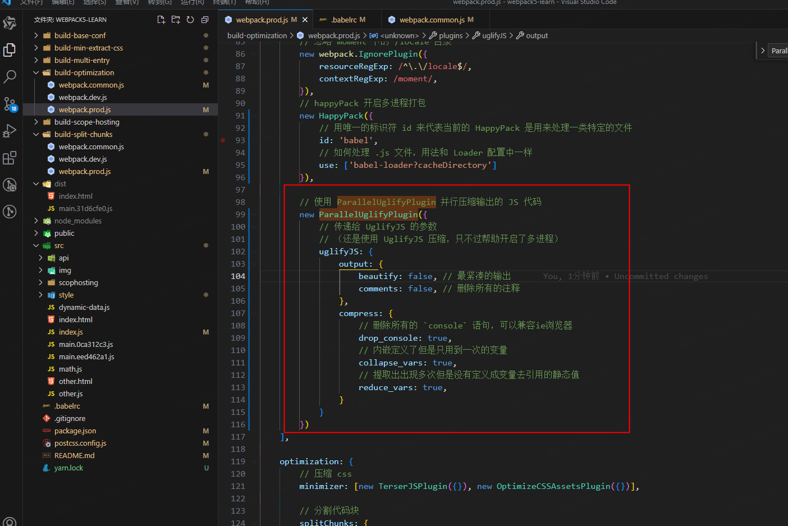

https://webpack.wuhaolin.cn/4%E4%BC%98%E5%8C%96/4-10%E4%BD%BF%E7%94%A8TreeShaking.html?q=

## webpack 五个核心概念

Webpack 是一个模块打包器(bundler)。  
在 Webpack 看来, 前端的所有资源文件(js/json/css/img/less/…)都会作为模块处理  
它将根据模块的依赖关系进行静态分析，生成对应的静态资源

- **Entry：** 入口起点(entry point)指示 webpack 应该使用哪个模块，来作为构建其内部依赖图的开始。
- **Output：** output 属性告诉 webpack 在哪里输出它所创建的 bundles，以及如何命名这些文件，默认值为 ./dist。
- **Loader：** loader 让 webpack 能够去处理那些非 JavaScript 文件（webpack 自身只能解析 JavaScript）。
- **Plugins：** 插件则可以用于执行范围更广的任务。插件的范围包括，从打包优化和压缩，一直到重新定义环境中的变量等。
- **Mode：** 模式，有生产模式 production 和开发模式 development

##### 理解 Loader

Webpack 本身只能加载 JS/JSON 模块，如果要加载其他类型的文件(模块)，就需要使用对应的 loader 进行转换/加载  
Loader 本身也是运行在 node.js 环境中的 JavaScript 模块  
它本身是一个函数，接受源文件作为参数，返回转换的结果  
loader 一般以 xxx-loader 的方式命名，xxx 代表了这个 loader 要做的转换功能，比如 json-loader。

#### 理解 Plugins

插件可以完成一些 loader 不能完成的功能。  
插件的使用一般是在 webpack 的配置信息 plugins 选项中指定。

## webpack 基本配置

### 拆分配置和 merge

> webpack.common.js(公共配置)  
> webpack.dev.js(开发环境配置)  
> webpack.prod.js(生产环境配置)  
> webpack.common.js 文件将生产环境和开发环境公有的配置都提取出来公用  
> 开发环境和生产环境使用'webpack-merge'中的 merge 合并公有配置
> 

### 启动本地服务(webpack-dev-server)

> 在开发环境中使用 webpack-dev-server

#### devServer 常用配置

```javascript
module.exports = {
  devServer: {
    open: true, // 自动打开浏览器
    compress: true, // 启动gzip压缩
    port: 3000, // 端口号
    hot: true, // 开启热模替换功能 HMR
    proxy: {
      // 代理
      '/api': {
        target: 'http://localhost:3000',
        changeOrigin: true,
        pathRewrite: { '^/api': '' } // 如果不希望传递/api，则需要重写路径：
      }
    }
    // 现在，对 /api/users 的请求会将请求代理到 http://localhost:3000/api/users
  }
};
```

devServer.proxy 代理功能，其底层依赖于 http-proxy-middleware 软件包。所以如果需要设置更多的代理服务配置，可以借鉴参考 http-proxy-middleware 配置文档说明。

http-proxy-middleware 本质上是一个 Node.js 的中间件库，用于在 Express、Koa 或任何基于 Node.js 的 HTTP 服务器上代理 HTTP 请求。

http-proxy-middleware 可以方便地配置代理规则，支持按路径、按域名、按请求头等进行匹配和过滤，也可以对请求和响应进行修改。通过这种方式，它可以实现反向代理、请求转发、API 接口代理等功能。

```js
  // 启动本地服务
  devServer: {
    port: 8080, // 端口号
    open: true, // 自动打开浏览器
    client: {
      progress: true // 打包进度
    },
    compress: true, // 启动 gzip 压缩
    // 设置代理
    proxy: {
      // 将本地 /api/xxx 代理到 localhost:9000/api/xxx
      '/api': 'http://localhost:9000',

      // 将本地 /api2/xxx 代理到 localhost:9000/xxx
      '/api2': {
        target: 'http://localhost:9000',
        pathRewrite: {
          '/api2': ''
        }
      }
    }
  }
```


### 处理 ES6(babel-loader)

> babel-loader  
> .babelrc 文件  
> 把 es6,7,8.....转换成浏览器能够运行的 es5 版本

```js
rules: [
  {
    test: /\.js$/,
    use: [
      {
        loader: 'babel-loader'
      }
    ],
    include: srcPath, // 处理的目录
    exclude: /node_modules/ // 排除
  }
];
```

.babelrc 文件

```json
{
  "presets": ["@babel/preset-env"], // 会把es6,7,8.....转换成浏览器能够运行的es5版本
  "plugins": []
}
```


### 处理样式(style-loader,css-loader,postcss-loader)

loader 的执行顺序是：从后往前

> style-loader,css-loader,postcss-loader  
> postcss-loader 解决浏览器兼容性  
> postcss.config.js  
> package.json 中添加配置

```js
   module:{
    rules: [

      // 处理css
      {
        test: /\.css$/,
        // loader 的执行顺序是：从后往前
        // 加了 postcss  需要配置postcss.config.js，
        // /* eslint-disable */
        // module.exports = {
        //   plugins: [
        //       require('postcss-preset-env') // 预设包含了浏览器兼容性
        //   ]
        // }
        // 同时需要在package.json中添加
        // "browserslist": {
        //   "development": [
        //     "last 1 chrome version",
        //     "last 1 firefox version",
        //     "last 1 safari version"
        //   ],
        //   "production": [
        //     ">0.2%",
        //     "not dead",
        //     "not op_mini all"
        //   ]
        // }
        use: ['style-loader', 'css-loader', 'postcss-loader']
      },
      {
        test: /\.less$/i,
        use: [
          // compiles Less to CSS
          'style-loader',
          'css-loader',
          'less-loader'
        ]
      }
    ]
  },
```

postcss.config.js

```js
module.exports = {
  plugins: [
    require('postcss-preset-env') // 预设包含了浏览器兼容性
  ]
};
```

在 package.json 中添加

```json
         "browserslist": {
           "development": [
             "last 1 chrome version",
             "last 1 firefox version",
             "last 1 safari version"
           ],
           "production": [
             ">0.2%",
             "not dead",
             "not op_mini all"
           ]
         }
```


### 处理图片(url-loader)

> file-loader  
> url-loader  
> 配置 limit 将小文件转换成 base64，可以减少一次 http 网络请求  
> outputPath 图片输出目录

```js
  module: {
    rules: [
      // 图片 - 考虑 base64 编码的情况
      {
        test: /\.(png|jpg|jpeg|gif)$/,
        use: {
          loader: 'url-loader', // file-loader
          options: {
            // 小于 12kb 的图片用 base64 格式产出，可以减少一次http的网络请求
            // 否则，依然延用 file-loader 的形式，产出 url 格式
            limit: 12 * 1024,

            // 打包到 img 目录下
            outputPath: '/img1/'

            // 设置图片的 cdn 地址（也可以统一在外面的 output 中设置，那将作用于所有静态资源）
            // publicPath: 'http://cdn.baidu.com'
          }
        }
      }
    ]
  },
```


### 模块化（contenthash）

> contenthash 的使用  
> 截取 8 个字符，如果文件内容不变，contenthash 就不变，  
> 这里有个好处是如果 contenthash 变了，说明内容变了，就不走缓存，直接从服务端获取数据，  
>  如果 contenthash 不变，说明内容不变，就走本地的缓存，这样可以提高访问的速度，可以提升性能

```js
output: {
    filename: '[name].[contenthash:8].js',
    path: distPath
    // publicPath: 'http://cdn.abc.com'  // 修改所有静态文件 url 的前缀（如 cdn 域名），这里暂时用不到
  },
```


### ------

### webpack.common.js

```javascript
/* eslint-disable */
// webpack.common.js文件将生产环境和开发环境公有的配置都提取出来公用
// 开发环境和生产环境使用'webpack-merge'中的merge合并公有配置
const path = require('path');
const HtmlWebpackPlugin = require('html-webpack-plugin');
const srcPath = path.join(__dirname, '..', 'src');
const distPath = path.join(__dirname, '..', 'dist');
module.exports = {
  entry: path.join(srcPath, 'index'),
  module: {
    rules: [
      // babel-loader处理es6，需要安装
      // 还需要新建.babelrc文件
      //   {
      //     "presets": ["@babel/preset-env"], // 会把es6,7,8.....转换成浏览器能够运行的es5版本
      //     "plugins": []
      // }
      {
        test: /\.js$/,
        use: [
          {
            loader: 'babel-loader'
          }
        ],
        include: srcPath, // 处理的目录
        exclude: /node_modules/ // 排除
      },

      // 处理css
      {
        test: /\.css$/,
        // loader 的执行顺序是：从后往前
        // 加了 postcss  需要配置postcss.config.js，
        // /* eslint-disable */
        // module.exports = {
        //   plugins: [
        //       require('postcss-preset-env') // 预设包含了浏览器兼容性
        //   ]
        // }
        // 同时需要在package.json中添加
        // "browserslist": {
        //   "development": [
        //     "last 1 chrome version",
        //     "last 1 firefox version",
        //     "last 1 safari version"
        //   ],
        //   "production": [
        //     ">0.2%",
        //     "not dead",
        //     "not op_mini all"
        //   ]
        // }
        use: ['style-loader', 'css-loader', 'postcss-loader']
      },
      {
        test: /\.less$/i,
        use: [
          // compiles Less to CSS
          'style-loader',
          'css-loader',
          'less-loader'
        ]
      }
    ]
  },
  plugins: [
    new HtmlWebpackPlugin({
      template: path.join(srcPath, 'index.html'),
      title: 'webpack5-demo',
      filename: 'index.html'
    })
  ]
};
```

### webpack.dev.js

```javascript
const path = require('path');
const webpack = require('webpack');
const webpackCommonConf = require('./webpack.common.js');
/* eslint-disable */
const { merge } = require('webpack-merge');
const srcPath = path.join(__dirname, '..', 'src');
const distPath = path.join(__dirname, '..', 'dist');
module.exports = merge(webpackCommonConf, {
  mode: 'development',
  module: {
    rules: [
      // 直接引入图片 url
      {
        test: /\.(png|jpg|jpeg|gif)$/,
        use: 'file-loader'
      }
    ]
  },
  plugins: [
    new webpack.DefinePlugin({
      // window.ENV = 'development'
      ENV: JSON.stringify('development')
    })
  ],
  // devServer: {
  //     static: {
  //       directory: path.join(__dirname, 'public'),
  //     },
  //     compress: true,
  //     port: 9000,
  // },

  // 启动本地服务
  devServer: {
    port: 8080, // 端口号
    open: true, // 自动打开浏览器
    client: {
      progress: true // 打包进度
    },
    compress: true, // 启动 gzip 压缩
    // 设置代理
    proxy: {
      // 将本地 /api/xxx 代理到 localhost:9000/api/xxx
      '/api': 'http://localhost:9000',

      // 将本地 /api2/xxx 代理到 localhost:9000/xxx
      '/api2': {
        target: 'http://localhost:9000',
        pathRewrite: {
          '/api2': ''
        }
      }
    }
  }
});
```

### webpack.prod.js

```javascript
/* eslint-disable */
const path = require('path');
const webpack = require('webpack');
const { CleanWebpackPlugin } = require('clean-webpack-plugin');
const { merge } = require('webpack-merge');
const webpackCommonConf = require('./webpack.common.js');
const srcPath = path.join(__dirname, '..', 'src');
const distPath = path.join(__dirname, '..', 'dist');
module.exports = merge(webpackCommonConf, {
  mode: 'production',
  output: {
    // 截取8个字符，如果文件内容不变，contenthash就不变，
    // 这里有个好处是如果contenthash变了，说明内容变了，就不走缓存，直接从服务端获取数据，
    // 如果contenthash不变，说明内容不变，就走本地的缓存，这样可以提高访问的速度，可以提升性能
    filename: '[name].[contenthash:8].js',
    path: distPath
    // publicPath: 'http://cdn.abc.com'  // 修改所有静态文件 url 的前缀（如 cdn 域名），这里暂时用不到
  },
  module: {
    rules: [
      // 图片 - 考虑 base64 编码的情况
      {
        test: /\.(png|jpg|jpeg|gif)$/,
        use: {
          loader: 'url-loader', // file-loader
          options: {
            // 小于 12kb 的图片用 base64 格式产出，可以减少一次http的网络请求
            // 否则，依然延用 file-loader 的形式，产出 url 格式
            limit: 12 * 1024,

            // 打包到 img 目录下
            outputPath: '/img1/'

            // 设置图片的 cdn 地址（也可以统一在外面的 output 中设置，那将作用于所有静态资源）
            // publicPath: 'http://cdn.baidu.com'
          }
        }
      }
    ]
  },
  plugins: [
    new CleanWebpackPlugin(), // 会默认清空 output.path 文件夹
    new webpack.DefinePlugin({
      // window.ENV = 'production'
      ENV: JSON.stringify('production')
    })
  ]
});
```

## webpack 高级配置

### 多入口

> entry 中配置多个入口

```js
entry: {
  index: path.join(srcPath, 'index.js'),
  other: path.join(srcPath, 'other.js')
},
```

> plugins 中配置多个 HtmlWebpackPlugin

```js
plugins: [
  // new HtmlWebpackPlugin({
  //     template: path.join(srcPath, 'index.html'),
  //     filename: 'index.html'
  // })

  // 多入口 - 生成 index.html
  new HtmlWebpackPlugin({
    template: path.join(srcPath, 'index.html'),
    filename: 'index.html',
    // chunks 表示该页面要引用哪些 chunk （即上面的 index 和 other），默认全部引用
    chunks: ['index'] // 只引用 index.js
  }),
  // 多入口 - 生成 other.html
  new HtmlWebpackPlugin({
    template: path.join(srcPath, 'other.html'),
    filename: 'other.html',
    chunks: ['other'] // 只引用 other.js
  })
];
```

> output 中 配置`filename: "[name].[contenthash:8].js"`,

```js
  output: {
   filename: '[name].[contenthash:8].js', // name 即多入口时 entry 的 key
   path: distPath
   // publicPath: 'http://cdn.test.com'  // 修改所有静态文件 url 的前缀（如 cdn 域名），这里暂时用不到
 },
```

> `mode: 'production'`, // 生产环境默认会把打包后的 html 文件压缩，格式不好看  
> `mode: "development"`, // 开发环境不会进行压缩

#### CleanWebpackPlugin

> `new CleanWebpackPlugin()`, // 会默认清空 output.path 文件夹

#### webpack.common.js

```javascript
/* eslint-disable */
const path = require('path');
const HtmlWebpackPlugin = require('html-webpack-plugin');
const srcPath = path.join(__dirname, '..', 'src');
const distPath = path.join(__dirname, '..', 'dist');

module.exports = {
  // 多入口
  entry: {
    index: path.join(srcPath, 'index.js'),
    other: path.join(srcPath, 'other.js')
  },
  module: {
    rules: [
      {
        test: /\.js$/,
        use: ['babel-loader'],
        include: srcPath,
        exclude: /node_modules/
      },
      // {
      //     test: /\.css$/,
      //     // loader 的执行顺序是：从后往前
      //     loader: ['style-loader', 'css-loader']
      // },
      {
        test: /\.css$/,
        // loader 的执行顺序是：从后往前
        use: ['style-loader', 'css-loader', 'postcss-loader'] // 加了 postcss
      },
      {
        test: /\.less$/,
        // 增加 'less-loader' ，注意顺序
        use: ['style-loader', 'css-loader', 'less-loader']
      }
    ]
  },
  plugins: [
    // new HtmlWebpackPlugin({
    //     template: path.join(srcPath, 'index.html'),
    //     filename: 'index.html'
    // })

    // 多入口 - 生成 index.html
    new HtmlWebpackPlugin({
      template: path.join(srcPath, 'index.html'),
      filename: 'index.html',
      // chunks 表示该页面要引用哪些 chunk （即上面的 index 和 other），默认全部引用
      chunks: ['index'] // 只引用 index.js
    }),
    // 多入口 - 生成 other.html
    new HtmlWebpackPlugin({
      template: path.join(srcPath, 'other.html'),
      filename: 'other.html',
      chunks: ['other'] // 只引用 other.js
    })
  ]
};
```

#### webpack.dev.js

```javascript
/* eslint-disable */
const path = require('path');
const webpack = require('webpack');
const webpackCommonConf = require('./webpack.common.js');
const { merge } = require('webpack-merge');
const srcPath = path.join(__dirname, '..', 'src');
const distPath = path.join(__dirname, '..', 'dist');
module.exports = merge(webpackCommonConf, {
  mode: 'development',
  module: {
    rules: [
      // 直接引入图片 url
      {
        test: /\.(png|jpg|jpeg|gif)$/,
        use: 'file-loader'
      }
    ]
  },
  plugins: [
    new webpack.DefinePlugin({
      // window.ENV = 'production'
      ENV: JSON.stringify('development')
    })
  ],
  devServer: {
    port: 8080,
    open: true, // 自动打开浏览器
    client: {
      progress: true
    },
    compress: true, // 启动 gzip 压缩
    // 设置代理
    proxy: {
      // 将本地 /api/xxx 代理到 localhost:3000/api/xxx
      '/api': 'http://localhost:3000',

      // 将本地 /api2/xxx 代理到 localhost:3000/xxx
      '/api2': {
        target: 'http://localhost:3000',
        pathRewrite: {
          '/api2': ''
        }
      }
    }
  }
});
```

#### webpack.prod.js

```javascript
/* eslint-disable */
const path = require('path');
const webpack = require('webpack');
const { CleanWebpackPlugin } = require('clean-webpack-plugin');
const webpackCommonConf = require('./webpack.common.js');
const { merge } = require('webpack-merge');
const srcPath = path.join(__dirname, '..', 'src');
const distPath = path.join(__dirname, '..', 'dist');

module.exports = merge(webpackCommonConf, {
  // mode: 'production', // 生产环境默认会把打包后的html文件压缩，格式不好看
  mode: 'development', // 开发环境不会进行压缩
  output: {
    filename: '[name].[contenthash:8].js', // name 即多入口时 entry 的 key
    path: distPath
    // publicPath: 'http://cdn.test.com'  // 修改所有静态文件 url 的前缀（如 cdn 域名），这里暂时用不到
  },
  module: {
    rules: [
      // 图片 - 考虑 base64 编码的情况
      {
        test: /\.(png|jpg|jpeg|gif)$/,
        use: {
          loader: 'url-loader',
          options: {
            // 小于 5kb 的图片用 base64 格式产出
            // 否则，依然延用 file-loader 的形式，产出 url 格式
            limit: 5 * 1024,

            // 打包到 img 目录下
            outputPath: '/img1/'

            // 设置图片的 cdn 地址（也可以统一在外面的 output 中设置，那将作用于所有静态资源）
            // publicPath: 'http://cdn.baidu.com'
          }
        }
      }
    ]
  },
  plugins: [
    new CleanWebpackPlugin(), // 会默认清空 output.path 文件夹
    new webpack.DefinePlugin({
      // window.ENV = 'production'
      ENV: JSON.stringify('production')
    })
  ]
});
```


### 抽离 css(MiniCssExtractPlugin)

> **问题**
> 使用 `style-loader`,会把 `css` 和 `js` 打包到一个 `js` 文件夹中  
> 开发环境可以这样配置，生产环境不建议  
> 使用`MiniCssExtractPlugin.loader`代替`style-loader`

```js
module: {
  rules: [
    // 抽离 css
    {
      test: /\.css$/,
      use: [
        MiniCssExtractPlugin.loader, // 注意，这里不再用 style-loader
        'css-loader',
        'postcss-loader'
      ]
    },
    // 抽离 less --> css
    {
      test: /\.less$/,
      use: [
        MiniCssExtractPlugin.loader, // 注意，这里不再用 style-loader
        'css-loader',
        'less-loader',
        'postcss-loader'
      ]
    }
  ];
}
```

> 使用**MiniCssExtractPlugin**抽离 css

```js
module:{
  plugins: [

    // 抽离 css 文件
    new MiniCssExtractPlugin({
      filename: 'css/main.[contenthash:8].css' // 在dist目录下生成css目录，存放css, html文件通过link标签引入css
    })
  ],
}
```

> **OptimizeCSSAssetsPlugin**压缩 css

```js
optimization: {
  // 压缩 css
  minimizer: [new TerserJSPlugin({}), new OptimizeCSSAssetsPlugin({})];
}
```

> `mode: 'production'`, 生产环境默认会对 css 进行压缩  
> `mode: "development"`, 开发环境不会  
> `style-loader`会把 css 插入到 dom 中`<style></style>`

#### webpack.common.js

```javascript
/* eslint-disable */
const path = require('path');
const HtmlWebpackPlugin = require('html-webpack-plugin');
const srcPath = path.join(__dirname, '..', 'src');
const distPath = path.join(__dirname, '..', 'dist');
module.exports = {
  entry: {
    index: path.join(srcPath, 'index.js')
    // other: path.join(srcPath, 'other.js')
  },
  module: {
    rules: [
      {
        test: /\.js$/,
        use: ['babel-loader'],
        include: srcPath,
        exclude: /node_modules/
      }
      // css
    ]
  },
  plugins: [
    // 多入口 - 生成 index.html
    new HtmlWebpackPlugin({
      template: path.join(srcPath, 'index.html'),
      filename: 'index.html',
      // chunks 表示该页面要引用哪些 chunk （即上面的 index 和 other），默认全部引用
      chunks: ['index'] // 只引用 index.js
    })
    // 多入口 - 生成 other.html
    // new HtmlWebpackPlugin({
    //     template: path.join(srcPath, 'other.html'),
    //     filename: 'other.html',
    //     chunks: ['other']  // 只引用 other.js
    // })
  ]
};
```

#### webpack.dev.js

```javascript
/* eslint-disable */
const path = require('path');
const webpack = require('webpack');
const webpackCommonConf = require('./webpack.common.js');
const { merge } = require('webpack-merge');
const srcPath = path.join(__dirname, '..', 'src');
const distPath = path.join(__dirname, '..', 'dist');
module.exports = merge(webpackCommonConf, {
  mode: 'development',
  module: {
    rules: [
      // 直接引入图片 url
      {
        test: /\.(png|jpg|jpeg|gif)$/,
        use: 'file-loader'
      },
      // {
      //     test: /\.css$/,
      //     // loader 的执行顺序是：从后往前
      //     loader: ['style-loader', 'css-loader']
      // },
      {
        test: /\.css$/,
        // loader 的执行顺序是：从后往前
        // style-loader会把css插入到dom中
        use: ['style-loader', 'css-loader', 'postcss-loader'] // 加了 postcss  需要配置postcss.config.js
      },
      {
        test: /\.less$/i,
        use: [
          // compiles Less to CSS
          'style-loader',
          'css-loader',
          'less-loader'
        ]
      }
    ]
  },
  plugins: [
    new webpack.DefinePlugin({
      // window.ENV = 'production'
      ENV: JSON.stringify('development')
    })
  ],
  devServer: {
    port: 8080,
    open: true, // 自动打开浏览器
    client: {
      progress: true
    },
    compress: true, // 启动 gzip 压缩
    // 设置代理
    proxy: {
      // 将本地 /api/xxx 代理到 localhost:9000/api/xxx
      '/api': 'http://localhost:9000',

      // 将本地 /api2/xxx 代理到 localhost:3000/xxx
      '/api2': {
        target: 'http://localhost:9000',
        pathRewrite: {
          '/api2': ''
        }
      }
    }
  }
});
```

#### webpack.prod.js

```javascript
/* eslint-disable */
const path = require('path');
const webpack = require('webpack');
const { merge } = require('webpack-merge');
const { CleanWebpackPlugin } = require('clean-webpack-plugin');
const MiniCssExtractPlugin = require('mini-css-extract-plugin');
const TerserJSPlugin = require('terser-webpack-plugin');
const OptimizeCSSAssetsPlugin = require('optimize-css-assets-webpack-plugin');
const webpackCommonConf = require('./webpack.common.js');
const srcPath = path.join(__dirname, '..', 'src');
const distPath = path.join(__dirname, '..', 'dist');
module.exports = merge(webpackCommonConf, {
  // mode: 'production', // 生产环境默认会对css进行压缩
  mode: 'development', // 开发环境不会
  output: {
    // filename: 'bundle.[contentHash:8].js',  // 打包代码时，加上 hash 戳
    filename: '[name].[contenthash:8].js', // name 即多入口时 entry 的 key
    path: distPath
    // publicPath: 'http://cdn.baidu.com'  // 修改所有静态文件 url 的前缀（如 cdn 域名），这里暂时用不到
  },
  module: {
    rules: [
      // 图片 - 考虑 base64 编码的情况
      {
        test: /\.(png|jpg|jpeg|gif)$/,
        use: {
          loader: 'url-loader',
          options: {
            // 小于 5kb 的图片用 base64 格式产出
            // 否则，依然延用 file-loader 的形式，产出 url 格式
            limit: 13 * 1024,

            // 打包到 img 目录下
            outputPath: '/img1/'

            // 设置图片的 cdn 地址（也可以统一在外面的 output 中设置，那将作用于所有静态资源）
            // publicPath: 'http://cdn.abc.com'
          }
        }
      },
      // 抽离 css
      {
        test: /\.css$/,
        use: [
          MiniCssExtractPlugin.loader, // 注意，这里不再用 style-loader
          'css-loader',
          'postcss-loader'
        ]
      },
      // 抽离 less --> css
      {
        test: /\.less$/,
        use: [
          MiniCssExtractPlugin.loader, // 注意，这里不再用 style-loader
          'css-loader',
          'less-loader',
          'postcss-loader'
        ]
      }
    ]
  },
  plugins: [
    new CleanWebpackPlugin(), // 会默认清空 output.path 文件夹
    new webpack.DefinePlugin({
      // window.ENV = 'production'
      ENV: JSON.stringify('production')
    }),

    // 抽离 css 文件
    new MiniCssExtractPlugin({
      filename: 'css/main.[contenthash:8].css' // 在dist目录下生成css目录，存放css, html文件通过link标签引入css
    })
  ],

  optimization: {
    // 压缩 css
    minimizer: [new TerserJSPlugin({}), new OptimizeCSSAssetsPlugin({})]
  }
});
```




### 压缩 css（OptimizeCSSAssetsPlugin）

```js
optimization: {
  // 压缩 css
  minimizer: [new TerserJSPlugin({}), new OptimizeCSSAssetsPlugin({})];
}
```

> `mode: 'production'`, 生产环境默认会对 css 进行压缩  
> `mode: "development"`, 开发环境不会

### 压缩 JS(TerserJSPlugin)

### 代码分割(SplitChunksPlugin 抽离公共的代码)

> 对于第三方的包和公用的逻辑代码，如果将这些和业务逻辑代码打包到一块，会有一个问题  
> 打包的时候会生成 contenthash，如果业务代码改了什么东西，重新打包的时候 contenthash 就会改变，但是对于第三方的包，比如 react，vue，lodash，这些包虽然内容没变，但是会重新打包，如果在生产环境，之前的一些缓存就会失效  
> 一些工具函数同理(lodash,common.js 公共的代码等)

**拆包主要分两块内容**

1.  提取公用的第三方包
2.  提取公用的业务逻辑代码

主要使用 SplitChunksPlugin 插件  
在开发环境没必要考虑拆包分包，只有在生产环境使用

```js
  // 在optimization中做分包
  optimization: {

    // 分割代码块
    splitChunks: {
      chunks: 'all',
      /**
             * initial 入口 chunk，对于异步导入的文件不处理
                async 异步 chunk，只对异步导入的文件处理
                all 全部 chunk 基本都配置all
             */

      // 缓存分组
      cacheGroups: {
        // 第三方模块
        vendor: {
          name: 'vendor', // chunk 名称
          priority: 1, // 权限更高，优先抽离，重要！！！值越大，抽离的优先级越高
          test: /node_modules/, // 匹配的范围
          minSize: 0, // 大小限制 如果第三报的包比较小，没必要进行分包，如果大于minSize就会进行分包
          minChunks: 1 // 最少复用过几次
        },

        // 公共的模块
        common: {
          name: 'common', // chunk 名称
          priority: 0, // 优先级
          minSize: 0, // 公共模块的大小限制
          minChunks: 2 // 公共模块最少复用过几次
        }
      }
    }
  }
```

多入口引入分包（代码分割）

```js
plugins: [
  // 多入口 - 生成 index.html
  new HtmlWebpackPlugin({
    template: path.join(srcPath, 'index.html'),
    filename: 'index.html',
    // chunks 表示该页面要引用哪些 chunk （即上面的 index 和 other），默认全部引用
    chunks: ['index', 'vendor', 'common'] // 要考虑代码分割
  }),
  // 多入口 - 生成 other.html
  new HtmlWebpackPlugin({
    template: path.join(srcPath, 'other.html'),
    filename: 'other.html',
    chunks: ['other', 'common'] // 考虑代码分割
  })
];
```

#### webpack.common.js

```javascript
/* eslint-disable */
const path = require('path');
const HtmlWebpackPlugin = require('html-webpack-plugin');
const srcPath = path.join(__dirname, '..', 'src');
const distPath = path.join(__dirname, '..', 'dist');

module.exports = {
  entry: {
    index: path.join(srcPath, 'index.js'),
    other: path.join(srcPath, 'other.js')
  },
  module: {
    rules: [
      {
        test: /\.js$/,
        use: ['babel-loader?cacheDirectory'],
        // include和 exclude是排除范围
        include: srcPath,
        exclude: /node_modules/
      },
      {
        test: /\.vue$/,
        use: ['vue-loader'],
        include: srcPath
      }
    ]
  },
  plugins: [
    // new HtmlWebpackPlugin({
    //     template: path.join(srcPath, 'index.html'),
    //     filename: 'index.html'
    // })

    // 多入口 - 生成 index.html
    new HtmlWebpackPlugin({
      template: path.join(srcPath, 'index.html'),
      filename: 'index.html',
      // chunks 表示该页面要引用哪些 chunk （即上面的 index 和 other），默认全部引用
      chunks: ['index', 'vendor', 'common'] // 要考虑代码分割
    }),
    // 多入口 - 生成 other.html
    new HtmlWebpackPlugin({
      template: path.join(srcPath, 'other.html'),
      filename: 'other.html',
      chunks: ['other', 'common'] // 考虑代码分割
    })
  ]
};
```

#### webpack.dev.js

```javascript
/* eslint-disable */
const path = require('path');
const webpack = require('webpack');
const webpackCommonConf = require('./webpack.common.js');
const { merge } = require('webpack-merge');
const srcPath = path.join(__dirname, '..', 'src');
const distPath = path.join(__dirname, '..', 'dist');

module.exports = merge(webpackCommonConf, {
  mode: 'development',
  module: {
    rules: [
      // 直接引入图片 url
      {
        test: /\.(png|jpg|jpeg|gif)$/,
        use: 'file-loader'
      },
      // {
      //     test: /\.css$/,
      //     // loader 的执行顺序是：从后往前
      //     loader: ['style-loader', 'css-loader']
      // },
      {
        test: /\.css$/,
        // loader 的执行顺序是：从后往前
        use: ['style-loader', 'css-loader', 'postcss-loader'] // 加了 postcss
      },
      {
        test: /\.less$/,
        // 增加 'less-loader' ，注意顺序
        use: ['style-loader', 'css-loader', 'less-loader']
      }
    ]
  },
  plugins: [
    new webpack.DefinePlugin({
      // window.ENV = 'production'
      ENV: JSON.stringify('development')
    })
  ],
  devServer: {
    port: 8080,
    open: true, // 自动打开浏览器
    client: {
      progress: true
    },
    compress: true, // 启动 gzip 压缩
    // 设置代理
    proxy: {
      // 将本地 /api/xxx 代理到 localhost:9000/api/xxx
      '/api': 'http://localhost:9000',

      // 将本地 /api2/xxx 代理到 localhost:3000/xxx
      '/api2': {
        target: 'http://localhost:9000',
        pathRewrite: {
          '/api2': ''
        }
      }
    }
  }
});
```

#### webpack.prod.js

```javascript
/* eslint-disable */
const path = require('path');
const webpack = require('webpack');
const { merge } = require('webpack-merge');
const { CleanWebpackPlugin } = require('clean-webpack-plugin');
const MiniCssExtractPlugin = require('mini-css-extract-plugin');
const TerserJSPlugin = require('terser-webpack-plugin');
const OptimizeCSSAssetsPlugin = require('optimize-css-assets-webpack-plugin');
const webpackCommonConf = require('./webpack.common.js');
const srcPath = path.join(__dirname, '..', 'src');
const distPath = path.join(__dirname, '..', 'dist');

module.exports = merge(webpackCommonConf, {
  //mode: 'production',
  mode: 'development',
  output: {
    // filename: 'bundle.[contentHash:8].js',  // 打包代码时，加上 hash 戳
    filename: '[name].[contenthash:8].js', // name 即多入口时 entry 的 key
    path: distPath
    // publicPath: 'http://cdn.baidu.com'  // 修改所有静态文件 url 的前缀（如 cdn 域名），这里暂时用不到
  },
  module: {
    rules: [
      // 图片 - 考虑 base64 编码的情况
      {
        test: /\.(png|jpg|jpeg|gif)$/,
        use: {
          loader: 'url-loader',
          options: {
            // 小于 5kb 的图片用 base64 格式产出
            // 否则，依然延用 file-loader 的形式，产出 url 格式
            limit: 5 * 1024,

            // 打包到 img 目录下
            outputPath: '/img1/'

            // 设置图片的 cdn 地址（也可以统一在外面的 output 中设置，那将作用于所有静态资源）
            // publicPath: 'http://cdn.abc.com'
          }
        }
      },
      // 抽离 css
      {
        test: /\.css$/,
        use: [
          MiniCssExtractPlugin.loader, // 注意，这里不再用 style-loader
          'css-loader',
          'postcss-loader'
        ]
      },
      // 抽离 less
      {
        test: /\.less$/,
        use: [
          MiniCssExtractPlugin.loader, // 注意，这里不再用 style-loader
          'css-loader',
          'less-loader',
          'postcss-loader'
        ]
      }
    ]
  },
  plugins: [
    new CleanWebpackPlugin(), // 会默认清空 output.path 文件夹
    new webpack.DefinePlugin({
      // window.ENV = 'production'
      ENV: JSON.stringify('production')
    }),

    // 抽离 css 文件
    new MiniCssExtractPlugin({
      filename: 'css/main.[contenthash:8].css'
    })
  ],

  // 在optimization中做分包
  optimization: {
    // 压缩 css
    minimizer: [new TerserJSPlugin({}), new OptimizeCSSAssetsPlugin({})],

    // 分割代码块
    splitChunks: {
      chunks: 'all',
      /**
             * initial 入口 chunk，对于异步导入的文件不处理
                async 异步 chunk，只对异步导入的文件处理
                all 全部 chunk 基本都配置all
             */

      // 缓存分组
      cacheGroups: {
        // 第三方模块
        vendor: {
          name: 'vendor', // chunk 名称
          priority: 1, // 权限更高，优先抽离，重要！！！值越大，抽离的优先级越高
          test: /node_modules/, // 匹配的范围
          minSize: 0, // 大小限制 如果第三报的包比较小，没必要进行分包，如果大于minSize就会进行分包
          minChunks: 1 // 最少复用过几次
        },

        // 公共的模块
        common: {
          name: 'common', // chunk 名称
          priority: 0, // 优先级
          minSize: 0, // 公共模块的大小限制
          minChunks: 2 // 公共模块最少复用过几次
        }
      }
    }
  }
});
```


### DllPlugin 动态链接库

> DllPlugin 是一个动态链接库插件

为什么要用呢？

- 前端框架 React，Vue 体积大，构建慢
- 比较稳定，基本不会升级版本
- 同一个版本只构建一次，不用每次都重新构建

具体怎么用？

- webpack 已经内置支持了 DllPlugin
- DllPlugin--打包出 dll 文件（比如对 react，vue 预打包）
- DllReferencePlugin--使用 dll 文件

> 先配置一个 webpack.dll.js 文件，通过 DllPlugin 插件打包完成之后生成 xxx.dll.js 文件，生成完之后在 html 模板中引入 xxx.dll.js 文件（相当于把链接的库作为一个全局的变量）  
> 用 webpack 内置的 DllReferencePlugin 做一个映射，使用这个 dll 文件，告诉 Webpack 使用了哪些动态链接库  
> 在开发环境编译速度就比较快

#### webpack.common.js

```javascript
/* eslint-disable */
const path = require('path');
const HtmlWebpackPlugin = require('html-webpack-plugin');
const srcPath = path.join(__dirname, '..', 'src');
const distPath = path.join(__dirname, '..', 'dist');
const publicPath = path.join(__dirname, '..', 'public');

module.exports = {
  entry: path.join(srcPath, 'index'),
  module: {
    rules: [
      {
        test: /\.js$/,
        use: ['babel-loader'],
        include: srcPath,
        exclude: /node_modules/
      }
    ]
  },
  plugins: [
    new HtmlWebpackPlugin({
      template: path.join(publicPath, 'index.html'),
      filename: 'index.html'
    })
  ]
};
```

#### webpack.dev.js

```javascript
/* eslint-disable */
const path = require('path');
const webpack = require('webpack');
const { merge } = require('webpack-merge');
const webpackCommonConf = require('./webpack.common.js');
const srcPath = path.join(__dirname, '..', 'src');
const distPath = path.join(__dirname, '..', 'dist');
// 第一，引入 DllReferencePlugin
const DllReferencePlugin = require('webpack/lib/DllReferencePlugin');

module.exports = merge(webpackCommonConf, {
  mode: 'development',
  module: {
    rules: [
      {
        test: /\.js$/,
        use: ['babel-loader'],
        include: srcPath,
        exclude: /node_modules/ // 第二，不要再转换 node_modules 的代码
      }
    ]
  },
  plugins: [
    new webpack.DefinePlugin({
      // window.ENV = 'production'
      ENV: JSON.stringify('development')
    }),
    // 第三，告诉 Webpack 使用了哪些动态链接库
    new DllReferencePlugin({
      // 描述 react 动态链接库的文件内容
      manifest: require(path.join(distPath, 'react.manifest.json'))
    })
  ],
  devServer: {
    port: 8080,
    compress: true, // 启动 gzip 压缩
    static: {
      // directory: path.join(__dirname, 'public'),
      directory: './'
    },
    // 设置代理
    proxy: {
      // 将本地 /api/xxx 代理到 localhost:9000/api/xxx
      '/api': 'http://localhost:9000',

      // 将本地 /api2/xxx 代理到 localhost:9000/xxx
      '/api2': {
        target: 'http://localhost:9000',
        pathRewrite: {
          '/api2': ''
        }
      }
    }
  }
});
```

#### webpack.prod.js

```javascript
/* eslint-disable */
const path = require('path');
const webpack = require('webpack');
const webpackCommonConf = require('./webpack.common.js');
const { merge } = require('webpack-merge');
const distPath = path.join(__dirname, '..', 'dist');

module.exports = merge(webpackCommonConf, {
  mode: 'production',
  output: {
    filename: 'bundle.[contenthash:8].js', // 打包代码时，加上 hash 戳
    path: distPath
    // publicPath: 'http://cdn.baidu.com'  // 修改所有静态文件 url 的前缀（如 cdn 域名），这里暂时用不到
  },
  plugins: [
    new webpack.DefinePlugin({
      // window.ENV = 'production'
      ENV: JSON.stringify('production')
    })
  ]
});
```

#### webpack.dll.js

```javascript
/* eslint-disable */
const path = require('path');
const DllPlugin = require('webpack/lib/DllPlugin');
const distPath = path.join(__dirname, '..', 'dist');

module.exports = {
  mode: 'development',
  // JS 执行入口文件
  entry: {
    // 把 React 相关模块的放到一个单独的动态链接库
    react: ['react', 'react-dom']
  },
  output: {
    // 输出的动态链接库的文件名称，[name] 代表当前动态链接库的名称，
    // 也就是 entry 中配置的 react 和 polyfill
    filename: '[name].dll.js',
    // 输出的文件都放到 dist 目录下
    path: distPath,
    // 存放动态链接库的全局变量名称，例如对应 react 来说就是 _dll_react
    // 之所以在前面加上 _dll_ 是为了防止全局变量冲突
    library: '_dll_[name]'
  },
  plugins: [
    // 接入 DllPlugin
    new DllPlugin({
      // 动态链接库的全局变量名称，需要和 output.library 中保持一致
      // 该字段的值也就是输出的 manifest.json 文件 中 name 字段的值
      // 例如 react.manifest.json 中就有 "name": "_dll_react"
      name: '_dll_[name]',
      // 描述动态链接库的 manifest.json 文件输出时的文件名称
      path: path.join(distPath, '[name].manifest.json')
    })
  ]
};
```



### 懒加载（异步加载）


### 处理 jsx

[babel 官网](https://www.babeljs.cn/docs/babel-preset-react)

`npm install --save-dev @babel/preset-react`


### 处理 vue

vue-loader

## webpack 性能优化

- 优化打包构建速度，开发和体验效率
- 优化产出代码，产品性能

常用的优化手段

- 优化 babel-loader
- Ignore-Plugin 忽略
- noParse 不需要处理的
- happyPack 开启多进程打包
- ParallelUglifyPlugin 开启多进程压缩 js
- DllPlugin 对于第三方的包在生产环境没必要每次都编译
- 自动刷新
- 热更新

### --1--

### 优化 babel-loader(配置 cacheDirectory)

cacheDirectory 对于 es6，编译过的不用重新编译

```js
rules: [
  // babel-loader
  {
    test: /\.js$/,
    // cacheDirectory 对于es6，编译过的不用重新编译
    use: ['babel-loader?cacheDirectory'],
    // include和 exclude是排除范围
    include: srcPath,
    exclude: /node_modules/
  }
];
```


#### webpack.common.js

```javascript
/* eslint-disable */
const path = require('path');
const HtmlWebpackPlugin = require('html-webpack-plugin');
const srcPath = path.join(__dirname, '..', 'src');
const distPath = path.join(__dirname, '..', 'dist');

module.exports = {
  entry: {
    // index: path.join(srcPath, 'index.js'),
    // other: path.join(srcPath, 'other.js')
    main: path.join(srcPath, 'scophosting/main.js')
  },
  module: {
    // jquery|react.min.js 没有采取模块化的打包
    // 忽略对 react.min.js 递归解析处理
    // noParse: /jquery.min.js|react.min.js/,
    rules: [
      // babel-loader
      {
        test: /\.js$/,
        // cacheDirectory 对于es6，编译过的不用重新编译
        use: ['babel-loader?cacheDirectory'],
        // include和 exclude是排除范围
        include: srcPath,
        exclude: /node_modules/
      }
    ]
  },
  plugins: [
    // new HtmlWebpackPlugin({
    //     template: path.join(srcPath, 'index.html'),
    //     filename: 'index.html'
    // })

    // 多入口 - 生成 index.html
    new HtmlWebpackPlugin({
      template: path.join(srcPath, 'index.html'),
      filename: 'index.html'
      // chunks 表示该页面要引用哪些 chunk （即上面的 index 和 other），默认全部引用
      // chunks: ['index', 'vendor', 'common']  // 要考虑代码分割
    })
    // 多入口 - 生成 other.html
    // new HtmlWebpackPlugin({
    //     template: path.join(srcPath, 'other.html'),
    //     filename: 'other.html',
    //     chunks: ['other', 'vendor', 'common']  // 考虑代码分割
    // })
  ]
};
```

### --2--

### happyPack 开启多进程打包

js 是单线程的,happyPack 可以开启多进程的打包  
可以提高构架速度

```js
rules:[
  {
        test: /\.js$/,
        // use: ['babel-loader?cacheDirectory'],
        // 把对 .js 文件的处理转交给 id 为 babel 的 HappyPack 实例
        use: ['happypack/loader?id=babel'],
        include: srcPath
        // exclude: /node_modules/
      },
],
plugins:[
   // happyPack 开启多进程打包
    new HappyPack({
      // 用唯一的标识符 id 来代表当前的 HappyPack 是用来处理一类特定的文件
      id: 'babel',
      // 如何处理 .js 文件，用法和 Loader 配置中一样
      use: ['babel-loader?cacheDirectory']
    })
]
```


webpack.prod.js

```javascript
/* eslint-disable */
const path = require('path');
const webpack = require('webpack');
const { merge } = require('webpack-merge');
const { CleanWebpackPlugin } = require('clean-webpack-plugin');
const MiniCssExtractPlugin = require('mini-css-extract-plugin');
const TerserJSPlugin = require('terser-webpack-plugin');
const OptimizeCSSAssetsPlugin = require('optimize-css-assets-webpack-plugin');
const HappyPack = require('happypack');
const ParallelUglifyPlugin = require('webpack-parallel-uglify-plugin');
const webpackCommonConf = require('./webpack.common.js');
const srcPath = path.join(__dirname, '..', 'src');
const distPath = path.join(__dirname, '..', 'dist');
module.exports = merge(webpackCommonConf, {
  mode: 'production',
  // mode: 'development',
  output: {
    // filename: 'bundle.[contentHash:8].js',  // 打包代码时，加上 hash 戳
    filename: '[name].[contenthash:8].js', // name 即多入口时 entry 的 key
    path: distPath,
    publicPath: 'http://cdn.baidu.com' // 修改所有静态文件 url 的前缀（如 cdn 域名），这里暂时用不到
  },
  module: {
    rules: [
      // js
      {
        test: /\.js$/,
        // use: ['babel-loader?cacheDirectory'],
        // 把对 .js 文件的处理转交给 id 为 babel 的 HappyPack 实例
        use: ['happypack/loader?id=babel'],
        include: srcPath
        // exclude: /node_modules/
      },
      // 图片 - 考虑 base64 编码的情况
      {
        test: /\.(png|jpg|jpeg|gif)$/,
        use: {
          loader: 'url-loader',
          options: {
            // 小于 5kb 的图片用 base64 格式产出
            // 否则，依然延用 file-loader 的形式，产出 url 格式
            limit: 5 * 1024,

            // 打包到 img 目录下
            outputPath: '/img1/'

            // 设置图片的 cdn 地址（也可以统一在外面的 output 中设置，那将作用于所有静态资源）
            // publicPath: 'http://cdn.test.com'
          }
        }
      },
      // 抽离 css
      {
        test: /\.css$/,
        use: [
          MiniCssExtractPlugin.loader, // 注意，这里不再用 style-loader
          'css-loader',
          'postcss-loader'
        ]
      },
      // 抽离 less
      {
        test: /\.less$/,
        use: [
          MiniCssExtractPlugin.loader, // 注意，这里不再用 style-loader
          'css-loader',
          'less-loader',
          'postcss-loader'
        ]
      }
    ]
  },
  plugins: [
    new CleanWebpackPlugin(), // 会默认清空 output.path 文件夹
    new webpack.DefinePlugin({
      // window.ENV = 'production'
      ENV: JSON.stringify('production')
    }),

    // 抽离 css 文件
    new MiniCssExtractPlugin({
      filename: 'css/main.[contenthash:8].css'
    }),

    // 忽略 moment 下的 /locale 目录
    new webpack.IgnorePlugin({
      resourceRegExp: /^\.\/locale$/,
      contextRegExp: /moment/
    }),
    // happyPack 开启多进程打包
    new HappyPack({
      // 用唯一的标识符 id 来代表当前的 HappyPack 是用来处理一类特定的文件
      id: 'babel',
      // 如何处理 .js 文件，用法和 Loader 配置中一样
      use: ['babel-loader?cacheDirectory']
    })

    // 使用 ParallelUglifyPlugin 并行压缩输出的 JS 代码
    // new ParallelUglifyPlugin({
    //     // 传递给 UglifyJS 的参数
    //     // （还是使用 UglifyJS 压缩，只不过帮助开启了多进程）
    //     uglifyJS: {
    //         output: {
    //             beautify: false, // 最紧凑的输出
    //             comments: false, // 删除所有的注释
    //         },
    //         compress: {
    //             // 删除所有的 `console` 语句，可以兼容ie浏览器
    //             drop_console: true,
    //             // 内嵌定义了但是只用到一次的变量
    //             collapse_vars: true,
    //             // 提取出出现多次但是没有定义成变量去引用的静态值
    //             reduce_vars: true,
    //         }
    //     }
    // })
  ],

  optimization: {
    // 压缩 css
    minimizer: [new TerserJSPlugin({}), new OptimizeCSSAssetsPlugin({})],

    // 分割代码块
    splitChunks: {
      chunks: 'all',
      /**
             * initial 入口chunk，对于异步导入的文件不处理
                async 异步chunk，只对异步导入的文件处理
                all 全部chunk
             */

      // 缓存分组
      cacheGroups: {
        // 第三方模块
        vendor: {
          name: 'vendor', // chunk 名称
          priority: 1, // 权限更高，优先抽离，重要！！！
          test: /node_modules/,
          minSize: 0, // 大小限制
          minChunks: 1 // 最少复用过几次
        },

        // 公共的模块
        common: {
          name: 'common', // chunk 名称
          priority: 0, // 优先级
          minSize: 0, // 公共模块的大小限制
          minChunks: 2 // 公共模块最少复用过几次
        }
      }
    }
  }
});
```

### ParallelUglifyPlugin 开启多进程压缩 js

webpack 内置了 Uglify 工具压缩 js  
js 是单线程，开启多进程压缩更快

```js
// 使用 ParallelUglifyPlugin 并行压缩输出的 JS 代码
new ParallelUglifyPlugin({
  // 传递给 UglifyJS 的参数
  // （还是使用 UglifyJS 压缩，只不过帮助开启了多进程）
  uglifyJS: {
    output: {
      beautify: false, // 最紧凑的输出
      comments: false // 删除所有的注释
    },
    compress: {
      // 删除所有的 `console` 语句，可以兼容ie浏览器
      drop_console: true,
      // 内嵌定义了但是只用到一次的变量
      collapse_vars: true,
      // 提取出出现多次但是没有定义成变量去引用的静态值
      reduce_vars: true
    }
  }
});
```



```javascript
let a = 10;
let b = 20;
let c = a + b;
// 开启多进程后会直接将表达式计算好,在压缩的时候就计算好了
let c = 30;
```

webpack.prod.js

```javascript
/* eslint-disable */
const path = require('path');
const webpack = require('webpack');
const { merge } = require('webpack-merge');
const { CleanWebpackPlugin } = require('clean-webpack-plugin');
const MiniCssExtractPlugin = require('mini-css-extract-plugin');
const TerserJSPlugin = require('terser-webpack-plugin');
const OptimizeCSSAssetsPlugin = require('optimize-css-assets-webpack-plugin');
const HappyPack = require('happypack');
const ParallelUglifyPlugin = require('webpack-parallel-uglify-plugin');
const webpackCommonConf = require('./webpack.common.js');
const srcPath = path.join(__dirname, '..', 'src');
const distPath = path.join(__dirname, '..', 'dist');
module.exports = merge(webpackCommonConf, {
  mode: 'production',
  // mode: 'development',
  output: {
    // filename: 'bundle.[contentHash:8].js',  // 打包代码时，加上 hash 戳
    filename: '[name].[contenthash:8].js', // name 即多入口时 entry 的 key
    path: distPath,
    publicPath: 'http://cdn.baidu.com' // 修改所有静态文件 url 的前缀（如 cdn 域名），这里暂时用不到
  },
  module: {
    rules: [
      // js
      {
        test: /\.js$/,
        // use: ['babel-loader?cacheDirectory'],
        // 把对 .js 文件的处理转交给 id 为 babel 的 HappyPack 实例
        use: ['happypack/loader?id=babel'],
        include: srcPath
        // exclude: /node_modules/
      },
      // 图片 - 考虑 base64 编码的情况
      {
        test: /\.(png|jpg|jpeg|gif)$/,
        use: {
          loader: 'url-loader',
          options: {
            // 小于 5kb 的图片用 base64 格式产出
            // 否则，依然延用 file-loader 的形式，产出 url 格式
            limit: 5 * 1024,

            // 打包到 img 目录下
            outputPath: '/img1/'

            // 设置图片的 cdn 地址（也可以统一在外面的 output 中设置，那将作用于所有静态资源）
            // publicPath: 'http://cdn.test.com'
          }
        }
      },
      // 抽离 css
      {
        test: /\.css$/,
        use: [
          MiniCssExtractPlugin.loader, // 注意，这里不再用 style-loader
          'css-loader',
          'postcss-loader'
        ]
      },
      // 抽离 less
      {
        test: /\.less$/,
        use: [
          MiniCssExtractPlugin.loader, // 注意，这里不再用 style-loader
          'css-loader',
          'less-loader',
          'postcss-loader'
        ]
      }
    ]
  },
  plugins: [
    new CleanWebpackPlugin(), // 会默认清空 output.path 文件夹
    new webpack.DefinePlugin({
      // window.ENV = 'production'
      ENV: JSON.stringify('production')
    }),

    // 抽离 css 文件
    new MiniCssExtractPlugin({
      filename: 'css/main.[contenthash:8].css'
    }),

    // 忽略 moment 下的 /locale 目录
    new webpack.IgnorePlugin({
      resourceRegExp: /^\.\/locale$/,
      contextRegExp: /moment/
    }),
    // happyPack 开启多进程打包
    new HappyPack({
      // 用唯一的标识符 id 来代表当前的 HappyPack 是用来处理一类特定的文件
      id: 'babel',
      // 如何处理 .js 文件，用法和 Loader 配置中一样
      use: ['babel-loader?cacheDirectory']
    }),

    // 使用 ParallelUglifyPlugin 并行压缩输出的 JS 代码
    new ParallelUglifyPlugin({
      // 传递给 UglifyJS 的参数
      // （还是使用 UglifyJS 压缩，只不过帮助开启了多进程）
      uglifyJS: {
        output: {
          beautify: false, // 最紧凑的输出
          comments: false // 删除所有的注释
        },
        compress: {
          // 删除所有的 `console` 语句，可以兼容ie浏览器
          drop_console: true,
          // 内嵌定义了但是只用到一次的变量
          collapse_vars: true,
          // 提取出出现多次但是没有定义成变量去引用的静态值
          reduce_vars: true
        }
      }
    })
  ],

  optimization: {
    // 压缩 css
    minimizer: [new TerserJSPlugin({}), new OptimizeCSSAssetsPlugin({})],

    // 分割代码块
    splitChunks: {
      chunks: 'all',
      /**
             * initial 入口chunk，对于异步导入的文件不处理
                async 异步chunk，只对异步导入的文件处理
                all 全部chunk
             */

      // 缓存分组
      cacheGroups: {
        // 第三方模块
        vendor: {
          name: 'vendor', // chunk 名称
          priority: 1, // 权限更高，优先抽离，重要！！！
          test: /node_modules/,
          minSize: 0, // 大小限制
          minChunks: 1 // 最少复用过几次
        },

        // 公共的模块
        common: {
          name: 'common', // chunk 名称
          priority: 0, // 优先级
          minSize: 0, // 公共模块的大小限制
          minChunks: 2 // 公共模块最少复用过几次
        }
      }
    }
  }
});
```

### 关于多进程打包

- 项目比较大，打包比较慢，开启多进程可以提高打包速度
- 项目比较小，本身打包就很快，开启多进程反而降低速度（进程开销）
- 在实际应用中，应按需使用

### --3--

### Ignore-Plugin 避免引入无用模块

> 项目中引入处理时间的 library `import moment from 'moment'`  
> 这个时间是有国际化的  
> 默认会引入所有语言的 js 代码，代码过大  
> 如何只引入我们需要的模块

```js
// 忽略 moment 下的 /locale 目录
new webpack.IgnorePlugin({
  resourceRegExp: /^\.\/locale$/,
  contextRegExp: /moment/
});
```

index.js

```javascript
import moment from 'moment';
import 'moment/locale/zh-cn'; // 自己手动引入国际化包
moment.locale('zh-cn'); // 设置语言是中文
console.log('locale---', moment.locale());
console.log('date---', moment().format('ll'));
```

#### webpack.prod.js

```javascript
/* eslint-disable */
const path = require('path');
const webpack = require('webpack');
const { merge } = require('webpack-merge');
const { CleanWebpackPlugin } = require('clean-webpack-plugin');
const MiniCssExtractPlugin = require('mini-css-extract-plugin');
const TerserJSPlugin = require('terser-webpack-plugin');
const OptimizeCSSAssetsPlugin = require('optimize-css-assets-webpack-plugin');
const HappyPack = require('happypack');
const ParallelUglifyPlugin = require('webpack-parallel-uglify-plugin');
const webpackCommonConf = require('./webpack.common.js');
const srcPath = path.join(__dirname, '..', 'src');
const distPath = path.join(__dirname, '..', 'dist');
module.exports = merge(webpackCommonConf, {
  mode: 'production',
  // mode: 'development',
  output: {
    // filename: 'bundle.[contentHash:8].js',  // 打包代码时，加上 hash 戳
    filename: '[name].[contenthash:8].js', // name 即多入口时 entry 的 key
    path: distPath
    // publicPath: 'http://cdn.baidu.com'  // 修改所有静态文件 url 的前缀（如 cdn 域名），这里暂时用不到
  },
  module: {
    rules: [
      // js
      // {
      //     test: /\.js$/,
      //     // use: ['babel-loader?cacheDirectory'],
      //     // 把对 .js 文件的处理转交给 id 为 babel 的 HappyPack 实例
      //     use: ['happypack/loader?id=babel'],
      //     include: srcPath,
      //     // exclude: /node_modules/
      // },
      // 图片 - 考虑 base64 编码的情况
      {
        test: /\.(png|jpg|jpeg|gif)$/,
        use: {
          loader: 'url-loader',
          options: {
            // 小于 5kb 的图片用 base64 格式产出
            // 否则，依然延用 file-loader 的形式，产出 url 格式
            limit: 5 * 1024,

            // 打包到 img 目录下
            outputPath: '/img1/'

            // 设置图片的 cdn 地址（也可以统一在外面的 output 中设置，那将作用于所有静态资源）
            // publicPath: 'http://cdn.test.com'
          }
        }
      },
      // 抽离 css
      {
        test: /\.css$/,
        use: [
          MiniCssExtractPlugin.loader, // 注意，这里不再用 style-loader
          'css-loader',
          'postcss-loader'
        ]
      },
      // 抽离 less
      {
        test: /\.less$/,
        use: [
          MiniCssExtractPlugin.loader, // 注意，这里不再用 style-loader
          'css-loader',
          'less-loader',
          'postcss-loader'
        ]
      }
    ]
  },
  plugins: [
    new CleanWebpackPlugin(), // 会默认清空 output.path 文件夹
    new webpack.DefinePlugin({
      // window.ENV = 'production'
      ENV: JSON.stringify('production')
    }),

    // 抽离 css 文件
    new MiniCssExtractPlugin({
      filename: 'css/main.[contenthash:8].css'
    }),

    // 忽略 moment 下的 /locale 目录
    new webpack.IgnorePlugin({
      resourceRegExp: /^\.\/locale$/,
      contextRegExp: /moment/
    })
    // happyPack 开启多进程打包
    // new HappyPack({
    //     // 用唯一的标识符 id 来代表当前的 HappyPack 是用来处理一类特定的文件
    //     id: 'babel',
    //     // 如何处理 .js 文件，用法和 Loader 配置中一样
    //     use: ['babel-loader?cacheDirectory']
    // }),

    // 使用 ParallelUglifyPlugin 并行压缩输出的 JS 代码
    // new ParallelUglifyPlugin({
    //     // 传递给 UglifyJS 的参数
    //     // （还是使用 UglifyJS 压缩，只不过帮助开启了多进程）
    //     uglifyJS: {
    //         output: {
    //             beautify: false, // 最紧凑的输出
    //             comments: false, // 删除所有的注释
    //         },
    //         compress: {
    //             // 删除所有的 `console` 语句，可以兼容ie浏览器
    //             drop_console: true,
    //             // 内嵌定义了但是只用到一次的变量
    //             collapse_vars: true,
    //             // 提取出出现多次但是没有定义成变量去引用的静态值
    //             reduce_vars: true,
    //         }
    //     }
    // })
  ],

  optimization: {
    // 压缩 css
    minimizer: [new TerserJSPlugin({}), new OptimizeCSSAssetsPlugin({})]

    // 分割代码块
    // splitChunks: {
    //     chunks: 'all',
    //     /**
    //      * initial 入口chunk，对于异步导入的文件不处理
    //         async 异步chunk，只对异步导入的文件处理
    //         all 全部chunk
    //      */

    //     // 缓存分组
    //     cacheGroups: {
    //         // 第三方模块
    //         vendor: {
    //             name: 'vendor', // chunk 名称
    //             priority: 1, // 权限更高，优先抽离，重要！！！
    //             test: /node_modules/,
    //             minSize: 0,  // 大小限制
    //             minChunks: 1  // 最少复用过几次
    //         },

    //         // 公共的模块
    //         common: {
    //             name: 'common', // chunk 名称
    //             priority: 0, // 优先级
    //             minSize: 0,  // 公共模块的大小限制
    //             minChunks: 2  // 公共模块最少复用过几次
    //         }
    //     }
    // }
  }
});
```


> 只引入需要的部分

### noParse 避免重复打包

```js
// jquery|react.min.js 没有采取模块化的打包
// 忽略对 react.min.js 递归解析处理
noParse: /jquery.min.js|react.min.js/,
```


### Ignore-Plugin 和 noParse 的区别

- Ignore-Plugin 直接不引入，代码中没有
- noParse 引入，但不打包

### --4--

### module,chunk,bundle 的区别

- module 是各个源码文件（一个文件就是一个 module），webpack 中一切模块
- chunk 是多模块合成的，如 entry，import() splitChunk（chunk 是 webpack 内存中的一个概念，webpack 中一切还没有处理的 module 的一个集合）
- bundle 是最终输出的文件（通过 webpack 的处理最终输出的文件）
- 一个 chunk 对应一个 bundle，一个 chunk 可能包含多个 module


### --5 自动刷新和热更新--

### 自动刷新(watch,watchOptions)

一般情况下 webpack-dev-server 会自动刷新浏览器

```js
  watch: true, // 默认是false
  watchOptions: {
      ignored: /node_modules/, // 忽略哪些
      // 监听到变化发生后会等300ms再去执行动作，防止文件更新太快导致重新编译频率太高
      // 默认为 300ms
      aggregateTimeout: 200,
      // 判断文件是否发生变化是通过不停的去询问系统指定文件有没有变化实现的
      // 默认每隔1000毫秒询问一次
      poll: 1000,
  },
```


### 热更新(HotModuleReplacementPlugin)

自动刷新的弊端  
自动刷新；整个网页全部刷新，速度较慢，状态丢失  
热更新：新代码生效，网页不刷新，状态不丢失

```js
const HotModuleReplacementPlugin = require('webpack/lib/HotModuleReplacementPlugin');

entry: {
    // index: path.join(srcPath, 'index.js'),
    index: [
      'webpack-dev-server/client?http://localhost:8080/',
      'webpack/hot/dev-server',
      path.join(srcPath, 'index.js')
    ]
    // other: path.join(srcPath, 'other.js')
  },

   plugins: [
    new HotModuleReplacementPlugin()
  ],

  devServer: {
    port: 8080,
    // open: true,  // 自动打开浏览器
    client: {
      progress: true
      // watch: true, // 开启监听，默认为 false
    },
    compress: true, // 启动 gzip 压缩
    hot: true,
    // 设置代理
    proxy: {
      // 将本地 /api/xxx 代理到 localhost:9000/api/xxx
      '/api': 'http://localhost:9000',

      // 将本地 /api2/xxx 代理到 localhost:30900000/xxx
      '/api2': {
        target: 'http://localhost:9000',
        pathRewrite: {
          '/api2': ''
        }
      }
    }
  }
```

```js
// // 增加，开启热更新之后的代码逻辑
// 需要指定哪些文件需要开启热更新
if (module.hot) {
  module.hot.accept(['./math'], () => {
    const sumRes = sum(10, 50);
    console.log('sumRes in hot', sumRes);
  });
}
```

**HotModuleReplacementPlugin**


webpack.dev.js

```javascript
/* eslint-disable */
const path = require('path');
const webpack = require('webpack');
const webpackCommonConf = require('./webpack.common.js');
const { merge } = require('webpack-merge');
const srcPath = path.join(__dirname, '..', 'src');
const distPath = path.join(__dirname, '..', 'dist');

const HotModuleReplacementPlugin = require('webpack/lib/HotModuleReplacementPlugin');

module.exports = merge(webpackCommonConf, {
  // watch: true, // 默认是false
  // watchOptions: {
  //     ignored: /node_modules/, // 忽略哪些
  //     // 监听到变化发生后会等300ms再去执行动作，防止文件更新太快导致重新编译频率太高
  //     // 默认为 300ms
  //     aggregateTimeout: 200,
  //     // 判断文件是否发生变化是通过不停的去询问系统指定文件有没有变化实现的
  //     // 默认每隔1000毫秒询问一次
  //     poll: 1000,
  // },
  mode: 'development',
  entry: {
    // index: path.join(srcPath, 'index.js'),
    index: [
      'webpack-dev-server/client?http://localhost:8080/',
      'webpack/hot/dev-server',
      path.join(srcPath, 'index.js')
    ]
    // other: path.join(srcPath, 'other.js')
  },
  module: {
    rules: [
      {
        test: /\.js$/,
        use: ['babel-loader?cacheDirectory'],
        include: srcPath
        // exclude: /node_modules/
      },
      // 直接引入图片 url
      {
        test: /\.(png|jpg|jpeg|gif)$/,
        use: 'file-loader'
      },
      // {
      //     test: /\.css$/,
      //     // loader 的执行顺序是：从后往前
      //     loader: ['style-loader', 'css-loader']
      // },
      {
        test: /\.css$/,
        // loader 的执行顺序是：从后往前
        use: ['style-loader', 'css-loader', 'postcss-loader'] // 加了 postcss
      },
      {
        test: /\.less$/,
        // 增加 'less-loader' ，注意顺序
        use: ['style-loader', 'css-loader', 'less-loader']
      }
    ]
  },
  plugins: [
    new webpack.DefinePlugin({
      // window.ENV = 'production'
      ENV: JSON.stringify('development')
    }),
    new HotModuleReplacementPlugin()
  ],
  devServer: {
    port: 8080,
    // open: true,  // 自动打开浏览器
    client: {
      progress: true
      // watch: true, // 开启监听，默认为 false
    },
    compress: true, // 启动 gzip 压缩
    hot: true,
    // 设置代理
    proxy: {
      // 将本地 /api/xxx 代理到 localhost:9000/api/xxx
      '/api': 'http://localhost:9000',

      // 将本地 /api2/xxx 代理到 localhost:30900000/xxx
      '/api2': {
        target: 'http://localhost:9000',
        pathRewrite: {
          '/api2': ''
        }
      }
    }
  }
});
```

### --6--

### cdn 加速

需要将打包后的文件上上传到 cdn 服务器

```js
 output: {
        // filename: 'bundle.[contentHash:8].js',  // 打包代码时，加上 hash 戳
        filename: '[name].[contenthash:8].js', // name 即多入口时 entry 的 key
        path: distPath,
        publicPath: 'http://cdn.baidu.com'  // 修改所有静态文件 url 的前缀（如 cdn 域名）
    },

     {
                test: /\.(png|jpg|jpeg|gif)$/,
                use: {
                    loader: 'url-loader',
                    options: {
                        // 小于 5kb 的图片用 base64 格式产出
                        // 否则，依然延用 file-loader 的形式，产出 url 格式
                        limit: 5 * 1024,

                        // 打包到 img 目录下
                        outputPath: '/img1/',

                        // 设置图片的 cdn 地址（也可以统一在外面的 output 中设置，那将作用于所有静态资源）
                        publicPath: 'http://cdn.test.com'
                    }
                }
            },
```


### --7--

### Tree Shaking(删除无效代码)

生产环境默认开启 Tree Shaking  
`export` 暴露的函数，在业务代码中用到，就会打包到 `bundle` 中,没有用到就表示是死代码，会剔除

参考：https://webpack.wuhaolin.cn/4%E4%BC%98%E5%8C%96/4-10%E4%BD%BF%E7%94%A8TreeShaking.html?q=

`mode:'production'`开启 Tree Shaking

ES6 module 才支持 tree-shaking
commonjs 不不支持

```js
export function sum(a, b) {
  return a + b;
}

export function minus(a, b) {
  return a - b;
}
// 如果代码中只是用了sum方法，那么打包的时候就不会打包minus方法
```

### 为什么 ES6Module 可以实现 Tree Shaking 而 Commonjs 不行

- ES6Module 静态引入，编译时引入
- Commonjs 动态引入，执行时引入
- 只有 ES6Module 才能静态分析，直线 Tree Shaking

webpack 打包的过程是代码的分析和编译的过程，还没有真正的执行，是静态分析，要把无用的代码删掉，打包成线上的代码在运行。在使用 Tree Shaking 的时候，前提是代码需要固定，不能有逻辑

```js
// commonjs 引入
let apiList = require('./api.json');
if (ISDEV) {
  // 可能会根据环境加载不同的包 ，运行时加载
  let apiList = require('./api-dev.json');
}

// es6 Module js 引入
import apiList from './api.json'; // import必须在最顶层引入，编译时候引用

// if (ISDEV) {
//     let apiList = require('./api-dev.json');
// }
```

参考：https://fn-wang-10.github.io/docs/JavaScript/require%E5%92%8Cimport%E7%9A%84%E5%8C%BA%E5%88%AB

### --8--

### Scope Hositing

生产环境默认开启 Scope Hoisting
`mode:'production'`


#### 什么是 Scope Hoisting

> 直译：作用域提升，webpack3 就有了
> 代码体积更小，运行更快
> 创建函数的作用域少，内存开销也随之变小
> 代码可读性更好

#### Scope Hoisting 原理

分析出模块之间的依赖关系，尽可能将打散的模块合并到一个函数中，前提是不能造成代码冗余。因此，**只有那些被引用一次的模块才能被合并**。
由于 Scope Hoisting 需要分析出模块之间的依赖关系，因此源码**必须采用 ES6 模块化语法**，不然她讲无法生效。和使用 TreeShaking 中介绍的类似

#### 启动 Scope Hoisting

第一种：`mode:'production'`

第二种：手动启动
在 webpack 中已经内置 Scope Hoisting,只需要配置 ModuleConcatenationPlugin 插件即可

```javascript
/* eslint-disable */
const path = require('path');
const srcPath = path.join(__dirname, '..', 'src');
const distPath = path.join(__dirname, '..', 'dist');
const webpack = require('webpack');

// 考虑到 Scope Hoisting 以来 ES6 模块化语法，而现在很多 npm 包的第三方库还是使用 CommonJS 语法，
// 为了充分发挥 Scope Hoisting 效果，我们可以增加以下 mainFields 配置：
module.exports = {
  resolve: {
    // 针对 npm 中的第三方模块优先采用 jsnext:main 中指向的 ES6 模块化语法的文件
    mainFields: ['jsnext:main', 'browser', 'main']
  },
  plugins: [new webpack.optimize.ModuleConcatenationPlugin()]
};

//  针对非 ES6 模块化语法的代码，webpack 会降级处理不使用 Scope Hoisting 优化，
//  我们可以在 webpack 命令上增加 --display-optimization-bailout 参数，在输出的日志查看哪些代码做了降级处理：

// package.json
// {
//     // ...
//     "scripts": {
//       "build": "webpack --display-optimization-bailout"
//     }
//   }

// index.js
import str from './main.js';

const { name } = require('./no-es6.js');
// main.js
export default 'scope hoisting';
// no-es6.js
module.exports = {
  name: 'scope hoisting'
};
```

## webpack 性能优化————优化产出物

- 体积小
- 合理分包，不重复 loader
- 访问速度更快

具体

- 图片处理
  > url-loader 小于多少 kb 的图片打成 base64
- 抽离 css(MiniCssExtractPlugin)
  > MiniCssExtractPlugin.loader 代替 style-loader  
  > 使用 MiniCssExtractPlugin 抽离 css
- css 压缩(OptimizeCSSAssetsPlugin)
- js 压缩(TerserJSPlugin)
- Html 文件压缩 HtmlWebpackPlugin
- bundle 加 contenthash
  > 文件改动了，hash 值才会变，如果没改动就不会改变，浏览器二次访问的时候可以直接从缓存中取
- 懒加载
  > import()
- 使用 production

  > 默认会压缩 js
  > 默认会压缩 css
  > 默认开启 Tree Shaking
  > 默认开启 ScopeHoisting

- 代码分割(SplitChunksPlugin 抽离公共的代码)

- DllPlugin 配置动态链接库

- 优化 babel-loader(配置 cacheDirectory)

  > cacheDirectory 对于 es6，编译过的不用重新编译

- happyPack 开启多进程打包
  > js 是单线程的,happyPack 可以开启多进程的打包  
  > 可以提高构架速度
- ParallelUglifyPlugin 开启多进程压缩 js

  > webpack 内置了 Uglify 工具压缩 js  
  > js 是单线程，开启多进程压缩更快

- Ignore-Plugin 避免引入无用模块
- noParse 避免重复打包

  > Ignore-Plugin 直接不引入，代码中没有  
  > noParse 引入，但不打包

- 自动更新（watch,watchOptions）
- 热更新（hot,HotModuleReplacementPlugin）

- CDN

  > 需要将打包后的文件上上传到 cdn 服务器

- Tree Shaking(删除无效代码)

- 开启 ScopeHoisting(作用域提升)
