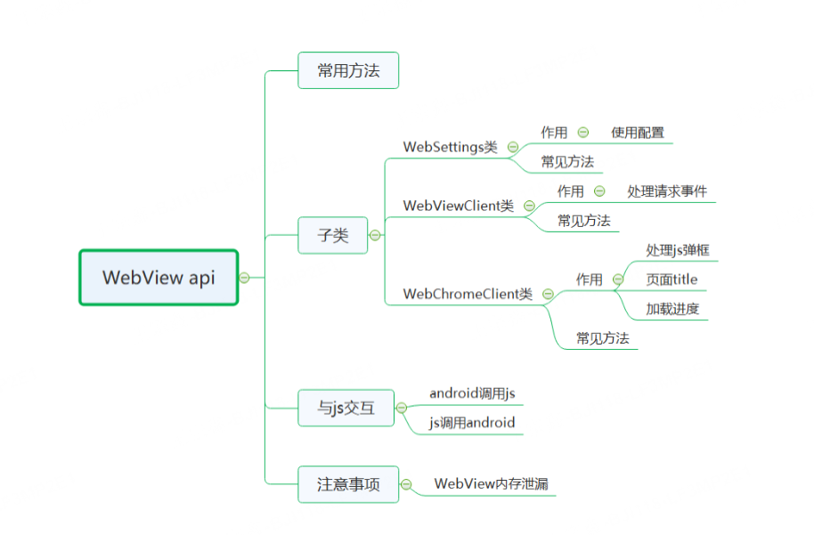
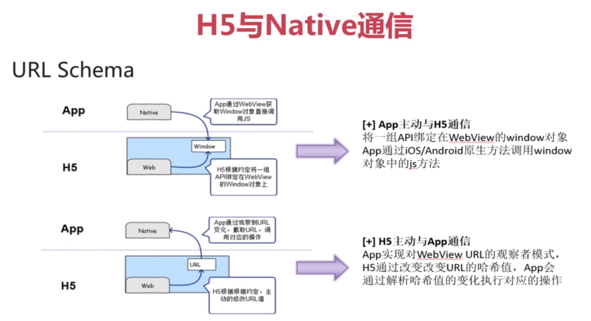

## webview

### webview 简介

Webview 是原生应用的一个普通组件，android 有 webview，ios 有 UIWebView/WKWebView，可用于显示和渲染 Web 页面，可和 JavaScript 交互调用

1. WebView 是一个浏览器组件，在 Android 4.3 系统及其以下，内部采用 Webkit 渲染引擎，在 Android 4.4 开始，采用 chromium 渲染引擎来渲染 View 的内容。
2. Google 对 WebKit 进行了封装，提供了丰富的 Java 接口，其中最重要的便是 android.webkit.WebView 控件。
3. WebKit 是一个开源的浏览器引擎

### api 结构

### Webview 比较常见的方法

1. webView.addJavascriptInterface(); 向 webView 中注册 android 方法
2. webView.evaluateJavascript(); 执行 javascript 方法
3. webView.loadUrl()；加载网页
4. webView.getSettings(); 获取 webView 配置对象
5. webView.onResume() ；激活 WebView 为活跃状态，能正常执行网页的响应
6. webView.onPause() ; 当页面被失去焦点被切换到后台不可见状态，需要执行 onPause ，通知内核尝试停止所有处理，如动画和地理位置，但是不能停止 javascript
7. webView.pauseTimers() ;当应用程序(存在 webview)被切换到后台时，这个方法不仅仅针对当前的 webview 而是全局的 webview ，会暂停所有 webview 的 layout，parsing，javascripttimer。降低 CPU 功耗。
8. webView.resumeTimers()；恢复 pauseTimers 状态
9. webView.destroy();销毁 Webview
10. webView.goBack(); 返回
11. webview.clearCache(true); 清除网页访问留下的缓存，由于内核缓存是全局的因此这个方法不仅仅针对 webview 而是针对整个应用程序.
12. webview.clearHistory();清除当前 webview 访问的历史记录

### Webview 子类及其比较常见的方法

## jsbridge

jsbridge 是 native 与 web 之间交互的统称，市面上有很多 jsbridge 库，我们目前在用的是 WebViewJavascriptBridge

1. javascript 调用原生代码
2. 原生代码调用 javascript

android 调用 javascript 方法有 2 种

1. webView.loadUrl();
2. webView.evaluateJavascript();

JavaScript 调用 android 方法有 3 种

1. WebView. addJavascriptInterface()注册，javascript 直接调用
2. webViewClient.shouldOverrideUrlLoading()拦截自定义协议 url
3. webChromeClient 拦截页面对话框

## Hybrid 开发

开发分工  
开发之前要将职责分清楚：哪些需要前端开发、哪些需要 native 开发

native 原则上只提供容器，不涉及具体业务；容器可以供其他业务的 H5 使用，做到可移植，一个公司可能有多个 hybrid 应用

技术方案  

