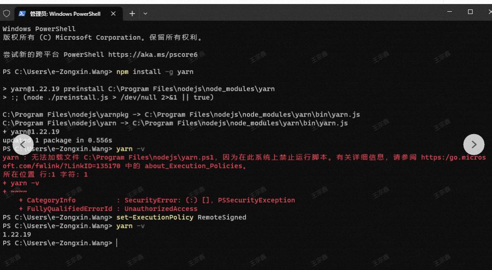

## powerSell

https://www.jianshu.com/p/8963e6f80e67



## nvm

https://developer.aliyun.com/article/1156085 卸载 nodehttps://blog.csdn.net/zz00008888/article/details/126117685 npxhttps://blog.csdn.net/HuangsTing/article/details/113857145

使用 encodeURI 与 decodeURI 对 json 字符串进行转码和解码

```javascript
import { useRef, useEffect, useCallback } from "react";

export function useDebounce(fn, delay, dep = []) {
  const { current } = useRef({ fn, timer: null });
  useEffect(() => {
    current.fn = fn;
  }, [fn]);

  return useCallback(function f(...args) {
    if (current.timer) {
      clearTimeout(current.timer);
    }
    current.timer = setTimeout(() => {
      current.fn.call(this, ...args);
    }, delay);
  }, dep);
}

export function useThrottle(fn, delay, dep = []) {
  const { current } = useRef({ fn, timer: null });
  useEffect(() => {
    current.fn = fn;
  }, [fn]);

  return useCallback(function f(...args) {
    if (!current.timer) {
      current.timer = setTimeout(() => {
        delete current.timer;
      }, delay);
      current.fn.call(this, ...args);
    }
  }, dep);
}
import { useState, useRef, useEffect, useCallback } from "react";

export default function useStateCallback(initialState) {
  const [state, setState] = useState(initialState);
  const cbRef = useRef(null);

  const setStateCallback = useCallback((state, callback) => {
    cbRef.current = callback;
    setState(state);
  }, []);

  useEffect(() => {
    if (cbRef.current) {
      cbRef.current(state);
      cbRef.current = null;
    }
  }, [state]);

  return [state, setStateCallback];
}
```

## -S -D -g

1. -S 等同于--save，保存在 package.json 文件中，是在 dependencies 下，

--save 安装包信息将加入到 dependencies（生产环境）中，生产阶段的依赖，也就是项目运行时的依赖，就是程序上线后仍然需要依赖；

2. -D 等同于--save-dev，也保存在 package.json 文件中，是在 devDependencies 下，

--save-dev 安装包信息将加入到 devDependencies（开发环境）中，开发阶段的依赖，就是我们在开发过程中需要的依赖，只在开发阶段起作用；

3. -g 等同于--global 的简写，对模块进行全局安装，作用于全局环境下，

--global 安装包信息是指把模块安装到操作系统上，

一般会安装在 AppDataAppData\Roaming\npm 目录下，

## react context 三种方式

https://juejin.cn/post/6924506511511126029

`git commit -m '' no-verify`

`yarn upgrade @cfe/venom`

https://blog.csdn.net/weixin_43239880/article/details/130313130