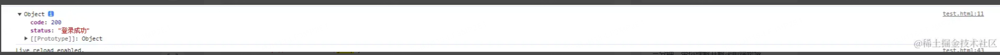

由于浏览器的同源策略限制，不允许跨域请求；但是页面中的 script、img、iframe 标签是例外，不受同源策略限制。

在没有 CORS 方法的年代，JSONP 就是最佳方法

在同源策略中，对标签的跨域请求限制较小，JSONP 就利用了这一点

在项目开发中常常会引入外链的图片、样式文件、插件等资源，但这些请求并没有导致跨域错误，因为这些请求都属于 http 请求 并不是会引发跨域 问题的 Xhr 请求  
简单来说 script 标签没有跨域限制的特性,把 script 脚本的 src 改成我需要跨域请求的 url,就能实现跨域获取资源，且不触发浏览器的同源策略，这就是 JSONP 的原理

```javascript
//前端
<script>
    window.callback = function (res) {
      console.log(res)
    }
  </script>
  <script src =' http://127.0.0.1:8080/jsonp?username=111&callback=callback'> </script>
```

```javascript
//后端
const express = require("express");

const router = express.Router();
const app = express();
router.get("/jsonp", (req, res) => {
  const { callback, username } = req.query;

  if (username === "111") {
    const requestData = {
      code: 200,
      status: "登录成功",
    };
    res.send(`${callback}(${JSON.stringify(requestData)})`);
  }
});

app.use(router);

app.listen("8080", () => {
  console.log("api server running at http://127.0.0.1:8080");
});
```

上面的代码中我们事先定义一个用于获取跨域响应数据的回调函数并挂载到 window 对象上，通过没有同源策略限制的 script 标签发起一个请求（将回调函数的名称放到这个请求的 query 参数里），然后服务端返回这个回调函数的执行，并将需要响应的数据放到回调函数的参数里，前端的 script 标签请求到这个执行的回调函数后会立马执行，于是就拿到了执行的响应数据



我们还可以在前端对 JSONP 代码进行一层封装

```javascript
const requestData = {


url: 'http://127.0.0.1:8080/jsonp',

data: {

username: 111,

},

jsonp: 'getMessage'

}
function jsonp(requestData) {

// 对传入参数进行处理

const { url, data, jsonp } = requestData;

let query = '';

for (let key in data) {

query += `${key}=${data[key]}&`;

}

const src = `${url}?${query}jsonp=${jsonp}`;

// 生成、填充script标签，在页面中挂载调用接口

let scriptTag = document.createElement('script');

scriptTag.src = src;

document.body.appendChild(scriptTag);
//返回Promise方便链式调用
return new Promise((resolve, reject) => {

window[jsonp] = function(rest){

resolve(rest)

document.body.removeChild(scriptTag)

}

})

}

//调用
jsonp(requestData).then(function (response) {

console.log(response);

})
```

当然上述只是简单的 JSONP 实现，在实际的使用中 JSONP 还存在诸多问题：

**1. CSRF 攻击**  
 当前端发起一个伪造的恶意 JSONP 请求时，服务端的敏感信息，如用户的个人信息，密码等存在泄露的风险，需要通过验证 JSONP 的调用来源（Referer），服务端判断  Referer  是否是白名单，或者部署随机  Token  来防御攻击

**2. XSS 漏洞**  
 不严谨的  content-type 类型会导致的  XSS  漏洞，如果没有严格定义好  Content-Type，例如 Content-Type: application/json，或者对请求 url 的 query 参数没有进行过滤，导致请求参数是一段恶意 JavaScript 代码，并被服务端接收执行并返回，那么前端就会执行这段恶意代码
通过严格定义 Content-Type: application/json，然后严格过滤 callback 后的参数并且限制长度（进行字符转义，例如`<换成&lt`，`>换成&gt`）等，这样返回的脚本内容会变成文本格式，脚本将不会执行

**3. 仅支持 GET 请求方式**  
 JSOP 仅支持 GET 方式的请求，对于 POST 等其他请求方式并不能使用 JSONP

参考文献  
https://juejin.cn/post/7285576848237412387
