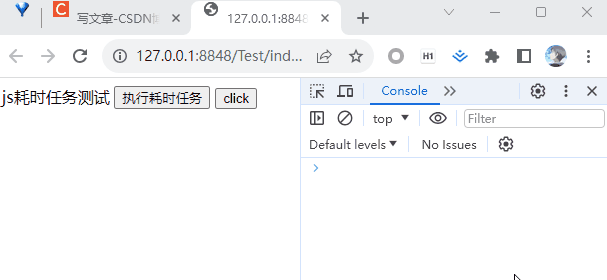

为了提高浏览器的性能和用户体验，现代浏览器采用了一些技术来优化主线程的执行。本文将提供浏览器因 JS 耗时任务导致页面卡顿的部分解决方案。主要着重讲解 requestIdleCallback（RIC）和 requestAnimationFrame（RAF）。

- setTimeout 延迟加载 （使用不当可能适得其反）
- web worker 多线程 （不能操作 dom，主要计算密集型的任务）
- requestIdleCallback 帧空闲时运行 （react18 带 🔥 的，低优先级任务）
- requestAnimationFrame 每帧都会运行 （主要做动画效果调优）
  在进入正题之前我们有必要先了解一下帧与卡顿。

### 帧

在计算机图形和动画领域，帧（Frame）是指一幅静态图像或一帧图像。当这些帧以一定的速率连续播放时，就会形成动画或视频的效果。

### 帧率

在动画或视频中，帧率（frame rate）表示每秒渲染的图像帧数。人眼对于连续视觉变化的感知能力通常被认为是每秒 24 到 30 帧。这意味着当连续的静态图像以每秒 24 到 30 帧的速度在屏幕上播放时，人眼会感知到流畅的运动和连续的动画效果。较高的帧率可以提供更流畅的动画效果，使用户感觉到连贯和真实的运动。当帧率高于 30 帧时，人眼对于连续动画的感知能力有所限制，因此超过这个帧率对大多数人来说没有明显的区别。

### 卡顿

浏览器的主线程是一个单线程，负责处理页面渲染、用户交互和执行 JavaScript 代码的线程。它按照任务队列（task queue）中的顺序依次执行任务（FIFO）。当任务被添加到任务队列中时，主线程会处理当前的任务，然后再处理下一个任务。

如果一个任务执行时间过长，它会阻塞主线程对页面的渲染，导致页面变得卡顿或不响应。

### 浏览器中的一帧


暂不展开讲解，后续有时间将单独写一文章。流水线流程可参看我之前文章：[页面的渲染流程（Chrome）](https://blog.csdn.net/wangfeijiu/article/details/106651592)

### 浏览器帧率和显示器帧率

显示器的帧率（也称为刷新率）是指显示器每秒钟刷新屏幕的次数。它通常以赫兹（Hz）为单位表示，例如 60 Hz、120 Hz 或 144 Hz。显示器的帧率决定了它能够显示的最大帧数。

浏览器帧率是指在网页浏览器中渲染和显示网页内容的帧率。它表示浏览器每秒钟更新屏幕上的内容的次数。尽管 60 帧/秒是一种常见的标准，但浏览器的帧率并不仅限于 60 帧/秒，并且可能根据不同的环境和设备而有所变化。

浏览器帧率可以受多个因素影响，包括浏览器的性能、网页的复杂程度、脚本和动画效果的使用等。浏览器的帧率可以根据设备的硬件性能、操作系统的设置和显示器的刷新率进行调整和适配。

## 耗时任务与解决方案

一个耗时任务的示例：

```html
<!DOCTYPE html>
<html>
  <body>
    <span>js耗时任务测试</span>
    <script>
      // 计算任务耗时毫秒数
      function processTaskTime(callback, ...args) {
        const startTime = new Date().valueOf();
        callback(...args);
        let endTime = new Date().valueOf();
        const processTime = endTime - startTime;
        console.log(
          `%c 执行 ${callback.name}(${args}) 消耗时间：` + processTime + '毫秒',
          'color:green'
        );
        return processTime;
      }

      // 双重遍历，计算求和 耗时任务
      function sumLoop(start, end) {
        let sum = 0;
        for (let i = start; i < end; i++) {
          for (let j = start; j < end; j++) {
            tmp = sum;
            sum = tmp + i + j;
          }
        }
        console.log(`从${start}到${end}自相相加和为：` + sum);
        return sum;
      }

      processTaskTime(sumLoop, 0, 15000);
    </script>
    <button onclick="processTaskTime(sumLoop,0,15000)">执行耗时任务</button>
    <button onclick="javascript:console.log('click event')">click</button>
  </body>
</html>
```

刷新看下页面的运行效果：  


刷新页面我们可以看到，页面加载了一小会才加载出来，因为 processTaskTime(sumLoop, 0, 15000)的执行就消耗了 3000 多毫秒（与个人电脑当时运行配置有关）。这对用户而言可谓相当的不友好，对网站自身而言也不利于 SEO。是否有改进的方式呢？


✿ 进一步观察 ，按下 执行耗时任务 按钮，立刻按下 click 按钮，为啥没有第一时间触发 click 按钮事件呢？

⭐ 触发的事件，都会依次加入到事件队列，先进先出，依次执行。


## setTimeout

1️⃣ 有法子让首屏加载时更快渲染出来？

```js
processTaskTime(sumLoop, 0, 15000);
			改 ⇓ 写
setTimeout(()=>processTaskTime(sumLoop, 0, 15000),100)
```

2️⃣ 直接 Ctrl+F5 强制刷新，可以看到页面瞬间加载完成。


✿ 通过定时器延迟执行 JS 耗时任务，页面更快地加载出来了 ？这里我们打上一个疑问号。

3️⃣ 进一步将 setTimeout(()=>processTaskTime(sumLoop, 0, 15000),100) 定时器的时间调整为 10 毫秒， Ctrl+F5 刷新看下页面结果：


可以看到页面加载的速度并没有提升，而是等待 JS 耗时任务执行完成才加载出来。为什么只是稍微调整一下定时器时间，会出现截然不同的页面效果呢？

当页面加载时，浏览器会执行各种操作，包括解析 HTML、构建 DOM 树、执行 JavaScript、加载 CSS 和其他资源等。这些操作需要消耗时间和计算资源。如果在页面加载过程中使用定时器，并将定时器的时间间隔设置得非常短，例如几毫秒或几十毫秒，那么浏览器在每个定时器触发时都会执行相关的代码，从而减慢其他重要操作的执行，包括首次页面渲染。这可能导致页面的响应时间延长、卡顿或页面渲染的不流畅。

主线程负责处理定时器事件和页面的渲染等，在页面未完成渲染之前，接收到定时器事件，会将定时器事件加入到事件队列并执行，当该轮事件队列为空的时候，才继续渲染页面。

所以，setTimeout 对任务进行延迟处理，一定要把握好定时时机。也就是 setTimeout 在执行回调的时候，无法确定浏览器主线程是否是空闲的，很可能耽误事儿。

## Web Worker

Web Worker 是一种浏览器提供的 JavaScript API，它允许在后台线程中执行长时间运行的任务，而不会阻塞主线程和页面的渲染。
Web Worker 是一个独立的 JavaScript 文件，运行在与主线程分离的上下文中，不能直接访问 DOM，也不能执行一些涉及 DOM 操作的代码。它通过消息传递的机制与主线程进行通信。主线程和 Web Worker 之间可以相互发送消息，进行数据的传递和交互。

Web Worker 使用示例
1️⃣ 创建一个独立的 JavaScript 文件，作为 Web Worker 的代码执行

```js
// worker.js

// 监听主线程发送的消息
self.onmessage = function (event) {
  // 从消息中获取数据
  var data = event.data;

  // 执行一些耗时的计算任务
  var result = performCalculation(data);

  // 将结果发送回主线程
  self.postMessage(result);
};

function performCalculation(data) {
  // 在这里执行一些耗时的计算任务
  // 例如，对传入的数据进行复杂的处理或计算
  // 返回计算结果
  return data * 2;
}
```

2️⃣ 在主线程中，创建一个 Web Worker 实例，并通过消息传递与其进行通信

```js
// 在主线程中创建 Web Worker 实例
var worker = new Worker('worker.js');

// 监听 Web Worker 发送的消息
worker.onmessage = function (event) {
  // 从消息中获取计算结果
  var result = event.data;

  // 处理计算结果
  console.log('计算结果：', result);
};

// 发送消息给 Web Worker
var data = 5;
worker.postMessage(data);
```

在上述示例中，首先通过 new Worker('worker.js') 创建了一个 Web Worker 实例，并指定了要执行的 Worker 脚本文件的路径。然后，我们监听 Web Worker 发送的消息，以获取计算结果。接下来，我们使用 worker.postMessage(data) 向 Web Worker 发送消息，并将数据 5 作为参数传递给它。Web Worker 在收到消息后执行计算任务，并通过 self.postMessage(result) 将结果发送回主线程。

在主线程中，我们通过监听 worker.onmessage 事件来获取 Web Worker 发送的消息，并在控制台打印出计算结果。

⭐⭐ 值得注意的是，在 Web Worker 中，self 是一个预定义的全局变量，用于引用 WorkerGlobalScope 对象。它是固定的，不能更改或重新赋值。WorkerGlobalScope 对象表示 Web Worker 的全局作用域，类似于浏览器中的 window 对象。因为 Web Worker 运行在独立的线程中，与主线程分离，所以它有自己的全局作用域。通过 self 可以访问 Web Worker 的全局属性和方法，例如 self.postMessage() 和 self.onmessage()。

**通过 Web Worker 改造案例**

```js
// worker.js
// 双重遍历，计算求和 耗时任务
function sumLoop(start, end) {
  let sum = 0;
  for (let i = start; i < end; i++) {
    for (let j = start; j < end; j++) {
      tmp = sum;
      sum = tmp + i + j;
    }
  }
  console.log(`从${start}到${end}自相相加和为：` + sum);
  return sum;
}

self.onmessage = function (event) {
  var data = event.data;
  var result = sumLoop(0, data);
  self.postMessage(result);
};
```

```html
<!DOCTYPE html>
<html>
  <body>
    <span>js耗时任务测试</span>
    <script>
      const worker = new Worker('worker.js');
      worker.onmessage = function (event) {
        const result = event.data;
        console.log(result);
      };
      worker.postMessage(15000);
    </script>
    <button onclick="processTaskTime(sumLoop,0,15000)">执行耗时任务</button>
    <button onclick="javascript:console.log('click event')">click</button>
  </body>
</html>
```

刷新，页面直接渲染出来。而后，才打印出来计算结果，不错！只是不能操作 dom。


## requestIdleCallback

requestIdleCallback 是一个 Web API，允许开发者在主线程空闲时去执行低优先级回调函数。这个函数的主要目的是使得开发者能够在不影响关键事件如动画和输入响应的情况下，执行后台或低优先级的任务。

```js
window.requestIdleCallback(callback[, options]);
	--callback 是一个函数，表示在空闲时段执行的回调函数。当callback被调用时，会接受一个参数 deadline，deadline是一个对象，对象上有两个属性timeRemaining，timeRemaining属性是一个函数，函数的返回值表示当前空闲时间还剩下多少时间；
didTimeout，didTimeout属性是一个布尔值，如果didTimeout是true，那么表示本次callback的执行是因为超时的原因
	--options 是一个可选的配置对象，用于指定更精确的空闲条件，例如 timeout（回调函数执行的最长时间）等。
```

不是每一帧都会执行，只有在浏览器主线程空闲的时候才会执行。

### 关键概念

requestIdleCallback 回调函数: 回调函数是在主线程空闲时被调用的函数。每次调用时，都会传入一个 IdleDeadline 对象，该对象提供一个 timeRemaining()方法，用来检测当前帧中剩余的空闲时间。

空闲时间和截止时间（deadline）: IdleDeadline 对象的 timeRemaining()方法返回一个 DOMHighResTimeStamp，表示在执行回调函数时，在当前帧中剩余多少空闲时间（毫秒）。开发者可以使用这个时间来执行任务，并在时间耗尽前选择适当的时机终止任务，从而避免影响关键渲染或事件处理。didTimeout 判断是否已经超时，如果超时将强制执行。

调度和取消回调: requestIdleCallback 函数安排一个回调函数在主线程下一次空闲时被执行，并返回一个 ID，可以用这个 ID 通过 cancelIdleCallback 函数取消回调。

超时: 可以给 requestIdleCallback 传递一个对象，其中一个属性是 timeout，用来指定最长时间（毫秒）。如果 didTimeout 的值为 true，则表示回调函数在超时时间内没有执行完毕。didTimeout 参数并不会强制执行回调函数。它只是一个标识，用于告知回调函数是否超过了可用的空闲时间。

```js
requestIdleCallback(
  (deadline) => {
    while (
      (deadline.timeRemaining() > 0 || deadline.didTimeout) &&
      tasks.length > 0
    ) {
      // 执行任务
      performTask(tasks.shift());
    }
  },
  { timeout: 200 }
);
```

### 注意事项

执行次数
在 react 的 [Umbrella] Releasing Suspense 中提到

requestIdleCallback is called only 20 times per second - Chrome on my 6x2 core Linux machine, it’s not really useful for UI work

我们都知道一般 FPS 为 60 hz 时对用户来说是感觉流畅的，即一帧时间为 16.7 ms，requestIdleCallback 在 12 核 linux 机器上的 FPS 只有 20，也就是 50ms 刷新一次，远远低于页面流畅度的要求

requestIdleCallback
**宏任务**

requestIdleCallback 注册的回调函数时，该回调函数会作为一个宏任务被添加到事件队列中。
requestIdleCallback 的回调函数在执行时是依赖于事件队列的管理的。当浏览器在空闲时段时调用。

主线程空闲的时候，说明事件队列其他的（与 requestIdleCallback 无关的）回调已经执行完了，requestIdleCallback 就处于事件队列最前面。

### 使用场景

合适情形
1️⃣ 埋点日志相关

在用户有操作行为时（如点击按钮、滚动页面）进行数据分析并上报
处理数据时往往会调用 JSON.stringify ，如果数据量较大，可能会有性能问题。

```js
const queues = [];

document.querySelectorAll('button').forEach(btn => {
  btn.addEventListener('click', e => {
    // do something...
    pushQueue({
      type: 'click'
      // ...
    }));

    schedule(); // 等到空闲再处理
  });
});

function schedule() {
  requestIdleCallback(deadline => {
    while (deadline.timeRemaining() > 1) {
        const data = queues.pop();
        // 这里就可以处理数据、上传数据
    }

    if (queues.length !== 0) {
      // 继续上传调用
      schedule();
    }
  });
}
```

2️⃣ 预加载

例如当你需要处理一些数据，但这些数据不需要立即展示给用户时，可以在空闲时预处理这些数据

```js
function prefetch(entry: Entry, opts?: ImportEntryOpts): void {
  if (!navigator.onLine || isSlowNetwork) {
    // Don't prefetch if in a slow network or offline
    return;
  }

  requestIdleCallback(async () => {
    const { getExternalScripts, getExternalStyleSheets } = await importEntry(
      entry,
      opts
    );

    requestIdleCallback(getExternalStyleSheets);
    requestIdleCallback(getExternalScripts);
  });
}
```

3️⃣ 延迟执行

当你有一些非必须立刻执行的代码时，比如初始化某些非关键的 UI 组件，你可以使用 requestIdleCallback 来推迟这些任务的执行。

不合适情形
1️⃣ 不适合操作 dom&更新 UI

执行时机不确定可能导致视觉难以预测
空闲回调执行的时候，当前帧已经结束绘制了，所有布局的更新和计算也已经完成。可能会引发回流重绘。
2️⃣ 不适合做一些耗时的长任务

虽然是在浏览器空闲执行，但依然运行在主线程上，耗时的长任务同样会导致帧率降低， 造成页面卡顿。
requestIdleCallback 不适合执行 DOM 操作，因为修改了 DOM 之后下一帧不一定会触发修改，主线程可能还被占据着。

### 由 React Fiber 引起的关注

react 并没有使用了 requestIdleCallback 来解决 stack 的问题，但 react 自主实现的调度算法与 requestIdleCallback 息息相关，那么为什么要放弃它而选择自主实现呢？

- 浏览器兼容性，目前并不是所有浏览器都支持这个 API
- 触发频率不稳定
- FPS 远低于 60, 这远远低于页面流畅度的要求（主要原因）
  

### 通过 requestIdleCallback 改造案例

```html
<!DOCTYPE html>
<html>
  <body>
    <span>js耗时任务测试</span>
    <script>
      // 计算任务耗时毫秒数
      function processTaskTime(callback, ...args) {
        const startTime = new Date().valueOf();
        callback(...args);
        let endTime = new Date().valueOf();
        const processTime = endTime - startTime;
        console.log(
          `%c 执行 ${callback.name}(${args}) 消耗时间：` + processTime + '毫秒',
          'color:green'
        );
        return processTime;
      }

      // 双重遍历，计算求和 耗时任务
      function sumLoop(start, end) {
        let sum = 0;
        for (let i = start; i < end; i++) {
          for (let j = start; j < end; j++) {
            tmp = sum;
            sum = tmp + i + j;
          }
        }
        console.log(`从${start}到${end}自相相加和为：` + sum);
        return sum;
      }

      function processTask(deadline) {
        console.log(
          `%c剩余空闲时间：` + deadline.timeRemaining() + '毫秒',
          'color:red'
        );
        while (deadline.timeRemaining() > 0) {
          processTaskTime(sumLoop, 0, 15000);
        }
      }

      window.requestIdleCallback(processTask);
    </script>
    <button onclick="processTaskTime(sumLoop,0,15000)">执行耗时任务</button>
    <button onclick="javascript:console.log('click event')">click</button>
  </body>
</html>
```

直接刷新页面，可见页面内容立即加载完成。耗时任务在后台继续执行，在此期间多次点击按钮，发现在空闲回调执行完成后才会执行点击事件的回调。


## requestAnimationFrame

顾名思义，请求动画帧，是专门为动画优化而设计的方法。和上文耗时案例关系不大，此处开始脱离上下文关系哈！😄（顺手笔记）

requestAnimationFrame 是一个浏览器提供的 JavaScript 方法，用于优化执行动画和其他循环操作的效率。它允许开发者在浏览器的下一次重绘之前调度一个回调函数，以确保动画在每一帧中都能够以最佳的性能和流畅度运行。

```js
requestAnimationFrame(callback)

--参数 callback 当你的动画需要更新时，为下一次重绘所调用的函数。该回调函数会传入 DOMHighResTimeStamp 参数，该参数与 performance.now() 的返回值相同，它表示 requestAnimationFrame() 开始执行回调函数的时刻。

--返回值 一个 long 整数，请求 ID，是回调列表中唯一的标识。是个非零值，没有别的意义。你可以传这个值给 window.cancelAnimationFrame() 以取消回调函数请求。
```

### 工作原理

requestAnimationFrame 的工作原理是，浏览器会在每一帧开始绘制之前，自动调用注册的回调函数。这意味着回调函数将与浏览器的刷新率同步，通常是每秒 60 次（60 帧/秒），以提供更平滑的动画效果。

⭐ 另一个 requestAnimationFrame 的优点是，它会自动处理浏览器标签页非激活或最小化的情况。当页面不可见时，requestAnimationFrame 会自动暂停，避免不必要的计算和功耗。

在动画循环中，可以更新元素的位置、改变 CSS 属性、渲染 Canvas 或 SVG 等操作。通过不断调用 requestAnimationFrame，可以创建一个连续而流畅的动画效果。

### 基本用法

```js
function animate() {
  // 动画逻辑和更新

  // 边界条件 决定何时停止执行 if(n>0){ n--;  requestAnimationFrame(animate); }
  requestAnimationFrame(animate);
}

// 启动动画
requestAnimationFrame(animate);
```

### 使用场景

动画场景（ vs setInterval 或 setTimeout）
⭐ 当使用 setInterval 或 setTimeout 来执行循环操作或动画时，存在以下问题：

1️⃣ 不稳定的帧率：setInterval 和 setTimeout 方法是按照指定的时间间隔执行回调函数。然而，浏览器的重绘率（屏幕刷新率）通常是固定的，例如 60 Hz（每秒 60 帧）。如果指定的时间间隔小于重绘率，那么某些帧可能会被跳过，导致动画不连续或不流畅。反之，如果时间间隔大于重绘率，动画可能会显得卡顿。

2️⃣ 不可预测的性能：使用 setInterval 或 setTimeout 无法准确控制每一帧的执行时间。由于 JavaScript 是单线程的，如果在某一帧执行的回调函数需要较长时间来完成，那么下一帧的回调函数可能会被延迟执行，从而导致不稳定的性能表现。这可能会导致动画的延迟、卡顿或者整体性能下降。

3️⃣ 响应性差：由于 setInterval 或 setTimeout 是通过定时器触发回调函数，它们不考虑浏览器的渲染过程。这意味着即使浏览器当前正在进行重绘，回调函数也会被触发。这可能导致在关键渲染时刻执行 JavaScript 代码，从而影响页面的响应性能。

⭐ 相比之下，requestAnimationFrame 是专门为动画优化而设计的方法，解决了上述问题：

1️⃣ 平滑的帧率：requestAnimationFrame 的回调函数会在每一帧开始绘制之前被调用，与浏览器的重绘率同步。这意味着动画将以流畅的 60 帧/秒（或其他重绘率）运行，产生连续而平滑的动画效果。

2️⃣ 更好的性能控制：requestAnimationFrame 的回调函数会在浏览器准备好绘制下一帧时被调用，确保每一帧的执行时间在可接受范围内。这有助于提供更稳定的性能，避免过长的回调导致的性能问题。

3️⃣ 更好的响应性能：requestAnimationFrame 会自动与浏览器的渲染过程同步。如果页面不可见或最小化，requestAnimationFrame 将自动暂停，避免不必要的计算和功耗。这对于提高页面的响应性能和用户体验非常重要。

```html
<!DOCTYPE html>
<html>
  <body>
    <div
      id="box"
      style="height: 20px; width: 20px; background-color: blue;position: relative;"
    ></div>
    <script>
      const box = document.querySelector('#box');
      let position = 0; // 初始位置
      const speed = 20; // 平移速度（每次移动的像素数）

      function animate() {
        // 更新位置
        position += speed;
        // 将位置应用到元素的样式
        box.style.left = position + 'px';
        if (position < 500) {
          window.requestAnimationFrame(animate);
        }
      }
      // setInterval(animate,16)
      window.requestAnimationFrame(animate);
    </script>
  </body>
</html>
```

其他场景 （如：首屏多模块加载优化）
基于 React 伪代码实现：

```js
const [status, setStatus] = useState(0);
function splitTaskRender() {
  setStatus(++status);
  if (status < 3) {
    window.requestAnimationFrame(splitTaskRender);
  }
}
window.requestAnimationFrame(splitTaskRender);

{
  status > 1 && <div>Module 1</div>;
}
{
  status > 2 && <div>Module 2</div>;
}
{
  status > 3 && <div>Module 3</div>;
}
```

### 避免在 requestAnimationFrame 回调函数中执行耗时的任务

性能问题
requestAnimationFrame 回调函数中执行的任务太耗时，会导致以下问题：

1️⃣ 卡顿和掉帧：如果回调函数的执行时间超过了每帧的时间限制（通常为 16.7 毫秒），就会导致浏览器无法及时完成绘制，导致页面出现卡顿和掉帧的现象。

2️⃣ 资源占用过多：执行耗时任务可能会占用过多的 CPU 资源，导致浏览器的性能下降。这可能会影响其他页面元素的响应性能，导致页面变得不流畅，用户可能无法顺利地与页面进行交互。

优化策略
1️⃣ 分割任务：将耗时任务分割为多个较小的子任务，并在多个帧中逐步执行。这样可以避免单个帧中执行时间过长，减少卡顿和掉帧的问题。（参考上文 首屏多模块加载优化）

2️⃣ 优化算法：通过优化算法或使用更高效的数据结构，尽量减少任务的执行时间。

3️⃣ 降低帧率：如果任务确实无法在单个帧中完成，可以通过降低 requestAnimationFrame 的调用频率，减少任务的执行次数，以达到平衡可接受的性能和任务完成的目标。

```js
let frameCount = 0;
const frameInterval = 10; // 每隔 10 帧执行一次任务

function animate() {
  frameCount++;

  if (frameCount % frameInterval === 0) {
    // 执行任务
    // ...

    // 重置计数器
    frameCount = 0;
  }

  requestAnimationFrame(animate);
}

requestAnimationFrame(animate);
```

4️⃣ 使用 Web Worker：对于非 UI 相关的耗时任务，可以考虑使用 Web Worker 在后台线程中执行，以充分利用多线程并减少对主线程的影响。

## 参考

https://blog.csdn.net/wangfeijiu/article/details/137948341
