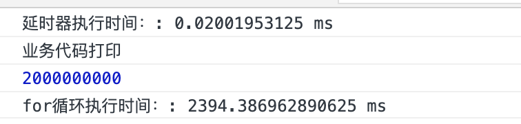
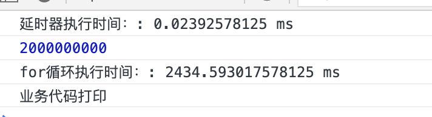
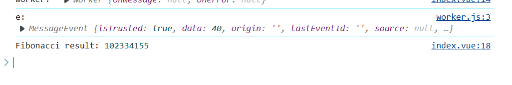

## 1.什么是 web Worker?

JavaScript 是单线程模型，即所有任务只能在同一个线程上面完成，前面的任务没有做完，后面的就只能等待，这样当我们执行一些时间较长的 js 运算时候呢就会阻塞后面执行的代码。有什么办法能解决这一问题呢？web worker 就是专门解决这一问题。
Web Worker 是一种网络接口，这意味着它无法访问或管理文档对象模型。Worker 存在于一个不同的线程中，它和主线程互不干扰。它在一个新的 Worker 对象创建时接受信息，然后向 worker 发送信息。

## 2.web worker 的作用

Web Worker 的作用，就是为 JavaScript 创造多线程环境，允许主线程创建 Worker 线程，将一些任务分配给后者运行。在主线程运行的同时，Worker 线程在后台运行，两者互不干扰。等到 Worker 线程完成计算任务，再把结果返回给主线程。这样的好处是，一些计算密集型或高延迟的任务，被 Worker 线程负担了，主线程（通常负责 UI 交互）就会很流畅，不会被阻塞或拖慢。

## 3.Web Worker 有以下几个使用注意点。

（1）同源限制

分配给 Worker 线程运行的脚本文件，必须与主线程的脚本文件同源。

（2）DOM 限制

Worker 线程所在的全局对象，与主线程不一样，无法读取主线程所在网页的 DOM 对象，也无法使用 document、window、parent 这些对象。但是，Worker 线程可以 navigator 对象和 location 对象。

（3）通信联系

Worker 线程和主线程不在同一个上下文环境，它们不能直接通信，必须通过消息完成。

（4）脚本限制

Worker 线程不能执行 alert()方法和 confirm()方法，但可以使用 XMLHttpRequest 对象发出 AJAX 请求。

（5）文件限制

Worker 线程无法读取本地文件，即不能打开本机的文件系统（file://），它所加载的脚本，必须来自网络。

## 4. 如何使用 web worker

1.主线程采用 new 命令，调用 Worker()构造函数，新建一个 Worker 线程。

```js
var worker = new Worker('./work.js');
```

2.主线程调用 worker.postMessage()方法，向 Worker 发消息。

```js
worker.postMessage('Hello World');
```

它可以是各种数据类型，包括二进制数据。

3.主线程通过 worker.onmessage 指定监听函数，接收子线程发回来的消息。

```js
worker.onmessage = function (event) {
  console.log('Received message ' + event.data);
  doSomething();
};
function doSomething() {
  // 执行任务
  worker.postMessage('Work done!');
}

// 这里的worker.onmessage 也可以换成self.addEventListener ,self代表子线程自身，即子线程的全局对象  等同于
self.addEventListener(
  'message',
  function (e) {
    self.postMessage('You said: ' + e.data);
  },
  false
);
```

4.Worker 完成任务以后，主线程就可以把它关掉。

```js
worker.terminate();
```

5.Worker 内部如果要加载其他脚本，有一个专门的方法 importScripts()。

```js
importScripts('script1.js', 'script2.js');
```

6.主线程可以监听 Worker 是否发生错误。如果发生错误，Worker 会触发主线程的 error 事件。

```js
worker.onerror(function (event) {
  console.log(
    ['ERROR: Line ', e.lineno, ' in ', e.filename, ': ', e.message].join('')
  );
});

// 或者
worker.addEventListener('error', function (event) {
  // ...
});
```

## 5. web worker 的简单应用

主线程

```js
const worker = new Worker('./worker.js');

worker.addEventListener(
  'message',
  function ({ data }) {
    switch (data.type) {
      case 'prime':
        document.getElementById('prime').textContent = `${
          data.n
        }之内的所有质数是：${data.result.join(',')}`;
        break;
      case 'fibonacci':
        document.getElementById(
          'fibonacci'
        ).textContent = `${data.n}之内的所有斐波那契数列之和是：${data.result}`;
        break;
      case 'reverseNumber':
        document.getElementById(
          'reverseNumber'
        ).textContent = `${data.n}之内的所有回文数是：${data.result}`;
        break;
      default:
        break;
    }
  },
  false
);
worker.postMessage({ type: 'prime', n: 300000 });
worker.postMessage({ type: 'fibonacci', n: 40 });
worker.postMessage({ type: 'reverseNumber', n: 400000 });
```

worker.js

```js
self.addEventListener(
  'message',
  function ({ data }) {
    switch (data.type) {
      case 'prime': // 质数
        self.postMessage({
          type: 'prime',
          n: data.n,
          result: countPrime(data.n)
        });
        break;
      case 'fibonacci': //斐波那契数列
        self.postMessage({
          type: 'fibonacci',
          n: data.n,
          result: fibonacci(data.n)
        });
        break;
      case 'reverseNumber': // 回文数
        self.postMessage({
          type: 'reverseNumber',
          n: data.n,
          result: countReverseNumber(data.n)
        });
      default:
        break;
    }
  },
  false
);

// 计算n以内的所有质数
function countPrime(num) {
  let n = 1;
  let nums = [];
  search: while (n < num) {
    // 开始搜寻下一个质数
    n += 1;
    for (let i = 2; i <= Math.sqrt(n); i++) {
      // 如果除以n的余数为0，开始判断下一个数字。
      if (n % i == 0) {
        nums.push(n);
        continue search;
      }
    }
  }
  return nums;
}
// 计算斐波那契数列之和
function fibonacci(n) {
  if (n == 1 || n == 2) return 1;
  return n >= 3 ? fibonacci(n - 1) + fibonacci(n - 2) : null;
}
// 计算
function countReverseNumber(n) {
  return Array.from(new Array(n), (v, i) => i + 1).filter((v) => {
    let nv = v.toString().split('').reverse().join('');
    return nv == v && v > 10;
  });
}
```

## 6. 相比异步 web worker 好在哪？

我们先看看在主线程 js 环境下执行一个很大的循环需要的时间

```js
function loopFor() {
  console.time('for循环执行时间：');
  let cnt = 0;
  for (let i = 0; i < 20e8; i += 1) {
    cnt += 1;
  }
  console.log(cnt);
  console.timeEnd('for循环执行时间：');
}
loopFor();
console.log('业务代码打印');
```


可以看到执行一个 20e8 大的循环需要大概 2 秒多的时间，并且在执行同时会阻塞下面的 console 打印代码

那么看到这有人会说可以将这个 for 循环写成异步，当然可以，我们把 for 循环加到延时器里执行

```js
function loopFor() {
  console.time('for循环执行时间：');
  let cnt = 0;
  for (let i = 0; i < 20e8; i += 1) {
    cnt += 1;
  }
  console.log(cnt);
  console.timeEnd('for循环执行时间：');
}
// loopFor()
console.time('延时器执行时间：');
setTimeout(loopFor);
console.timeEnd('延时器执行时间：');

console.log('业务代码打印');
```



可以 看到确实没阻塞同步执行的业务代码，但这并非解决代码流堵塞问题的最佳方案。虽然 setTimeout 是一个不阻碍正常代码流的异步函数，但是这样做仅仅改变了函数的执行顺序。继续看下面例子，将业务代码也写成延时器

```js
function loopFor() {
  console.time('for循环执行时间：');
  let cnt = 0;
  for (let i = 0; i < 20e8; i += 1) {
    cnt += 1;
  }
  console.log(cnt);
  console.timeEnd('for循环执行时间：');
}
// loopFor()
console.time('延时器执行时间：');
setTimeout(loopFor);
console.timeEnd('延时器执行时间：');

setTimeout(() => {
  console.log('业务代码打印');
});
```



可以看到第二个 setTimeout 总是在第一个 setTimeout 结束 for 循环后才开始运行 console.log 指令。如果第一个 setTimeout 包含的任务耗时较长，那么第二个 setTimeout 将无法运行。
为什么？因为 Javascript 是一种单线程编程语言。异步函数存在于不同的任务队列中，但它们仍然遵循单线程规则。

## 7. 使用方向

1）预先抓取或缓存数据以便稍后使用
2）突出显示代码语法或其他实时文本格式
3）拼写检查
4）分析视频或音频数据
5）背景 I/O 或网络服务轮询
6）处理较大数组或超大 JSON 响应
7） 中的图片过滤
8）更新本地网络数据库中的多行内容

## 8.Vue、React 项目使用

接下来为大家演示 vue 以及 react 项目如何使用

### Vue 使用

vue 版本："vue": "^2.6.14",vue-cli 版本：@vue/cli 5.0.8 安装 worker-loader

#### 页面使用

```js
<template><div>我的页面</div></template>
<script>
export default {
  name: 'MyselfView',
  data() {
    return {
      worker: null,
    }
  },
  mounted() {
    // 创建 WebWorker 实例
   this.worker = new Worker(new URL('./worker.js', import.meta.url))
    console.log('worker: ', this.worker)
    this.worker.postMessage(40) // 请求计算斐波那契数列的第40项

    this.worker.addEventListener('message', (event) => {
      console.log('Fibonacci result:', event.data)
    })
  },
  beforeDestroy() {
    // 组件销毁时终止 WebWorker
    this.worker.terminate()
  },
}
</script>
```

#### worker.js

```js
// worker.js
self.addEventListener('message', (e) => {
  console.log('e: ', e);
  const n = e.data;
  let a = 0,
    b = 1,
    temp;
  for (let i = 2; i <= n; i++) {
    temp = a;
    a = b;
    b = temp + b;
  }
  self.postMessage(b);
});
```

效果


### React 使用

react 版本： "react": "^18.2.0"

```js
import React, { useEffect } from 'react'
// import WorkerScript from './worker.worker.js'

const Demo = () => {
  useEffect(() => {
    const worker = new Worker(new URL('./worker.worker.js', import.meta.url))

    worker.onmessage = function (e) {
      console.log('Fibonacci result:', e.data)
    }
    worker.postMessage(40) // 请求计算斐波那契数列的第40项
    // 使用 worker ...
    return () => worker.terminate()
  }, [])

  return (
    <div>
      <p>count的值</p>
    </div>
  )
```

效果


#### 注意

由于我们在项目开发时，使用不同的打包工具(vite/webpack)。幸运的是，最新版的 vite/webpack 都支持 Web Worker 了。

我们可以通过：new URL()的方式 --vite/webpack 都支持

```js
new Worker(new URL('./worker.js', import.meta.url));
```

## 9. 总结

通常 worker 被用于占用大量 CPU 资源的程序中，比如 2D canvas 和矢量图,webGL 数据索引计算等。因为 worker 位于另一个线程中，它不会阻断主线程中的任何任务，比如 UI 渲染。如果能将 worker 运用自如，它的效果将十分强大。包括 IE10 在内的众多浏览器都能够很好地支持这一功能。

## 参考

- https://blog.csdn.net/chenyajundd/article/details/137033829
- https://blog.csdn.net/weixin_37680520/article/details/117623499
