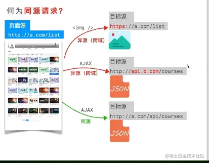
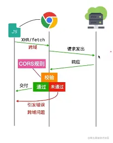
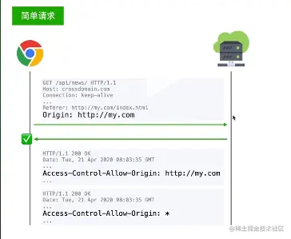
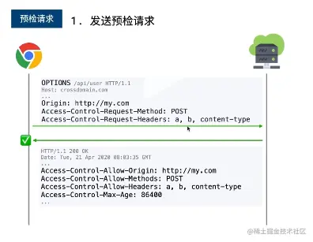
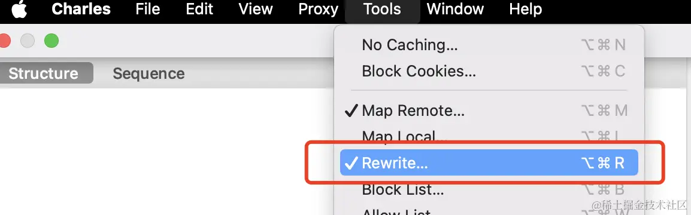
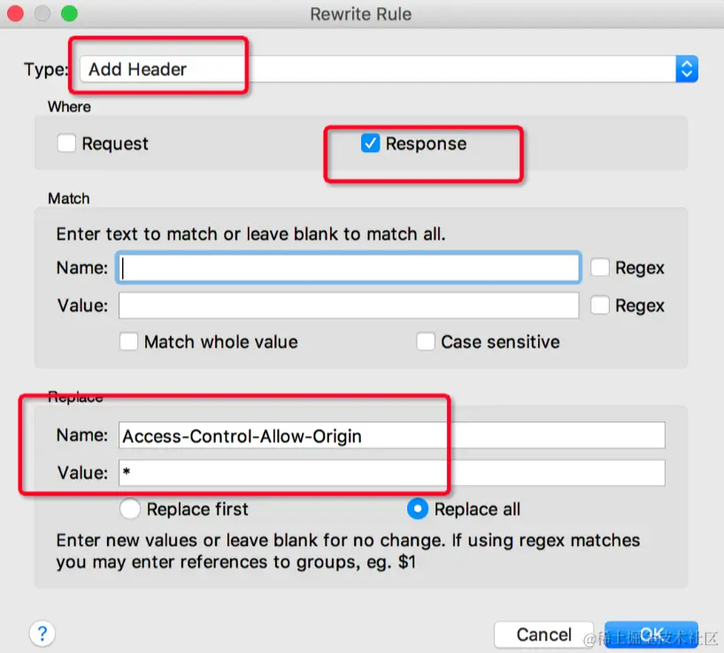

跨域问题是由于浏览器的同源策略引起的，当一个请求的协议、域名或端口与当前页面不一致时，浏览器会拒绝接收响应。虽然服务器已经处理并响应了请求，但浏览器为了用户的安全，会单方面拒绝响应。

## 一、跨域的原因

跨域是浏览器的`同源策略`引起的

### 同源策略

同源策略是浏览器最核心最基本的安全功能，如果缺少了同源策略，会存在一切安全风险，如 CSRF(跨站请求伪造)、XSS(跨站脚本攻击) 等攻击

跨域只会存在于浏览器，服务器不存在跨域问题

### 哪些情况下产生跨域

1.  协议不同产生跨域(http/https)
2.  域名不同产生跨域
3.  端口不同产生跨域
4.  域名和域名对应的 ip 地址产生跨域(比如：localhost 和 127.0.0.1 产生跨域)
5.  一级域名和二级域名产生跨域

### 何为同源请求？



同源请求不止针对 Ajax，对其他类型的如请求图片、JS 文件、CSS 等，只不过对 Ajax 的限制较为厉害而已

### 浏览器如何限制？

对标签元素发出的跨域请求轻微限制

对 Ajax 发出的跨域请求严厉限制

对 Ajax 的限制如图：


这里跨域的发生地方在收到响应时；浏览器是发出请求了的，同时服务端也接收到了请求，而且返回了响应，只不过这个响应被浏览器拦截了，因为有安全因素考虑，会对响应做出校验，通过了就没有跨域问题了，没有校验通过就会引发错误产生跨域问题了

比如在浏览器控制台发出一个异源请求，就会发生错误


## 二、跨越解决方式

### 1.jsonp

由于浏览器的同源策略限制，不允许跨域请求；但是页面中的 script、img、iframe 标签是例外，不受同源策略限制。

在没有 CORS 方法的年代，JSONP 就是最佳方法

在同源策略中，对标签的跨域请求限制较小，JSONP 就利用了这一点

在项目开发中常常会引入外链的图片、样式文件、插件等资源，但这些请求并没有导致跨域错误，因为这些请求都属于 http 请求 并不是会引发跨域 问题的 Xhr 请求  
简单来说 script 标签没有跨域限制的特性,把 script 脚本的 src 改成我需要跨域请求的 url,就能实现跨域获取资源，且不触发浏览器的同源策略，这就是 JSONP 的原理

```javascript
//前端
<script>
    window.callback = function (res) {
      console.log(res)
    }
  </script>
  <script src =' http://127.0.0.1:8080/jsonp?username=111&callback=callback'> </script>
```

```javascript
//后端
const express = require("express");

const router = express.Router();
const app = express();
router.get("/jsonp", (req, res) => {
  const { callback, username } = req.query;

  if (username === "111") {
    const requestData = {
      code: 200,
      status: "登录成功",
    };
    res.send(`${callback}(${JSON.stringify(requestData)})`);
  }
});

app.use(router);

app.listen("8080", () => {
  console.log("api server running at http://127.0.0.1:8080");
});
```

上面的代码中我们事先定义一个用于获取跨域响应数据的回调函数并挂载到 window 对象上，通过没有同源策略限制的 script 标签发起一个请求（将回调函数的名称放到这个请求的 query 参数里），然后服务端返回这个回调函数的执行，并将需要响应的数据放到回调函数的参数里，前端的 script 标签请求到这个执行的回调函数后会立马执行，于是就拿到了执行的响应数据


我们还可以在前端对 JSONP 代码进行一层封装

```javascript
const requestData = {


url: 'http://127.0.0.1:8080/jsonp',

data: {

username: 111,

},

jsonp: 'getMessage'

}
function jsonp(requestData) {

// 对传入参数进行处理

const { url, data, jsonp } = requestData;

let query = '';

for (let key in data) {

query += `${key}=${data[key]}&`;

}

const src = `${url}?${query}jsonp=${jsonp}`;

// 生成、填充script标签，在页面中挂载调用接口

let scriptTag = document.createElement('script');

scriptTag.src = src;

document.body.appendChild(scriptTag);
//返回Promise方便链式调用
return new Promise((resolve, reject) => {

window[jsonp] = function(rest){

resolve(rest)

document.body.removeChild(scriptTag)

}

})

}

//调用
jsonp(requestData).then(function (response) {

console.log(response);

})
```

当然上述只是简单的 JSONP 实现，在实际的使用中 JSONP 还存在诸多问题：

**1. CSRF 攻击**  
 当前端发起一个伪造的恶意 JSONP 请求时，服务端的敏感信息，如用户的个人信息，密码等存在泄露的风险，需要通过验证 JSONP 的调用来源（Referer），服务端判断  Referer  是否是白名单，或者部署随机  Token  来防御攻击

**2. XSS 漏洞**  
 不严谨的  content-type 类型会导致的  XSS  漏洞，如果没有严格定义好  Content-Type，例如 Content-Type: application/json，或者对请求 url 的 query 参数没有进行过滤，导致请求参数是一段恶意 JavaScript 代码，并被服务端接收执行并返回，那么前端就会执行这段恶意代码
通过严格定义 Content-Type: application/json，然后严格过滤 callback 后的参数并且限制长度（进行字符转义，例如`<换成&lt`，`>换成&gt`）等，这样返回的脚本内容会变成文本格式，脚本将不会执行

**3. 仅支持 GET 请求方式**  
 JSOP 仅支持 GET 方式的请求，对于 POST 等其他请求方式并不能使用 JSONP

参考文献  
https://juejin.cn/post/7285576848237412387

### 2.CORS(跨域资源共享)



如上述图所示，，跨域发生的原因就是在这个校验规则上，校验通过了就不会发生跨域问题，校验不通过就会引发跨域问题，跨域的校验规则就是 CORS 规则，也是跨域产生的最本质的地方

跨域的解决方法有很多种，但是 CORS 一定是最根本、最正统的方法

CORS 是一套机制，用于浏览器校验跨域请求

它的基本理念是：

只要服务器明确表示允许，则校验通过

服务器明确拒绝或没有表示，则校验不通过

所以这里的解决主要靠服务器，还得保证服务器是自己人，能访问修改

CORS 将请求分为两类：简单请求和预检请求

**简单请求**

- 请求方法为：GET、HEAD、POST
- 头部字段满足 CORS 安全规范，详见：MDN
- 请求头的 Content-Type 为：
  1. text/plain(表示请求体中是纯文本数据，可以用普通的纯文本编辑器查看与编辑)
  2. multipart/form-data(表示请求体中包含多种数据类型，如文件上传等，通常用于表单提交)
  3. application/x-www-form-urlencoded(表示请求体中包含键值对数据，以键值对的形式拼接在 URL 后面发送请求，也可放在请求体中)

这里注意只要不去改动请求头部字段，则基本都是满足安全规范

**预检请求**
即是非简单请求

举两个例子：

`fetch('https://douyin.com')`


这是个简单请求

`fetch('https://douyin.com', {headers:{a:1}})`


这是预检请求，因为改了头部字段

知道了简单请求和预检请求后，那么浏览器遇到这两种请求是如何校验的呢？

**针对简单请求和预检请求的校验**

简单请求：



这里浏览器发现是简单请求后，会自动在请求头 headers 中添加 Origin 这个字段，表示是来自哪个源的请求，然后服务器一般会在返回响应头中添加 Access-Control-Allow-Origin 字段，如果值和请求源一样，浏览器一看表示允许这个源通过，则校验通过；或者值为\*号，表示所有源都可以通过，那浏览器一看不管了，都校验通过

预检请求：



当浏览器发现是预检请求后，会先发出一个 OPTIONS 的预检请求，请求头中带有 Origin-请求源地址，Access-Control-Request-Method-请求方法和 Access-Control-Request-Headers-这次请求改动的头部字段等，服务器收到后会返回响应头字段有允许的源地址、允许的方法、允许的头部 headers 和最大缓存时间，下次这个时间范围内直接使用缓存

当这个 OPTIONS 请求通过后才会发出真实的请求和简单请求处理一模一样

### 3.proxy 反向代理

#### 运用 devServer.proxy 进行请求代理

devServer.proxy 是 webpack 开发服务器的一个配置选项，通过该选项配置可以在开发环境中实现跨域请求的代理。它解决跨域问题的原理是将前端的请求转发到后端，然后由后端再代理发送请求到目标服务器，最终将响应返回给前端。

所以，如果我们的项目是通过 webpack 启动服务的或者框架底层正好使用了 http-proxy-middleware 服务的，都可以通过配置 devServer.proxy 直接解决跨域问题。

核心流程如下：

1. **配置 devServer.proxy**

在 webpack 配置文件中的 devServer 部分，通过设置 proxy 选项配置代理。例如：

```javascript
module.exports = {
  // ...
  devServer: {
    proxy: {
      "/api": {
        target: "http://localhost:3000", // 如果本地使用的后端服务在 localhost:3000 上，可以使用它来启用代理
        changeOrigin: true,
        pathRewrite: { "^/api": "" },
      },
    },
  },
};
```

​ 上述配置表示将以 `/api` 开头的请求代理到 `http://localhost:3000`。

2. **启动 webpack 开发服务器**  
   当开发者启动 webpack 开发服务器时，它会监听前端的请求，并根据 devServer.proxy 的配置将符合条件的请求代理到指定的后端服务器。

3. **代理转发**  
   当前端发起以 `/api` 开头的请求时，webpack 开发服务器将请求转发到指定的后端服务器（例如`http://localhost:3000`）。

4. **后端处理请求**  
   后端服务器接收到代理过来的请求后，按照正常的处理流程处理请求，并将响应返回。

5. **前端接收响应**  
   最终，webpack 开发服务器将后端服务器的响应返回给前端，完成整个代理过程。

通过使用 devServer.proxy 配置，前端在开发环境中能够绕过同源策略的限制，实现与后端不同域的服务器进行交互，从而解决跨域问题。这样开发者可以在本地开发环境中方便地与后端服务进行协作和调试。

#### http-proxy-middleware 介绍：

上文所述的 devServer.proxy 代理功能，其底层依赖于 http-proxy-middleware 软件包。所以如果需要设置更多的代理服务配置，可以借鉴参考 http-proxy-middleware 配置文档说明。

http-proxy-middleware 本质上是一个 Node.js 的中间件库，用于在 Express、Koa 或任何基于 Node.js 的 HTTP 服务器上代理 HTTP 请求。

它的工作原理如下：

1. 当客户端发起 HTTP 请求时，请求首先被发送到代理服务器。
2. 代理服务器收到请求后，根据配置的规则（如目标地址、路径重写等）修改请求的参数。
3. 修改后的请求被转发到目标服务器。
4. 目标服务器接收到请求后，处理请求并返回响应。
5. 代理服务器接收到响应后，根据配置的规则（如路径重写、请求头修改等）修改响应的参数。
6. 修改后的响应被返回给客户端。

http-proxy-middleware 可以方便地配置代理规则，支持按路径、按域名、按请求头等进行匹配和过滤，也可以对请求和响应进行修改。通过这种方式，它可以实现反向代理、请求转发、API 接口代理等功能。

#### 设置了 proxy 无效？

设置了 `proxy` 后，发现还是无法生效。此时你需要了解一个问题，你的请求连接符合 `proxy` 的匹配规则吗？

出现这个问题的大概率是你的项目代码设置了请求的域名，比如你的接口地址是 `a.com`，你的前端项目是 `localhost:8080`,前端设置了 `baseUrl='a.com'`，此时浏览器发出的请求路径是 `a.com/api/xxx`，这个路径是浏览器直接向 `a.com` 域名发出的请求，根本没有走项目本地配置的 `proxy`，所以才不会生效。

解决办法：把 `baseUrl` 设置删除（通过 `proxy` 匹配你的`/api/xxx` 路径代理请求，而不是代码直接写目标域名的地址）

### 4.Nginx 代理


Nginx 配置解决浏览器跨域问题的原理是通过反向代理，将前端应用和后端服务整合在同一域名和端口下。通过在 Nginx 配置文件中设置不同路径的 location 块，将前端请求和后端请求分别代理到对应的服务地址，确保它们具有相同的域名和端口。这样一来，前端页面和后端服务在同一源上，遵循浏览器的同源策略，解决了跨域问题。

在代理过程中，Nginx 还可以添加自定义的请求头信息，确保正确的信息传递和安全性。通过这种方式，Nginx 提供了一种简便有效的解决跨域问题的方法，同时提高了应用的灵活性和安全性。

例如：当前端应用页面部署于 `http://10.188.27.166:9897`，后端服务接口部署于 `http://10.188.27.166:9898`，因为两者的端口不一致，所以就会导致跨域请求限制。我们可以通过 nginx.conf 配置，让两者处于同一个域名和端口下，配置如下：

```
server {
        listen       8080; # 端口
        server_name  localhost; # 域名

				# 代理所有前端页面
        location / {
            proxy_pass http://10.188.27.166:9897;
        }

				# 代理后端接口
        location /cors-api {
            proxy_pass http://10.188.27.166:9898;

						# 添加了部分自定义属性
            add_header Access-Control-Allow-Origin * always;
            add_header Access-Control-Allow-Headers *;
            add_header Access-Control-Allow-Methods "GET, POST, PUT, OPTIONS";
            if ($request_method = 'OPTIONS') {
                return 200;
            }
        }
}
```

执行 nginx -s reload 命令重新启动 nginx 服务后，我们在浏览器访问 http://localhost:8080/ 地址，跨域限制问题就已经被成功解决了.

### 5.关闭浏览器同源策略

在启动 Chrome 浏览器时，添加 --disable-web-security 参数可用来禁用同源策略。但请注意，这种方式只是在开发和调试时使用，不要在生产环境中禁用同源策略来验收项目。具体操作如下：

`Mac` 电脑，直接在终端命令行中输入如下指令（`<自定义目录>` 例如：`/Users/xxx/MyChromeData`） ：

```
$ open -n /Applications/Google\ Chrome.app/ --args --disable-web-security --user-data-dir=<自定义目录>
```

`Windows 电脑，右键点击 Chrome 浏览器 -> 属性 -> 目标 -> 在 chrome.exe 路径后面添加代码 --disable-web-security --user-data-dir="<自定义目录>"。(<自定义目录> 例如：D:\MyChromeData)`


后续打开该 Chrome 浏览器应用，都是以禁用浏览器同源策略的方式打开。如果设置成功了，打开 Chrome 浏览器会有如下提示：


既然导致跨域的“罪魁祸首”是浏览器的同源策略，我们直接从根本入手不就解决问题了吗？

各大主流浏览器也确实提供了关闭同源策略的功能

IE 浏览器：进入 ie 的网际网路选项设置，然后选择安全性，再选择自订等级，然后下拉，找到「存取跨网络的资料来源」，选择启用即可

chrome 浏览器：首先需要关闭所有打开的浏览器窗口，在命令行窗口输入 chrome --disable-web-security

FireFox 浏览器：在地址栏输入 about:config，然后下拉找到 security.fileuri.strict_origin_policy，然后设置为 false 即可

这样的做法确实从根本上解决了跨域问题，但禁用同源策略会导致安全风险，所有并不推荐这样做

## 六、其它方法

### 借助浏览器插件的妙用

一些浏览器插件允许在浏览器中启用 CORS 配置，以便在开发过程中更轻松地处理跨域请求，也有一些插件可以帮助临时禁用或修改浏览器的安全设置，以允许跨域请求。以下是一些常见的浏览器插件：

1. CORS Unblock: 解除跨域限制。
2. Allow-Control-Allow-Origin: 允许跨域资源共享（CORS）。
3. ModHeader: 允许用户修改请求头，可以用于测试不同的 CORS 配置。
4. Postman Interceptor: 结合 Postman 工具使用，拦截请求和响应，方便测试和调试。

请注意，使用这些插件时应谨慎，仅在开发和调试环境中使用，切勿在生产环境中禁用浏览器的安全设置。

下面将简单介绍一下 Chrome 插件 CORS Unblock 的使用。

步骤一：在 chrome 应用商店 搜索 CORS Unblock 插件，并点击安装。


步骤二：固定插件到导航栏，并点击启用 CORS Unblock 插件。


步骤三：刷新网页，会发现原本存在跨域限制的接口都可以正常访问了。

启动插件前：跨域请求失败


启动插件后：跨域请求被自动添加了 CORS 配置，请求成功


### 巧用抓包工具代理请求

抓包工具是一类用于捕获、分析和修改计算机网络通信流量的软件工具。这些工具允许开发人员和网络管理员监控应用程序的网络交互，查看请求和响应的详细信息，进行性能评估，以及在开发和测试阶段修改数据流以进行调试。抓包工具对于诊断网络问题、优化性能和确保安全性都具有重要作用。常用的抓包工具有 Fiddler、Charles、Wireshark 等。

使用抓包工具代理请求的方式来处理跨域问题，通常涉及将 Web 网络请求通过工具进行中间代理，实现对请求和响应的监控、分析和修改。通过抓包工具的 rewrite 能力重写网络响应，给存在跨域的接口都添加上 CORS 相关配置，来解决跨域问题。

下面将简单介绍 Charles 工具的操作步骤：

步骤一：打开 Charles 工具栏 Tools --> Rewrite



步骤二：添加 Rewrite 配置


步骤三：Add 时添加 CORS 配置响应头



通过完成上述的三个步骤，我们现在就可以直接访问跨域接口了，可以看到所有的接口响应上都已经被添加了 `Access-Control-Allow-Origin:\*` CORS 属性。


## CSRF 攻击

CSRF，又称跨站请求伪造，指非法网站挟持用户 cookie 在已登陆网站上实施非法操作的攻击，这是基于使用 cookie 在网站免登和用户信息留存的实用性，接下来来讲讲正常网站免登的请求流程。

请求流程如下:

> 我们进入一个网站，发送登陆请求给后端  
> 后端接受登陆请求，判断登陆信息是否准确  
> 判断信息准确后后端后会发送 response 给浏览器并在 response header 中加入 set-cookie 字段  
> 浏览器接受 response 返给用户，并将 header 中的 cookie 进行保存  
> 用户关闭当前网站窗口后再次打开后，浏览器会自动将 cookie 加入 request header 实现免登

我们设想这样一个场景

> 小 a 登陆了网银网站，小 a 所在浏览器记录了网银回馈的 cookie  
> 这时他 qq 上收到个链接，什么澳门赌场，美女荷官，在线送钱的网站 b  
> 他点开那个链接之后，网站 b 就可以携带浏览器设置的 cookie 向网银系统上发送请求
